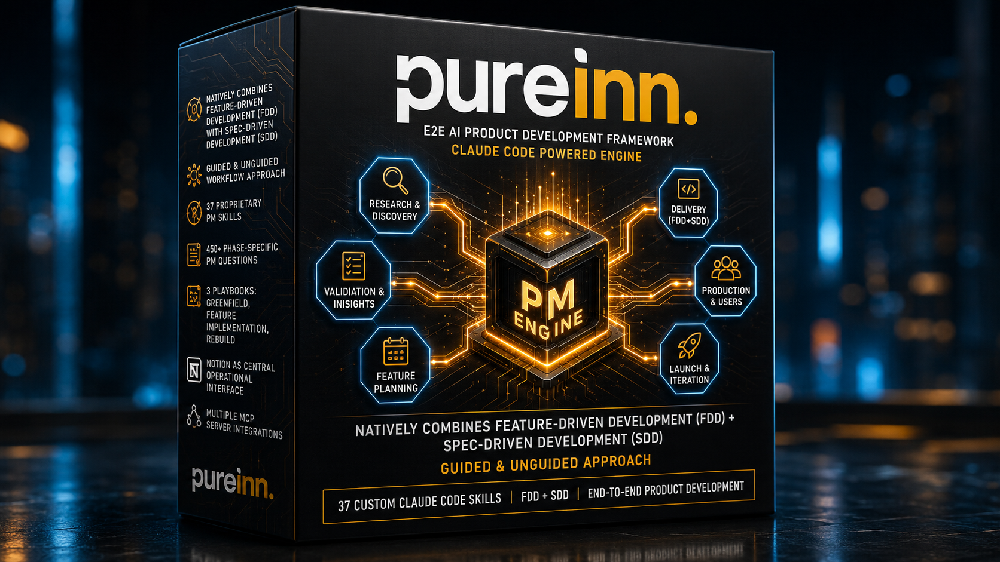

<p align="center">
  
</p>

# Pureinn - AI Product Development Framework

A structured methodology for building products - from zero to launch. Implemented as a Claude Code plugin running an AI-native execution engine.

---

## Install

```bash
/plugin marketplace add ljucask/pureinn-product-development
/plugin install pureinn-product-development@pureinn-product-development
```

---

## What this is

**50 active skills + 2 commands** covering the full product lifecycle: client discovery, discovery, validation, prototyping, stakeholder pushback rehearsal, anomaly root-cause diagnosis, domain modeling, process & user-flow mapping, feature planning, prioritization, FDD delivery, reconciliation-based rebuild, workspace health-check, team onboarding, and meeting capture.

Three playbooks:

| Playbook | Use when |
|---|---|
| Greenfield | New product, zero users, validating PMF |
| Feature Implementation | Product exists, active users, adding functionality |
| Rebuild | Product exists, active users, technical transformation *(coming soon)* |

---

## Quick start

```bash
/pureinn "your product idea"
```

Engine scans existing documents, asks 9 intake questions, selects playbook, and shows a dashboard with the ordered skills queue. Run skills one at a time. Run `/pureinn` again after each phase to advance.

```bash
/pureinn-resume [project-slug]
```

Resume a paused project. Omit slug to list all available projects.

```bash
/pureinn map
```

Full framework overview - all playbooks, phases, skills, and artifact chains.

```bash
/pureinn define                        # jump into a stage of the current project
/pureinn vezmee model                  # jump into a stage of a named project
/pureinn discover "food delivery app"  # fresh project, straight into a stage
```

Jump straight to one part of the framework with a **stage keyword** - useful when you only need Pureinn for a slice (e.g. you already did your own research and just want the `define` work). Keywords: `setup` · `discover` · `validate` · `define` · `model` · `plan` · `build` (aliases accepted). The engine checks the inputs that stage needs (offers options if something's missing - never hard-blocks), and if no workspace exists yet it scaffolds the full project first, so everything downstream keeps working. For a single artifact, run its skill directly (`/jtbd-building`, `/pm-features-list`) - no stage needed.

```bash
/pm-prd --agent          # draft the artifact autonomously, review after
```

**Agent mode (`--agent`).** Any skill can be run with `--agent` to draft its artifact autonomously from existing inputs (in a subagent, keeping your main session clean) and return a short summary you review after - instead of building it interactively. Each skill declares how it behaves: **synthesis** skills run fully, **decision** skills draft then require your review before anything is final, and a few dialogue-driven skills (stress-test, root-cause, hypotheses...) decline agent mode. Missing inputs are never invented - they're marked `[ASSUMED]` for you to fill. No flag = interactive (the default); the flag = obey.

---

## Fast Track

Skip upstream phases and go straight to spec + build. The engine detects the right path automatically after intake - or you can declare it explicitly.

### Greenfield Express
Use when: you have a validated idea, know the problem and customer, and don't need discovery.

```
/pureinn "your idea"     → workspace setup (3 questions)
/pm-entity-registry      → lean entity list + key states
/pm-business-rules-library → core rules, Draft mode
/pm-features-list        → feature inventory + FEAT-IDs
/pm-mvp-scope            → MVP scope + Delivery Stripes
/pm-feature-design [ID]  → JIT spec per feature
→ Build → Test → Release
```

Skips: Phase 1 (Foundation), Phase 2 (Discovery), Phase 3a/3b (Validation + Commercial).

---

### Feature Implementation - First Run
Use when: existing product, first time using Pureinn on this codebase.

```
/pureinn [project]       → workspace setup
/common-ground           → tech context from existing code
/pm-reverse-extract      → bootstrap domain registers + feature inventory from codebase
                           (shows what it found - you confirm or correct)
/pm-feature-design [ID]  → JIT spec for the feature you want to build
→ Build → Test → Release
```

FI delivery rules always apply: feature flags, regression suite, gradual rollout.

---

### Feature Implementation - Returning Session
Use when: Pureinn already ran on this project, context files exist.

```
/pureinn [project-slug]  → loads state.json + context
/pm-feature-design [ID]  → JIT spec directly
→ Build → Test → Release
```

If FEAT-ID doesn't exist yet: add it to `feature_list.md`, create stub card, then run `pm-feature-design`.

---

## Skill map

### Phase 1 - Foundation
| Skill | Output |
|---|---|
| `/pm-project-charter` | Project Charter, Assumptions & Risks Register |
| `/pm-team-roster` | Team Roster, Decision Rights Matrix, Skill Gap Assessment |
| `/pm-comms-charter` | Communication Charter, Meeting Rhythm |
| `/pm-stakeholder-map` | Stakeholder Map, RACI Matrix, Escalation Tree |
| `/pm-onboarding` | Role-specific Onboarding Brief for new team members (Developer, PM, Designer, Stakeholder) - product context, settled decisions, artifact map, current delivery state, who to ask |
| `/pm-meeting` | Structured meeting notes, decisions, and action items from raw notes or transcript. Auto-detects meeting type (Customer Discovery, Client/Requirements Discovery, Product Review, Planning, Strategic, Standup/Retro, Partner). Tags each action item with destination (Notion Task / Feature Card / follow-up meeting / framework skill). Pushes to Notion Meetings DB with linked tasks. |

### Phase 2 - Discovery
| Skill | Output |
|---|---|
| `/pm-tech-feasibility` | Tech Feasibility Report |
| `/pm-domain-analysis` | Domain Analysis, Legal & Regulatory Requirements |
| `/pm-market-analysis` | Market Size (TAM/SAM/SOM), Competitor Analysis, SWOT - three input paths: paste research (A), guided elicitation (B), AI-powered via OpenAI (C) |
| `/pm-personas` | Customer Segments, Personas (with Empathy Map, provenance-tracked incl. `[CLIENT-ASSERTED]`), Early Adopters Profile |
| `/jtbd-building` | JTBD Analysis, Forces Diagram (+ Commissioner Job on commissioned builds) |
| `/pm-discovery-interview` | Session agenda for a live client/user discovery session - reads what discovery already covered, targets the biggest gaps, compiles questions from its built-in discovery question bank (two planes: commissioner + real users; three user populations) |
| `/pm-discovery-report` | Client-facing Discovery Report - "what we heard, what we recommend", incremental and re-runnable across sessions; narrative companion to the internal Problem Validation Summary |
| `/pm-problem-validation` | Problem Validation Summary (Phase 2 exit) |

### Phase 3a - Validation
| Skill | Output |
|---|---|
| `/design-thinking` | Problem Statement, POV, HMW, Elevator Pitch, Validation Hypotheses draft |
| `/pm-hypotheses` | Hypothesis Register + Go/No-Go Decision (hard gate - GO required for Phase 3b) |

### Phase 3b - Commercial Definition
| Skill | Output |
|---|---|
| `/pm-kotler` | Product Definition - Kotler's Five Levels |
| `/pm-lean-canvas` | Lean Canvas (problem-focused, startups) |
| `/pm-business-model` | Business Model Canvas (optional fuller alternative for established/complex models) |
| `/pm-kpis` | North Star Metric, AARRR, OKRs |
| `/pm-business-case` | Business Case (3-year projections, Go/No-Go) |
| `/pm-product-roadmap` | Product Roadmap v1 |
| `/pm-prd` | PRD - Phase 3b exit artifact (frozen after creation) |
| `/pm-scope-brief` | Scope Brief - alternative Phase 3b exit for commissioned builds (client/exec mandate already given): what exactly gets built, Business Capabilities, edge cases `[CANDIDATE-BR]`, non-goals, acceptance criteria + Change Log. Phase 4-5 consume it exactly like a PRD |
| `/pm-pitch-deck` | Pitch Deck content brief (+ Gamma visual deck if MCP connected) |

### Phase 4 - Domain Modeling + Register Setup
| Skill | Output |
|---|---|
| `/pm-domain-model` | Domain Model, ERD (+ Excalidraw diagram if MCP connected) |
| `/pm-entity-registry` | entities.md - entity states + Mermaid state machines (Live Register 1) |
| `/pm-business-rules-library` | business_rules.md + decision_models.md in Draft mode (Live Registers 2+3) |
| `/pm-privacy-requirements` | PII Inventory, Privacy Requirements, GDPR Action Plan |
| `/pm-process-flows` | System user types + E2E process map per domain + per-user user flows connected to screens (designer/dev brief). Lean - references entity states by name. Bridge into design; feeds pm-feature-design UX. |
| `/pm-product-roadmap` | Product Roadmap v2 |

### Phase 5 - Feature Planning
| Skill | Output |
|---|---|
| `/pm-features-list` | feature_list.md (FDD Feature List, Live Register 4), KANO Analysis, V×C Matrix + stub Feature Cards |
| `/pm-prioritize` | Re-runnable backlog prioritization engine - align to roadmap, follow a directive, apply a lens, or let it propose a basis. Dependency-reconciled, non-destructive. Run at any point when priorities shift. |
| `/pm-mvp-scope` | MVP Scope, Delivery Stripes (domain-focused channels), Feature-to-Stripe assignment |
| `/pm-product-roadmap` | Product Roadmap v3 |

### Phase 6 + 7 - FDD Delivery (JIT per Feature)
| Skill | Output |
|---|---|
| `/pm-stripe` | Session orchestrator - stripe dashboard, advance feature through lifecycle (1_Backlog → 6_Shipped), Impact Analysis |
| `/pm-feature-viability` | Feature Viability Assessment (optional) - KANO, MDP scope, success metrics before JIT design |
| `/pm-feature-design` | Feature Card Sections 1-3 (JIT, per feature) - Biznis Mantinely, ACs, sequence diagram, UX/UI context |

### Cross-phase
| Skill | When |
|---|---|
| `/pm-glossary` | Start in Phase 1, update continuously |
| `/pm-diagrams` | Any phase - Domain Model Overview, User Flow, System Architecture, JTBD Forces |
| `/pm-prototype` | Any phase - validate before real build. Turns a feature / PRD initiative / whole product / slice into a tool-ready prototype spec (Lovable, v0/Vercel, Figma Make, Base44). Gate-checks whether a prototype is worth it, compiles a tool-optimized build prompt (Lovable Prompting Bible baked in), pushes via MCP or hands a paste-ready block. On re-run, captures the result and feeds it back to the Feature Card / hypothesis register. |
| `/pm-stress-test` | Before any high-stakes room - exec review, investor pitch, board meeting, budget defense, contentious feature push. Plays a specific skeptical stakeholder (investor, CFO, board, CTO, legal, DPO, sales, product lead, and more) and stress-tests your proposal in multiple rounds - not one shot. Runs a silent weakness diagnosis first, fires the sharpest questions that persona actually asks, and ends with a prep summary: what held, what's thin, unresolved blind spots, robustness score, and a pre-meeting checklist. Baked-in bank of real objections, adversarial methods (pre-mortem, red team, murder board), and failure patterns. |
| `/pm-root-cause` | When something live behaves unexpectedly - a metric dropped, churn spiked, a feature isn't adopted, conversion fell, tickets are rising. Diagnostic engine: you describe the symptom, it drills to the real root cause (not the first plausible one). Structured investigation - is it real or a measurement artifact → where does it concentrate (segment/funnel) → what changed → candidate causes across categories → 5-Whys → evidence-vs-guess → cheapest confirm test. Baked-in diagnostic methods (5 Whys, Ishikawa, change analysis, cohort, funnel, Simpson's paradox...), a 12-anomaly cause differential library, measurement-trap catalogue, and a bias/validation checklist. Ends with testable hypotheses that feed pm-hypotheses. |

### Feature Implementation - migration path
| Skill | Purpose |
|---|---|
| `/pm-reconcile` | **Rebuild playbook.** Existing code + a legacy source (BRD/FSD/domain models/wiki/spreadsheet - whatever the user points to, never hardcoded) that conflicts with the code. First plans (which areas, what order, target structure), then reconciles per layer - `/pm-reconcile domain` → `rules` → `features` - with code = structural truth, source = business logic, real conflicts asked. A closing `/pm-reconcile verify` pass re-reads the source, proves every unit was transposed, **incorporates the gaps**, and rules whether the source is safe to archive (source-disposal gate). Produces a living Reconciliation Report + Coverage Report and rebuilds the registers + feature inventory clean. Entry point when docs are stale or the team is changing. |
| `/pm-reconcile-status` | Read-only progress dashboard for a multi-session reconcile: which areas are done/pending, open divergences awaiting a team decision, source-disposal readiness, next area command. |
| `/pm-entity-registry` | Extracts entity states from existing codebase into entities.md |
| `/pm-business-rules-library` | Extracts business rules from existing codebase into business_rules.md + decision_models.md |
| `/pm-reverse-extract` | Extracts feature inventory from an existing product into Notion + local artifacts. Run instead of pm-features-list + pm-mvp-scope for products built outside the framework. |
| `/pm-audit` | **Workspace health check.** Scans the Pureinn artifacts against current conventions, finds drift/errors, fixes mechanical ones, asks about judgment calls. Migrates older-version workspaces. Run after reconcile/extract, on an older workspace, or any time before continuing. |

---

## MCP integrations

| MCP | Skills | Without MCP |
|---|---|---|
| Notion | `pm-features-list`, `pm-mvp-scope`, `pm-glossary`, `pm-domain-model`, `pm-kpis`, `pm-privacy-requirements`, `pm-reverse-extract`, `pm-reconcile`, `pm-feature-card` | Markdown artifacts only, Notion push skipped |
| Figma | `pm-feature-design` | Paste Figma URL or attach screenshot manually |
| Excalidraw | `pm-diagrams`, `pm-domain-model` | Mermaid.js output only (state machines, sequence diagrams always available) |
| Gamma | `pm-pitch-deck` | Slide content brief only |

Connect via `/mcp` in Claude Code.

**Notion setup:** Duplicate the Pureinn Notion template to your workspace, then paste the URLs into `pureinn-variables.md` when the engine creates it. See [NOTION_TEMPLATE.md](NOTION_TEMPLATE.md) for the setup guide and template link.

---

## Project output structure

```
pureinn-workspace/
  [project-slug]/
    state.json              - Current phase, playbook, completed phases, register init flags
    assessment.md           - Initial product assessment
    pureinn-variables.md    - Notion URLs per project (fill in once)
    glossary.md
    product/
      PRD_master.md         - pm-prd Phase 3b output (frozen after creation, never overwritten)
    domain/                 - Living registers (source of truth for AI during Phase 6-7)
      entities.md           - Entity states + Mermaid state machines (Live Register 1)
      business_rules.md     - Business Rules Library (Live Register 2)
      decision_models.md    - Decision Models Matrix (Live Register 3)
    features/
      feature_list.md       - FDD Feature List (Live Register 4)
      cards/
        FEAT-ORD-001.md     - Feature Cards (one per feature, 6-state lifecycle)
        FEAT-PAY-001.md
    initiatives/
      [initiative-slug]/    - One folder per major new initiative (FI Track B or scoped launch)
        discovery/          - Track B discovery outputs
        prd.md              - Initiative PRD (scoped, living)
        kano-analysis.md
        value-complexity-matrix.md
    artifacts/
      phase-1-foundation/
      phase-2-discovery/
      phase-3-define/
      phase-4-domain/
      phase-5-planning/
```

---

## Examples

The `examples/` folder contains realistic output samples showing what the framework produces in a real project scenario. Use them to calibrate expectations before running skills for the first time.

**Available examples:**

| Example | Playbook | Domain | What it shows |
|---|---|---|---|
| [saas-subscription/](examples/saas-subscription/) | Feature Implementation | Subscription Billing (Stripe) | Initiative PRD, full domain registers (entities, business rules, feature list), two Feature Cards at different lifecycle stages (6_Shipped + 3_Ready_to_Build) |

---

## Core principles

- **Impact over activity.** Decisions measured by outcome, not output.
- **Evidence over politics.** Validate before building. Research before deciding.
- **Human-in-the-loop.** Every phase requires human approval before advancing.
- **Bring your data.** Claude structures and formalizes - it does not hallucinate market data or domain facts.
- **Simplicity is a feature.** Remove everything that does not serve the user directly.
