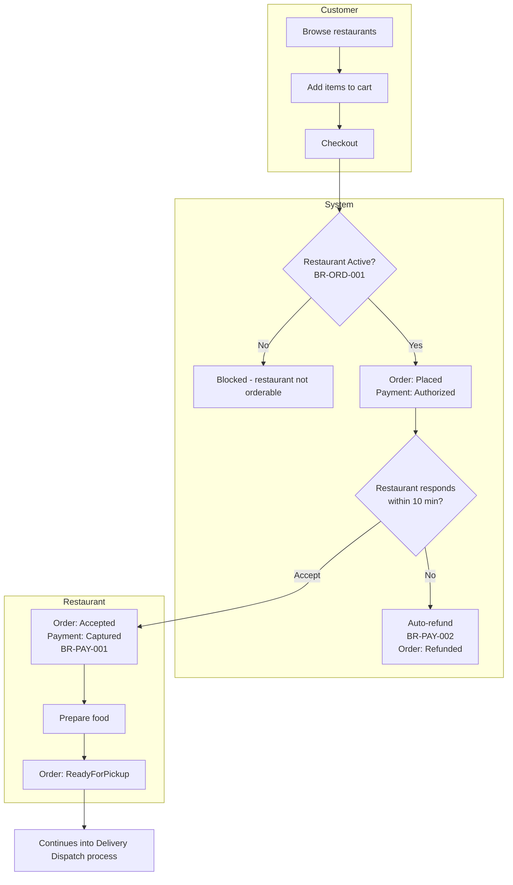
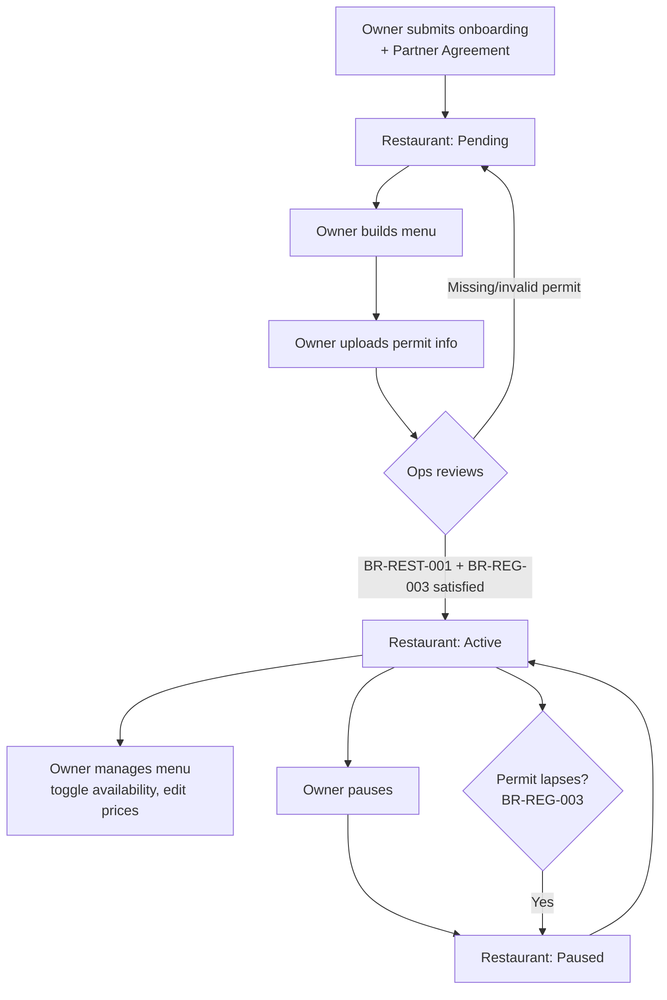
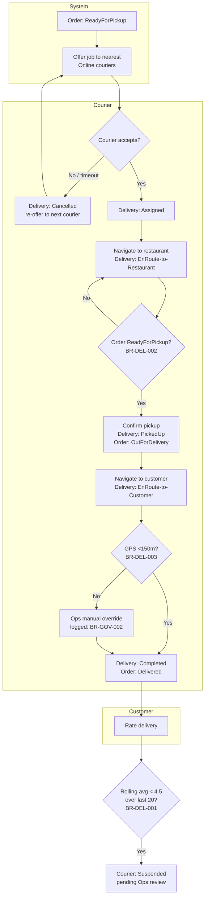
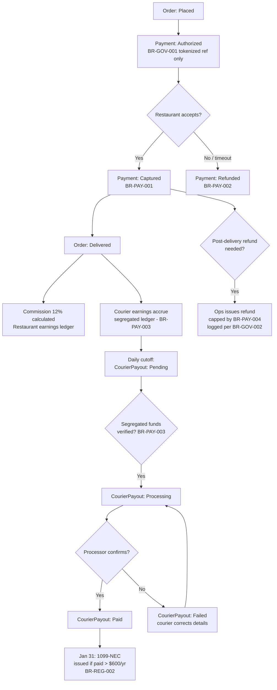
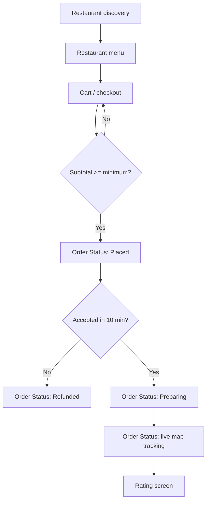
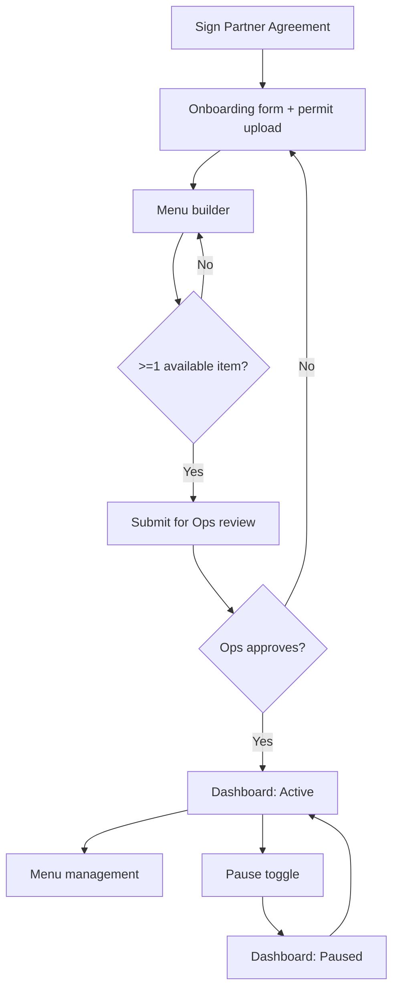
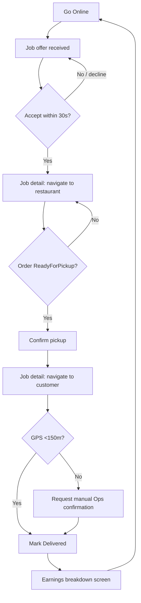
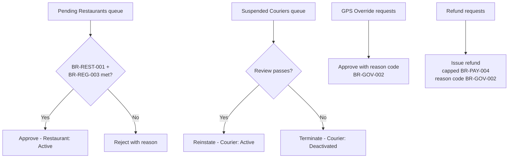

# Process Flows - PureHunger
> Source: confirmed with founding team (Sam Okonkwo, Lena Vogt, Marcus Field) against PRD Business Capabilities and `domain/entities.md`. Business + dev/design support view - references entity states and BR-IDs **by name only**, does not restate state machines or attribute lists (those live in `domain/entities.md` and `domain/business_rules.md`).

---

## 1. System User Types

## Customer
**Description:** A person who browses restaurants and places orders for delivery. Represents Maya Torres ("The Busy Professional Customer").
**Primary goals in the system:** Discover a good independent restaurant quickly, order food that arrives in a reasonable time, trust that payment is fair and pickup/delivery is honest.
**Modules touched:** Ordering, Payments (checkout only)
**Maps to persona:** Maya Torres

## Restaurant Owner/Staff
**Description:** The owner (or, post-MVP, staff) of an independent restaurant partner. Represents Daniel Osei ("The Independent Restaurant Owner").
**Primary goals in the system:** Get discovered by local customers, manage the menu accurately, keep commission and payout terms transparent and low, avoid orders the kitchen can't fulfill.
**Modules touched:** Restaurant Management, Ordering (accept/prep side), Payments (commission visibility)
**Maps to persona:** Daniel Osei

## Courier
**Description:** An independent contractor who delivers orders around their own schedule. Represents Priya Nair ("The Courier").
**Primary goals in the system:** Get clear, fair job offers; know exactly what a delivery pays before accepting; get paid daily with full transparency on the calculation.
**Modules touched:** Delivery & Dispatch, Payments (payout visibility)
**Maps to persona:** Priya Nair

## Ops/Admin
**Description:** Internal PureHunger staff (initially the founding team - Sam Okonkwo owns restaurant/courier policy decisions, Marcus Field owns onboarding relationships) who monitor the marketplace, approve onboarding, and handle exceptions.
**Primary goals in the system:** Keep the marketplace healthy (approve good restaurants/couriers, catch and resolve disputes), enforce Critical and Governance rules that require a human check (permit verification, courier reinstatement review, GPS-override, refunds).
**Modules touched:** All - Restaurant Management (approval), Delivery & Dispatch (courier review, GPS override), Payments (refunds, payout monitoring)
**Maps to persona:** N/A (internal role, not a market persona)

---

## 2. Process Maps (2A - Business View)

### Process: Order a Meal (Ordering & Checkout)
**Actors involved:** Customer, Restaurant Owner/Staff (System)
**Entities involved (by name):** Order, MenuItem, Payment - see `domain/entities.md`
**Rules that gate this process:** BR-ORD-001, BR-ORD-002, BR-ORD-004, BR-PAY-001, BR-PAY-002, BR-GOV-001

#### Happy path
1. Customer browses restaurants (filtered to Active status) and views a menu.
2. Customer adds available MenuItems to cart.
3. Customer checks out - Order moves Cart → Placed; Payment is authorized (not captured).
4. Restaurant receives the order notification and accepts within the SLA window - Order moves Placed → Accepted; Payment captures.
5. Restaurant prepares the food - Order moves Accepted → Preparing → ReadyForPickup.
6. (Continues into the Delivery Dispatch process once a courier picks up.)

#### Alternate paths
- Customer cancels while still in Placed state (before restaurant acceptance) - Order moves to Cancelled, Payment authorization released.
- Restaurant rejects the order explicitly (not just non-response) - same effect as timeout: Order refunded.

#### Edge cases
- Restaurant does not respond within the SLA window - system auto-refunds (BR-PAY-002), Order moves to Refunded.
- A MenuItem the customer wants to add is unavailable (BR-ORD-002) - blocked at cart level, not at checkout.
- Cart subtotal below the restaurant's minimum (BR-ORD-004) - checkout blocked with a message showing the required minimum to unlock checkout.

#### Constraints
- Restaurant must be Active to receive new orders (BR-ORD-001).
- 10-minute acceptance SLA is platform-fixed, not restaurant-configurable (BR-PAY-002).
- Payment is authorized at placement but never captured before acceptance (BR-PAY-001) - this is the platform's core trust commitment to customers.

#### Diagram

---

### Process: Onboard a Restaurant and Manage the Menu (Restaurant Onboarding & Menu Management)
**Actors involved:** Restaurant Owner/Staff, Ops/Admin
**Entities involved (by name):** Restaurant, MenuItem - see `domain/entities.md`
**Rules that gate this process:** BR-REST-001, BR-REG-003, BR-REST-002

#### Happy path
1. Restaurant owner (e.g. Daniel Osei) signs the Restaurant Partner Agreement and submits onboarding details - Restaurant created in Pending state.
2. Owner builds the initial menu, marking at least one MenuItem available.
3. Owner uploads food-service permit information.
4. Ops reviews and approves - Restaurant moves Pending → Active (requires BR-REST-001 + BR-REG-003 both satisfied).
5. Owner manages menu day-to-day: toggling item availability, adjusting prices (does not affect already-placed orders, per `OrderLineItem` price-snapshot design in `domain/domain_model.md`).

#### Alternate paths
- Owner pauses the restaurant temporarily (e.g. short-staffed) - Restaurant Active → Paused, resumes later.
- Ops rejects onboarding (permit missing/invalid) - Restaurant stays Pending, owner corrects and resubmits.

#### Edge cases
- Restaurant's actual prep time drifts from its declared estimate over 20 orders (BR-REST-002) - system prompts redeclaration; suppressed during the first 14 days post-activation.
- Restaurant's permit lapses - Restaurant auto-transitions Active → Paused (not Deactivated) pending renewal, per BR-REG-003.
- Owner tries to reactivate from Paused with zero available MenuItems - blocked, same guard as initial activation (BR-REST-001).

#### Constraints
- At least one available MenuItem required to be Active (BR-REST-001).
- Valid food-service permit required to be Active, re-verified annually (BR-REG-003).
- Commission rate changes require 30 days written notice (BR-REG-001) - handled in the post-MVP admin commission tool, not this process.

#### Diagram

---

### Process: Dispatch and Track a Delivery (Delivery Dispatch & Tracking)
**Actors involved:** Courier, Customer, Ops/Admin (System)
**Entities involved (by name):** Order, Delivery, Courier - see `domain/entities.md`
**Rules that gate this process:** BR-DEL-001, BR-DEL-002, BR-DEL-003, BR-GOV-002

#### Happy path
1. Order reaches ReadyForPickup - dispatch system offers the job to the nearest Online, Active couriers.
2. A courier (e.g. Priya Nair) accepts - Delivery created in Assigned state.
3. Courier navigates to the restaurant - Delivery moves to EnRoute-to-Restaurant.
4. Courier confirms pickup (only allowed once Order is ReadyForPickup, BR-DEL-002) - Delivery moves to PickedUp; Order moves to OutForDelivery.
5. Courier navigates to the customer - Delivery moves to EnRoute-to-Customer.
6. Courier marks delivered, confirmed by GPS proximity (BR-DEL-003) - Delivery moves to Completed; Order moves to Delivered.
7. Customer rates the delivery - rating feeds the courier's rolling average (BR-DEL-001).

#### Alternate paths
- Courier declines or times out on the job offer - Delivery moves to Cancelled, dispatch creates a new Delivery record and offers to the next courier.
- GPS proximity check fails at drop-off (e.g. dense downtown Boise building) - Ops manually overrides with a logged reason (BR-DEL-003 + BR-GOV-002 audit logging).

#### Edge cases
- Courier's rolling rating average drops below 4.5 over the last 20 deliveries - automatic suspension (BR-DEL-001), pending Ops manual review before reinstatement.
- Courier attempts to confirm pickup before the restaurant has marked the Order ReadyForPickup - blocked (BR-DEL-002), prevents inaccurate pickup timestamps.

#### Constraints
- One active (non-terminal) Delivery per Order at a time.
- GPS-confirmed proximity <150m required for completion, or a logged Ops override (BR-DEL-003).
- Every Ops override is logged with actor, reason, and timestamp (BR-GOV-002) - no silent overrides.

#### Diagram

---

### Process: Pay Customers, Restaurants, and Couriers (Payments & Payouts)
**Actors involved:** Customer, Restaurant Owner/Staff, Courier, Ops/Admin (System)
**Entities involved (by name):** Payment, CourierPayout, Order, Delivery - see `domain/entities.md`
**Rules that gate this process:** BR-PAY-001, BR-PAY-002, BR-PAY-003, BR-PAY-004, BR-GOV-001, BR-REG-002

#### Happy path
1. Payment authorized at Order placement, captured on restaurant acceptance (BR-PAY-001) - see Ordering process above for detail.
2. On Order Delivered, the restaurant's 12% commission is calculated against the captured amount and reflected in the restaurant's earnings ledger (visible in Restaurant Management dashboard).
3. Each completed Delivery's courier earnings ($4 base + $1.25/mile + 100% of tip) accrue in a segregated ledger account (BR-PAY-003).
4. At daily cutoff, a CourierPayout batch is created (Pending), submitted to the payment processor (Processing, guarded by BR-PAY-003's segregated-funds check), and confirmed Paid.
5. Annually, couriers paid over $600 in the calendar year receive a 1099-NEC by January 31 (BR-REG-002).

#### Alternate paths
- Ops issues a full or partial refund post-delivery (e.g. quality complaint) - capped at the originally captured amount (BR-PAY-004), logged per BR-GOV-002.

#### Edge cases
- Restaurant declines/times out an order before capture - Payment authorization released, no funds ever move (see Ordering process Edge cases).
- Payout batch submission fails (e.g. bad bank details on file) - CourierPayout moves to Failed, courier is prompted to correct details, Ops retries the batch.

#### Constraints
- Payment must never be captured before restaurant acceptance (BR-PAY-001) - no exceptions.
- Refunds can never exceed the captured amount (BR-PAY-004).
- Courier-owed funds must sit in a segregated ledger until the payout batch actually pays out (BR-PAY-003).
- No raw card data is ever stored - only the processor's tokenized reference (BR-GOV-001).
- 1099-NEC issuance deadline (January 31) is a fixed federal requirement, not adjustable (BR-REG-002).

#### Diagram

---

## 3. User Flows (2B - Designer Brief)

### Customer - Order a Meal
**Goal:** Find a good independent restaurant nearby and get food delivered without overpaying or waiting on an unresponsive kitchen.
**Entry point:** App home screen (post-login)

#### Happy path (step → screen → UI behaviour)
| Step | User action | Screen / element | System & UI response |
|---|---|---|---|
| 1 | Opens app | Restaurant discovery screen | Loading skeleton → list of Active restaurants near Boise, ID renders; empty state if none in range |
| 2 | Taps a restaurant | Restaurant menu screen | MenuItems load; unavailable items shown greyed out and non-tappable (BR-ORD-002) |
| 3 | Adds items to cart | Menu screen, cart drawer | Cart badge count updates; running subtotal shown |
| 4 | Taps "Checkout" | Cart / checkout screen | If subtotal < restaurant minimum (BR-ORD-004): inline banner "Add $X more to checkout" and CTA disabled; else proceeds |
| 5 | Confirms payment method + taps "Place Order" | Checkout screen | Optimistic transition to Order Status screen; Payment authorized (not captured) - no "charged" language shown yet |
| 6 | Watches order status | Order Status screen | Live status updates: "Waiting for restaurant confirmation" → progress bar with 10-min countdown |
| 7 | Sees "Restaurant accepted!" | Order Status screen | Status updates to "Preparing"; push notification sent (EXT-003) |
| 8 | Sees "Courier picked up" / live map | Order Status screen | Live courier location on map (EXT-002 RouteEstimate), ETA shown |
| 9 | Receives order, rates delivery | Rating screen | Star rating (1-5) + optional comment; submits, returns to home |

#### Alternate paths
- Restaurant doesn't respond in 10 minutes → Order Status screen shows "No response - refunded automatically" (BR-PAY-002), full refund confirmation, no customer action needed.
- Customer cancels while still "Placed" → cancel button visible only in that state (BR-ORD-003); disappears once "Preparing" begins.

#### Edge cases
- Item goes unavailable while in cart (restaurant toggles it off mid-browse) → cart auto-flags the item at checkout with "No longer available - remove to continue."
- Network drop mid-checkout → checkout screen shows retry state, does not double-submit the order.

#### Constraints
- Cannot cancel once Restaurant has accepted (BR-ORD-003) - checkout screen and order-status screen never show a cancel CTA past that point.

#### Loading & Empty states
- **Loading:** Skeleton cards on restaurant discovery; spinner on menu load; progress bar (not spinner) on order status once Placed, since a countdown is more informative than an indeterminate spinner.
- **Empty:** No restaurants in range → "No restaurants near you yet - we're expanding! " with a waitlist CTA.
- **Error:** Payment authorization failure → inline error on checkout, cart preserved, no order created.

#### Diagram

> Screen-level wireframes are out of scope here - hand this brief to the designer (impeccable / Figma). The live-map tracking screen (step 8) needs a dedicated detail diagram given its real-time state complexity.

---

### Restaurant Owner/Staff - Onboard and Manage Menu
**Goal:** Get listed on PureHunger and keep the menu accurate without babysitting it constantly.
**Entry point:** Restaurant Partner web portal, "Get Started" flow

#### Happy path (step → screen → UI behaviour)
| Step | User action | Screen / element | System & UI response |
|---|---|---|---|
| 1 | Signs Restaurant Partner Agreement | Partner Agreement screen | E-signature captured; proceeds to onboarding form |
| 2 | Fills restaurant details + uploads permit | Onboarding form | Inline validation on required fields; permit upload shows file preview |
| 3 | Builds menu (name, price, at least 1 item marked available) | Menu builder screen | Live preview of how the menu appears to customers; "Publish" disabled until BR-REST-001 satisfied (at least 1 available item) |
| 4 | Submits for review | Onboarding summary screen | Status badge: "Pending Ops review" |
| 5 | Gets approved | Restaurant dashboard | Push/email notification "You're live!"; dashboard now shows "Active" status and live order feed |
| 6 | Manages menu day-to-day | Menu management screen | Toggle switches per item for availability; price edits save instantly, apply only to future orders (OrderLineItem snapshot preserves historical prices) |

#### Alternate paths
- Ops rejects onboarding (permit issue) → onboarding summary screen shows "Action needed: permit not valid" with resubmit CTA; stays Pending.
- Owner pauses restaurant (e.g. short-staffed) → one-tap "Pause orders" toggle on dashboard; status badge updates to "Paused," new orders stop, existing orders unaffected.

#### Edge cases
- Owner tries to resume from Paused with zero available items → resume button shows tooltip "Add at least 1 available menu item to reopen" (BR-REST-001).
- Prep-time redeclaration prompt (BR-REST-002) appears as a dashboard banner, not a blocking modal - owner can dismiss and address later, but banner persists until addressed.

#### Constraints
- Cannot go Active without both a valid permit (BR-REG-003) and ≥1 available MenuItem (BR-REST-001) - dashboard shows both as a checklist during Pending.

#### Loading & Empty states
- **Loading:** Menu builder shows skeleton rows while restaurant data loads.
- **Empty:** New restaurant with no menu items yet → menu management screen shows "Add your first dish" empty state with CTA.
- **Error:** Permit upload failure (file too large/wrong format) → inline error under upload field, does not block the rest of the form.

#### Diagram

---

### Courier - Accept and Deliver a Job
**Goal:** See clear job offers with transparent pay, deliver safely, get paid daily.
**Entry point:** Courier app, "Go Online" toggle

#### Happy path (step → screen → UI behaviour)
| Step | User action | Screen / element | System & UI response |
|---|---|---|---|
| 1 | Taps "Go Online" | Courier home screen | Availability set to Online; job-offer listener starts |
| 2 | Receives a job offer | Job offer modal | Shows pickup/dropoff distance, estimated pay breakdown ($4 base + $1.25/mile + tip), 30-second countdown to respond |
| 3 | Taps "Accept" | Job offer modal → Job detail screen | Optimistic accept; if job was taken by another courier in the same instant, error toast "Job no longer available" + returns to home |
| 4 | Navigates to restaurant | Job detail screen, map view | Turn-by-turn navigation (EXT-002); "Confirm Pickup" CTA greyed out until order is ReadyForPickup (BR-DEL-002), with live status text "Waiting for restaurant to finish preparing" |
| 5 | Confirms pickup | Job detail screen | CTA becomes enabled once ReadyForPickup; tap transitions to drop-off navigation |
| 6 | Navigates to customer | Job detail screen, map view | Turn-by-turn navigation; "Mark Delivered" CTA active only within GPS proximity (BR-DEL-003) |
| 7 | Marks delivered | Job detail screen | Confirmation screen shows trip earnings breakdown; returns to home, ready for next offer |

#### Alternate paths
- Courier declines the job offer or lets the countdown expire → offer withdrawn, sent to next-nearest courier; no penalty for occasional declines.
- GPS proximity check fails at drop-off (e.g. tall downtown building) → "Mark Delivered" stays disabled; in-app "Request manual confirmation" option routes to Ops queue (logged override, BR-DEL-003 + BR-GOV-002).

#### Edge cases
- Courier's rolling rating drops below 4.5 over the last 20 deliveries (BR-DEL-001) → next app open shows a full-screen "Account under review" state; cannot go Online until Ops completes manual review.
- Courier tries to confirm pickup before the kitchen marks ready → CTA stays disabled with the waiting-state text from step 4, not a rejected tap (prevents confusion/frustration).

#### Constraints
- Can only hold one active job at a time - "Go Online" and new job offers are suppressed while a Delivery is in progress.

#### Loading & Empty states
- **Loading:** Map/navigation view shows route-loading spinner while EXT-002 resolves.
- **Empty:** No job offers currently available while Online → home screen shows "Looking for jobs near you..." with a subtle pulsing indicator, not a static "no jobs" dead-end.
- **Error:** Navigation service unreachable → falls back to a static address + "Open in Maps" external-app link.

#### Diagram

---

### Ops/Admin - Approve Onboarding and Handle Exceptions
**Goal:** Keep the marketplace healthy - approve legitimate restaurants/couriers quickly, resolve the exceptions the system correctly refuses to handle automatically.
**Entry point:** Internal Ops console

#### Happy path (step → screen → UI behaviour)
| Step | User action | Screen / element | System & UI response |
|---|---|---|---|
| 1 | Opens review queue | Ops console - Pending Restaurants tab | List of restaurants awaiting approval, permit status flagged per row |
| 2 | Reviews a restaurant's permit + menu | Restaurant review detail | Shows uploaded permit doc, menu preview, checklist of BR-REST-001 / BR-REG-003 status |
| 3 | Approves | Restaurant review detail | Restaurant → Active; notification sent to owner |
| 4 | Reviews a suspended courier (BR-DEL-001 trigger) | Courier review queue | Shows last 20 delivery ratings, trend chart, any prior review history |
| 5 | Reinstates or terminates | Courier review detail | Action requires a reason code (BR-GOV-002); Courier → Active or → Deactivated |
| 6 | Handles a GPS-override request from a courier | Delivery override queue | Shows courier's location, dropoff address, distance gap; approve requires reason code (BR-GOV-002) |
| 7 | Issues a refund | Order detail / refund tool | Refund amount field capped at remaining captured amount (BR-PAY-004); requires reason code |

#### Alternate paths
- Rejects a restaurant application → sends specific rejection reason (permit / menu quality / other) back to owner's onboarding screen.

#### Edge cases
- A courier's override-request rate is unusually high (fraud signal) → flagged automatically on the courier review screen with a warning badge, surfaced before Ops approves any further overrides for that courier.

#### Constraints
- No override action (GPS confirmation, refund, courier reinstatement) can be submitted without a reason code - the submit button stays disabled until one is selected (BR-GOV-002).

#### Loading & Empty states
- **Loading:** Queue tables show skeleton rows while loading.
- **Empty:** No pending reviews → "All caught up" state, not a blank table.
- **Error:** Action submission fails (e.g. network) → inline retry, queue item stays in the list (not silently dropped).

#### Diagram

> Screen-level wireframes are out of scope here - hand this brief to the designer (impeccable / Figma). The Ops console is internal tooling and can prioritize density/speed over visual polish.

---

## 4. Coverage Cross-Check

**Every process step has an owner:** Confirmed across all four 2A process maps - each step names Customer, Restaurant Owner/Staff, Courier, Ops/Admin, or System explicitly (e.g. the 10-minute auto-refund timeout in the Ordering process is owned by System, not left ambiguous).

**Every user-type goal has a flow:** Confirmed against Section 1 - Customer's goal (discover + order) is served by the Customer flow; Restaurant Owner/Staff's goal (get discovered + manage menu) is served by the Restaurant flow; Courier's goal (clear offers + fair transparent pay) is served by the Courier flow; Ops/Admin's goal (marketplace health + exception handling) is served by the Ops flow. No orphaned goals, no flow serving an unstated goal.

---

## Handoff

**Čo si teraz má:** Katalóg 4 systémových typov používateľov + E2E procesnú mapu pre všetky 4 business capabilities (business view) + 4 user flows napojené na obrazovky (designer brief) - happy/alternate/edge/constraints všade, 2B navyše s UI response a loading/empty states. Lean - stavy a atribúty referencované len po mene z `domain/entities.md`.

**Ďalší krok:**
- Dizajnér: user-flow sekcie vyššie sú brief na kreslenie obrazoviek (impeccable / Figma) - live-map tracking (Customer) a Ops console (Ops/Admin) sú flagované ako potrebujúce dedikovaný detail diagram.
- `/pm-feature-design FEAT-ORD-001` alebo `/pm-feature-design FEAT-DEL-002` — UX kontext (Section 3b) čerpá z príslušného user flow vyššie.

**Môžeš preskočiť ak:** Modul je čisto backend/API bez používateľského toku - neplatí tu, všetky 4 capabilities PureHunger majú silný user-facing povrch.
