# Domain Model - PureHunger

**Version:** 1.0 (final)
**Date:** 2026-03-02
**Status:** Confirmed - Stage 1 + Stage 2 complete

---

## 1. Business Domains

| Domain | Responsibility | Key entities |
|---|---|---|
| Identity & Accounts | Customer accounts, authentication, profile | Customer |
| Restaurant Management | Restaurant onboarding, menu management, availability | Restaurant, MenuItem |
| Ordering | Cart, checkout, order lifecycle from placement to delivered | Order, OrderLineItem |
| Delivery & Dispatch | Courier accounts, job assignment, live delivery execution | Courier, Delivery |
| Payments & Payouts | Customer payment capture/refunds, daily courier payouts | Payment, CourierPayout |

These five domains map directly onto the four Business Capabilities in `product/PRD_master.md` (Identity & Accounts is a cross-cutting fifth domain that the PRD folds into Ordering & Checkout, since PureHunger has no standalone account-management capability at MVP):

| PRD Business Capability | Domain(s) |
|---|---|
| Ordering & Checkout | Ordering (+ Identity & Accounts) |
| Restaurant Onboarding & Menu Management | Restaurant Management |
| Delivery Dispatch & Tracking | Delivery & Dispatch |
| Payments & Payouts | Payments & Payouts |

---

## 2. Domain Boundaries

**Principles:**
- Each entity has one owner domain - the source of truth. `Order` owns its own lifecycle; `Payment` and `Delivery` reference it by ID, they do not duplicate its state.
- Domains communicate via references (IDs) and events, not direct data access. Delivery & Dispatch never writes to `Order` directly - it emits `delivery.*` events that the Ordering domain's Order state machine reacts to (e.g. `delivery.completed` drives `Order: OutForDelivery → Delivered`).
- Boundary smell test: if two domains constantly need each other's data synchronously to do anything, the boundary is drawn wrong. Ordering and Payments pass this test - Ordering triggers a capture via `order.accepted`, Payments reports back via `payment.captured` / `payment.failed`; neither reads the other's tables directly.
- Restaurant Management does not own pricing or commission logic - the 12% commission rate and payout math live in Payments & Payouts (BR-REG-001, BR-PAY-003), even though the rate is a restaurant-facing figure.
- Delivery & Dispatch does not own payment amounts - a Courier's per-delivery earnings ($4 base + $1.25/mile + 100% tips) are computed in Payments & Payouts from the `Delivery`'s distance and the `Order`'s tip, not stored redundantly on `Delivery`.

---

## 3. High-Level Domain Diagram

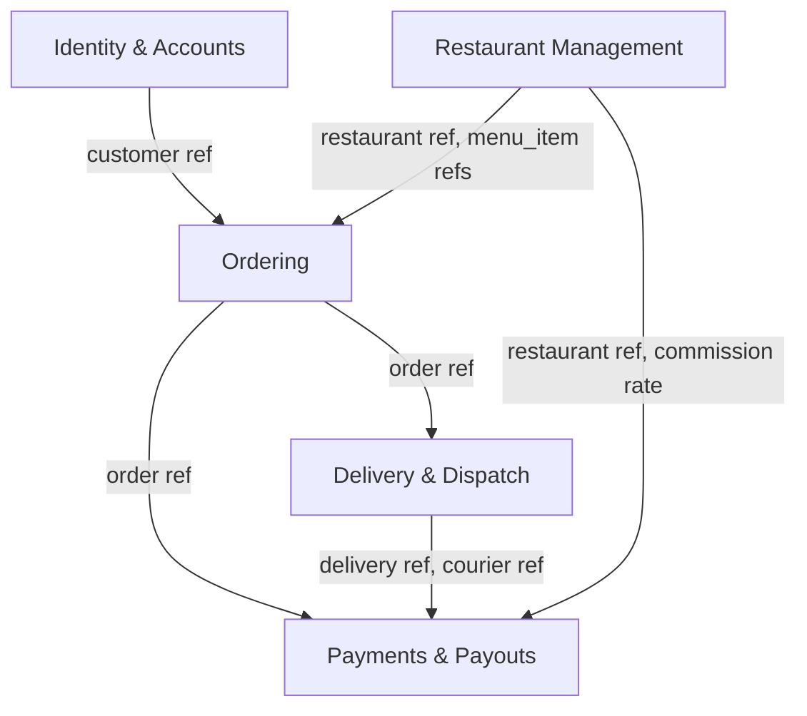
```mermaid
graph TD
  Identity[Identity & Accounts] -->|customer ref| Ordering[Ordering]
  RestMgmt[Restaurant Management] -->|restaurant ref, menu_item refs| Ordering
  Ordering -->|order ref| Delivery[Delivery & Dispatch]
  Ordering -->|order ref| Payments[Payments & Payouts]
  Delivery -->|delivery ref, courier ref| Payments
  RestMgmt -->|restaurant ref, commission rate| Payments
```

---

## 4. Entity Catalogue

### Internal Entities

| ID | Entity | Domain | Description |
|---|---|---|---|
| ENT-001 | Customer | Identity & Accounts | A person who browses restaurants and places orders |
| ENT-002 | Restaurant | Restaurant Management | An independent restaurant partner listed on PureHunger |
| ENT-003 | MenuItem | Restaurant Management | A single sellable dish/product belonging to a Restaurant |
| ENT-004 | Order | Ordering | A customer's order for one or more MenuItems from one Restaurant |
| ENT-005 | OrderLineItem | Ordering | A snapshot record of one MenuItem's name/price/qty at the moment it was ordered |
| ENT-006 | Courier | Delivery & Dispatch | An independent contractor who delivers Orders |
| ENT-007 | Delivery | Delivery & Dispatch | The courier-facing execution record tied 1:1 to an Order once a courier accepts it |
| ENT-008 | Payment | Payments & Payouts | The financial transaction (auth → capture → refund) tied 1:1 to an Order |
| ENT-009 | CourierPayout | Payments & Payouts | A daily batch payout record aggregating a Courier's completed Deliveries |

### External / Integration Entities

| ID | Entity | Source system | Description |
|---|---|---|---|
| EXT-001 | StripePaymentIntent | Stripe | Payment intent object - backs Payment.Authorized/Captured/Refunded; source of the tokenized card reference (BR-GOV-001) |
| EXT-002 | RouteEstimate | Mapbox Directions API | Distance/ETA between restaurant, courier, and customer - drives the $1.25/mile courier pay component and live tracking |
| EXT-003 | NotificationDispatch | Twilio (SMS) / OneSignal (push) | Order-status and delivery-status notifications to Customer, Restaurant, and Courier |

### Entities Flagged as TBD

| Entity | Why flagged | Priority |
|---|---|---|
| RestaurantReview | Customer-facing restaurant ratings/reviews to help discovery of independent spots - not in MVP ordering loop | Medium (post-MVP, supports the "hard to discover good independent spots" problem statement) |
| RestaurantStaffAccount | MVP models one owner login per Restaurant; multi-staff logins (kitchen staff, multiple locations) deferred | Low (post-MVP) |
| PureHungerPlusSubscription | Subscription tier ($6.99/mo, free delivery over $15) named in business model as post-MVP | Low (post-MVP, explicitly out of scope per brief) |

---

## Confirmation Checkpoint

Reviewed and confirmed:
1. Domains - five domains, four map 1:1 to PRD Business Capabilities; Identity & Accounts is intentionally thin (single Customer entity) since PureHunger has no separate account-management capability at MVP.
2. Entity list is complete for the MVP ordering loop (browse → cart → checkout → accept → deliver → rate). `OrderLineItem` was added beyond the brief's core list to model priced snapshots correctly (menu prices can change after an order is placed - the line item freezes price/name at order time).
3. External entities: Stripe, Mapbox, and the notification provider are correctly external - PureHunger owns no data model for them beyond the reference ID.

---

## ENT-001: Customer

**Domain:** Identity & Accounts
**Description:** A person who has created a PureHunger account to browse restaurants and place orders. Represents personas like Maya Torres ("The Busy Professional Customer").

### Attributes

| Attribute | Type | Required | Description | Notes |
|---|---|---|---|---|
| `id` | UUID | Yes | Unique identifier | PK |
| `created_at` | Timestamp | Yes | Record creation time | |
| `updated_at` | Timestamp | Yes | Last modification time | |
| `email` | String | Yes | Login + notification address | Unique |
| `phone` | String | Yes | SMS delivery notifications | |
| `default_address_id` | UUID | No | Saved delivery address | |
| `payment_method_token` | String | No | Tokenized reference to Stripe payment method | Never a raw card number - BR-GOV-001 |
| `status` | Enum | Yes | `active`, `deactivated` | |

### Identifiers

| Type | Attribute |
|---|---|
| Primary Key | `id` |
| Business Key | `email` |
| External ID | N/A |

### Relationships

| Relationship | Target | Type | Cardinality | Description |
|---|---|---|---|---|
| Has many | ENT-004 Order | Association | 1:N | A customer can place many orders |

### States (if entity has a lifecycle)

Simple entity - no full lifecycle state machine. `status` is a flat flag (`active` / `deactivated`), not a modeled business process; behavior does not meaningfully branch beyond "can log in" vs. "cannot log in."

### Events

| Event | Trigger | Payload fields |
|---|---|---|
| `customer.registered` | Sign-up completes | `customer_id`, `email` |
| `customer.deactivated` | Self-service closure or Ops action (BR-GOV) | `customer_id`, `reason` |

### Notes

Restaurant Owner/Staff and Courier are not modeled as Customer sub-types - they are their own top-level entities (Restaurant, Courier) since their business lifecycles are entirely different (Pending/Active/Paused vs. Applied/Active/Suspended). Admin/Ops is a system role with no dedicated domain entity at MVP - see `process-flows.md` for the Ops/Admin user type.

---

## ENT-002: Restaurant

**Domain:** Restaurant Management
**Description:** An independent restaurant partner (e.g. Daniel Osei's West African restaurant) listed on PureHunger. Owns its menu and controls its own availability.

### Attributes

| Attribute | Type | Required | Description | Notes |
|---|---|---|---|---|
| `id` | UUID | Yes | Unique identifier | PK |
| `created_at` | Timestamp | Yes | Record creation time | |
| `updated_at` | Timestamp | Yes | Last modification time | |
| `name` | String | Yes | Public-facing restaurant name | |
| `owner_customer_id` | UUID | No | FK to the owner's login (MVP: reuses Customer login schema for the single owner account) | |
| `cuisine_type` | String | Yes | e.g. "West African" | Used in discovery/search |
| `commission_rate` | Decimal | Yes | Default `0.12` (12%) | BR-REG-001 governs changes |
| `avg_prep_time_minutes` | Integer | Yes | Declared prep time estimate | BR-REST-002 |
| `status` | Enum | Yes | `pending`, `active`, `paused`, `deactivated` | |
| `city` | String | Yes | Launch market: Boise, ID | |

### Identifiers

| Type | Attribute |
|---|---|
| Primary Key | `id` |
| Business Key | `name` + `city` |
| External ID | N/A |

### Relationships

| Relationship | Target | Type | Cardinality | Description |
|---|---|---|---|---|
| Has many | ENT-003 MenuItem | Ownership | 1:N | A restaurant owns its menu items |
| Has many | ENT-004 Order | Association | 1:N | A restaurant receives many orders |

### States (if entity has a lifecycle)

| State | Description | Entry conditions |
|---|---|---|
| Pending | Onboarded but not yet visible to customers | Restaurant Partner Agreement signed, awaiting Ops approval |
| Active | Live and orderable | Ops approves (BR-REST-001: at least 1 available MenuItem; BR-REG-003: permit on file) |
| Paused | Temporarily hidden, orders blocked | Owner or Ops pauses (e.g. kitchen closed, understaffed) |
| Deactivated | Permanently removed from platform | Owner closes account or Ops terminates for policy violation |

**State transitions:**
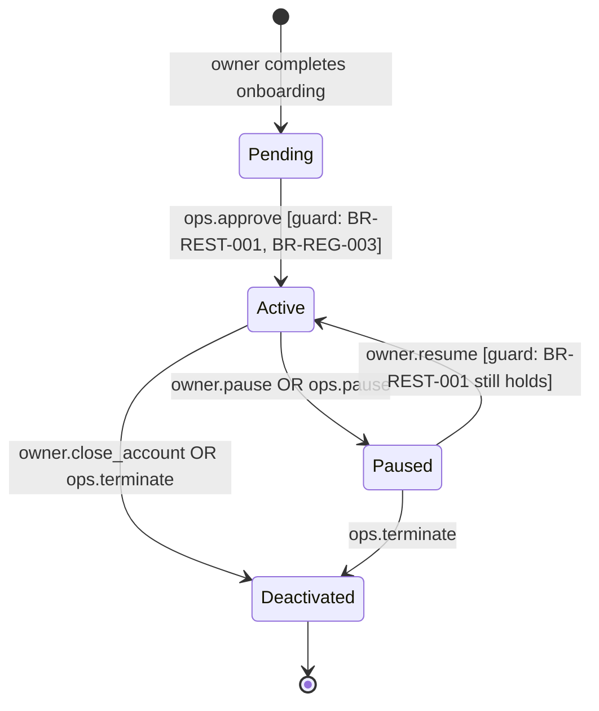
```mermaid
stateDiagram-v2
    [*] --> Pending : owner completes onboarding
    Pending --> Active : ops.approve [guard: BR-REST-001, BR-REG-003]
    Active --> Paused : owner.pause OR ops.pause
    Paused --> Active : owner.resume [guard: BR-REST-001 still holds]
    Active --> Deactivated : owner.close_account OR ops.terminate
    Paused --> Deactivated : ops.terminate
    Deactivated --> [*]
```

### Events

| Event | Trigger | Payload fields |
|---|---|---|
| `restaurant.activated` | Pending → Active | `restaurant_id`, `activated_at` |
| `restaurant.paused` | Active → Paused | `restaurant_id`, `reason` |
| `restaurant.deactivated` | → Deactivated | `restaurant_id`, `reason`, `terminated_by` |

### Enums

| Enum | Values | Description |
|---|---|---|
| `status` | `pending`, `active`, `paused`, `deactivated` | Lifecycle state |

### Derived Fields

| Field | Derived from | Business meaning |
|---|---|---|
| `avg_actual_prep_time` | Rolling average of Order `Preparing → ReadyForPickup` durations | Compared against declared `avg_prep_time_minutes` per BR-REST-002 |

### ERD Diagram

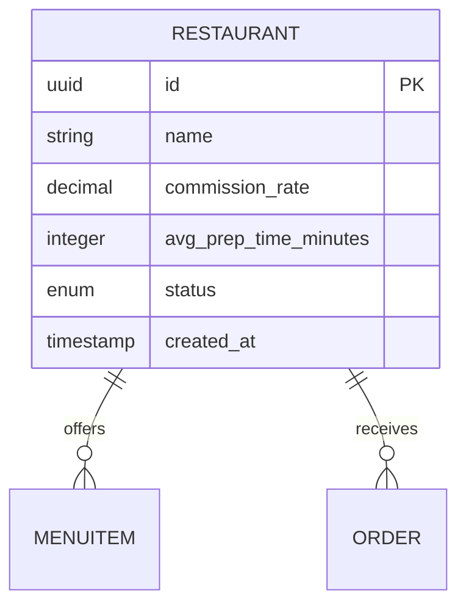
```mermaid
erDiagram
  RESTAURANT {
    uuid id PK
    string name
    decimal commission_rate
    integer avg_prep_time_minutes
    enum status
    timestamp created_at
  }
  RESTAURANT ||--o{ MENUITEM : "offers"
  RESTAURANT ||--o{ ORDER : "receives"
```

### Notes

`Active` while `Paused` looks similar at first glance - but they are not twins: `Paused` blocks new orders while preserving the menu and settings so the owner can resume in one tap, whereas `Deactivated` is a terminal removal requiring re-onboarding. This passes the behavior test (different allowed actions in each state).

---

## ENT-003: MenuItem

**Domain:** Restaurant Management
**Description:** A single sellable dish belonging to a Restaurant. Toggled available/unavailable by the owner (e.g. "sold out today"), not a full business-lifecycle entity.

### Attributes

| Attribute | Type | Required | Description | Notes |
|---|---|---|---|---|
| `id` | UUID | Yes | Unique identifier | PK |
| `created_at` | Timestamp | Yes | Record creation time | |
| `updated_at` | Timestamp | Yes | Last modification time | |
| `restaurant_id` | UUID | Yes | FK to owning Restaurant | |
| `name` | String | Yes | Dish name | |
| `price` | Decimal | Yes | Current price | Snapshotted onto OrderLineItem at order time |
| `is_available` | Boolean | Yes | Availability toggle | BR-ORD-002 |

### Identifiers

| Type | Attribute |
|---|---|
| Primary Key | `id` |
| Business Key | `restaurant_id` + `name` |
| External ID | N/A |

### Relationships

| Relationship | Target | Type | Cardinality | Description |
|---|---|---|---|---|
| Belongs to | ENT-002 Restaurant | Ownership | N:1 | A menu item belongs to exactly one restaurant |
| Referenced by | ENT-005 OrderLineItem | Derivation | 1:N | Each order line item snapshots one menu item at order time |

### States (if entity has a lifecycle)

Simple entity - value object with a single boolean toggle (`is_available`), not a state machine. Behavior only branches on one axis (can/cannot be added to cart, per BR-ORD-002) so a full lifecycle diagram would be over-modeling.

### Events

| Event | Trigger | Payload fields |
|---|---|---|
| `menu_item.availability_changed` | Owner toggles `is_available` | `menu_item_id`, `restaurant_id`, `is_available` |

### Notes

Price changes do not retroactively affect Orders already placed - see ENT-005 OrderLineItem, which exists specifically to freeze price/name at order time.

---

## ENT-004: Order

**Domain:** Ordering
**Description:** A customer's order for one or more MenuItems from one Restaurant. The central entity of the MVP ordering loop (FEAT-ORD-001).

### Attributes

| Attribute | Type | Required | Description | Notes |
|---|---|---|---|---|
| `id` | UUID | Yes | Unique identifier | PK |
| `created_at` | Timestamp | Yes | Record creation time | |
| `updated_at` | Timestamp | Yes | Last modification time | |
| `customer_id` | UUID | Yes | FK to Customer | |
| `restaurant_id` | UUID | Yes | FK to Restaurant | |
| `subtotal` | Decimal | Yes | Sum of line items | |
| `delivery_fee` | Decimal | Yes | Flat $2.99 | |
| `tip` | Decimal | No | Customer-set tip, 100% to courier | |
| `status` | Enum | Yes | See States below | |
| `placed_at` | Timestamp | No | Set on Cart → Placed | Starts the 10-minute BR-PAY-002 clock |
| `accepted_at` | Timestamp | No | Set on Placed → Accepted | |

### Identifiers

| Type | Attribute |
|---|---|
| Primary Key | `id` |
| Business Key | N/A (system-generated order number shown to users) |
| External ID | N/A |

### Relationships

| Relationship | Target | Type | Cardinality | Description |
|---|---|---|---|---|
| Belongs to | ENT-001 Customer | Association | N:1 | An order is placed by one customer |
| Belongs to | ENT-002 Restaurant | Association | N:1 | An order is placed at one restaurant |
| Has many | ENT-005 OrderLineItem | Ownership | 1:N | An order contains one or more line items |
| Has one | ENT-008 Payment | Ownership | 1:1 | An order has exactly one payment record |
| Has one | ENT-007 Delivery | Ownership | 1:1 | An order has at most one delivery record once accepted |

### States (if entity has a lifecycle)

| State | Description | Entry conditions |
|---|---|---|
| Cart | Being assembled, not yet submitted | Customer adds MenuItems |
| Placed | Submitted, awaiting restaurant response | Customer checks out (BR-ORD-001, BR-ORD-002, BR-ORD-004) |
| Accepted | Restaurant confirmed the order | Restaurant accepts within 10 min |
| Preparing | Kitchen actively preparing | Restaurant starts prep |
| ReadyForPickup | Food ready, awaiting courier | Restaurant marks ready |
| OutForDelivery | Courier has picked up | Courier confirms pickup (BR-DEL-002) |
| Delivered | Completed successfully | Courier confirms drop-off (BR-DEL-003) |
| Cancelled | Terminated by customer | Customer cancels while still Placed (BR-ORD-003) |
| Refunded | Restaurant did not respond in time | Auto-refund after 10 min (BR-PAY-002) |

**State transitions:**
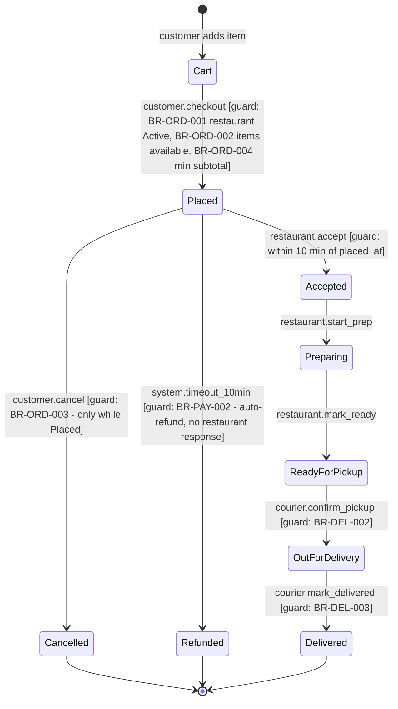
```mermaid
stateDiagram-v2
    [*] --> Cart : customer adds item
    Cart --> Placed : customer.checkout [guard: BR-ORD-001 restaurant Active, BR-ORD-002 items available, BR-ORD-004 min subtotal]
    Placed --> Accepted : restaurant.accept [guard: within 10 min of placed_at]
    Placed --> Cancelled : customer.cancel [guard: BR-ORD-003 - only while Placed]
    Placed --> Refunded : system.timeout_10min [guard: BR-PAY-002 - auto-refund, no restaurant response]
    Accepted --> Preparing : restaurant.start_prep
    Preparing --> ReadyForPickup : restaurant.mark_ready
    ReadyForPickup --> OutForDelivery : courier.confirm_pickup [guard: BR-DEL-002]
    OutForDelivery --> Delivered : courier.mark_delivered [guard: BR-DEL-003]
    Cancelled --> [*]
    Refunded --> [*]
    Delivered --> [*]
```

**Illegal transitions:**
- `Delivered`, `Cancelled`, `Refunded` → any state (terminal)
- `Accepted` → `Cancelled` (once accepted, customer cannot self-cancel - only Ops can, via a separate refund path against BR-PAY-004; this is out of MVP scope and flagged TBD)
- Any state → `OutForDelivery` skipping `ReadyForPickup` (blocked by BR-DEL-002 at the Delivery level)

### Events

| Event | Trigger | Payload fields |
|---|---|---|
| `order.placed` | Cart → Placed | `order_id`, `customer_id`, `restaurant_id`, `subtotal` |
| `order.accepted` | Placed → Accepted | `order_id`, `accepted_at` |
| `order.cancelled` | Placed → Cancelled | `order_id`, `cancelled_by` |
| `order.refunded` | Placed → Refunded | `order_id`, `reason: "restaurant_no_response"` |
| `order.ready_for_pickup` | Preparing → ReadyForPickup | `order_id` |
| `order.delivered` | OutForDelivery → Delivered | `order_id`, `delivered_at` |

### Enums

| Enum | Values | Description |
|---|---|---|
| `status` | `cart`, `placed`, `accepted`, `preparing`, `ready_for_pickup`, `out_for_delivery`, `delivered`, `cancelled`, `refunded` | Lifecycle state |

### Derived Fields

| Field | Derived from | Business meaning |
|---|---|---|
| `total` | `subtotal + delivery_fee + tip` | Amount authorized/captured on Payment |

### ERD Diagram

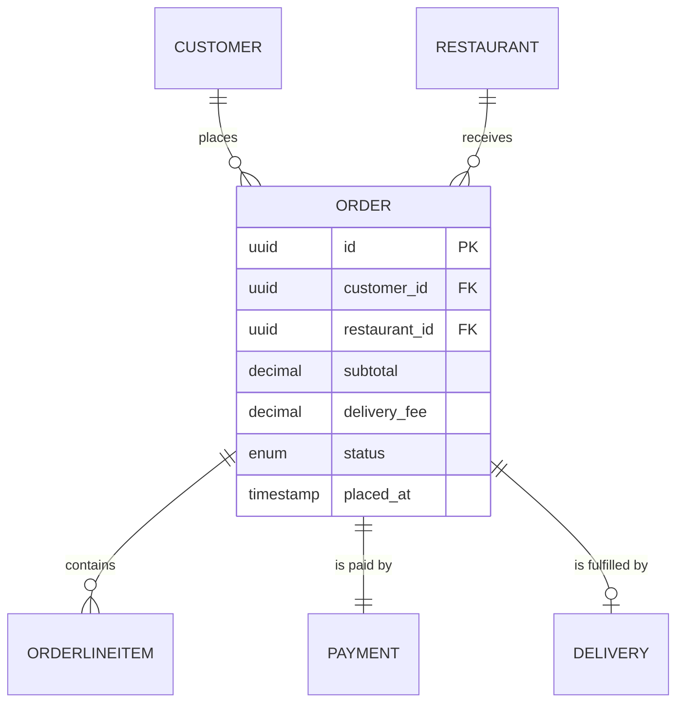
```mermaid
erDiagram
  ORDER {
    uuid id PK
    uuid customer_id FK
    uuid restaurant_id FK
    decimal subtotal
    decimal delivery_fee
    enum status
    timestamp placed_at
  }
  CUSTOMER ||--o{ ORDER : "places"
  RESTAURANT ||--o{ ORDER : "receives"
  ORDER ||--o{ ORDERLINEITEM : "contains"
  ORDER ||--|| PAYMENT : "is paid by"
  ORDER ||--o| DELIVERY : "is fulfilled by"
```

### Notes

`Placed` is the highest-risk state - it is where BR-PAY-001 and BR-PAY-002 both apply (payment authorized but not yet captured, and a hard 10-minute SLA before an automatic refund). This is a direct implementation of the founders' "no charging for orders that are never confirmed" commitment.

---

## ENT-005: OrderLineItem

**Domain:** Ordering
**Description:** A snapshot record of one MenuItem's name, price, and quantity at the moment an Order was placed. Exists so later MenuItem price/name changes never retroactively alter a historical Order.

### Attributes

| Attribute | Type | Required | Description | Notes |
|---|---|---|---|---|
| `id` | UUID | Yes | Unique identifier | PK |
| `order_id` | UUID | Yes | FK to Order | |
| `menu_item_id` | UUID | Yes | FK to MenuItem (reference only, not source of truth for price) | |
| `name_snapshot` | String | Yes | MenuItem name at order time | |
| `price_snapshot` | Decimal | Yes | MenuItem price at order time | |
| `quantity` | Integer | Yes | Quantity ordered | |

### Identifiers

| Type | Attribute |
|---|---|
| Primary Key | `id` |
| Business Key | N/A |
| External ID | N/A |

### Relationships

| Relationship | Target | Type | Cardinality | Description |
|---|---|---|---|---|
| Belongs to | ENT-004 Order | Ownership | N:1 | A line item belongs to one order |
| References | ENT-003 MenuItem | Association | N:1 | Points to the source menu item, non-authoritative for price |

### States (if entity has a lifecycle)

No lifecycle - immutable once the parent Order is Placed.

### Notes

This entity is the intentional exception to "one entity, one owner domain" simplicity: it exists purely to prevent a specific, real bug class (menu price edited mid-order-lifecycle silently changing historical revenue figures).

---

## ENT-006: Courier

**Domain:** Delivery & Dispatch
**Description:** An independent contractor who delivers Orders. Represents personas like Priya Nair.

### Attributes

| Attribute | Type | Required | Description | Notes |
|---|---|---|---|---|
| `id` | UUID | Yes | Unique identifier | PK |
| `created_at` | Timestamp | Yes | Record creation time | |
| `updated_at` | Timestamp | Yes | Last modification time | |
| `name` | String | Yes | Courier name | |
| `phone` | String | Yes | Contact + notifications | |
| `status` | Enum | Yes | `applied`, `active`, `suspended`, `deactivated` | |
| `availability` | Enum | No | `online`, `offline` | Only meaningful while `status = active` |
| `rolling_rating_avg` | Decimal | Yes | Avg of last 20 completed deliveries' customer ratings | BR-DEL-001 |
| `tax_paid_ytd` | Decimal | Yes | Running total of payouts in current calendar year | BR-REG-002 |

### Identifiers

| Type | Attribute |
|---|---|
| Primary Key | `id` |
| Business Key | `phone` |
| External ID | N/A |

### Relationships

| Relationship | Target | Type | Cardinality | Description |
|---|---|---|---|---|
| Has many | ENT-007 Delivery | Association | 1:N | A courier performs many deliveries |
| Has many | ENT-009 CourierPayout | Association | 1:N | A courier receives many daily payouts |

### States (if entity has a lifecycle)

| State | Description | Entry conditions |
|---|---|---|
| Applied | Application submitted, background check pending | Signs up |
| Active | Approved, can go online and accept jobs | Ops approves application |
| Suspended | Blocked from accepting new jobs pending review | Auto-suspend on low rating (BR-DEL-001) or Ops action |
| Deactivated | Permanently removed | Resigns or Ops terminates after failed review |

**State transitions:**
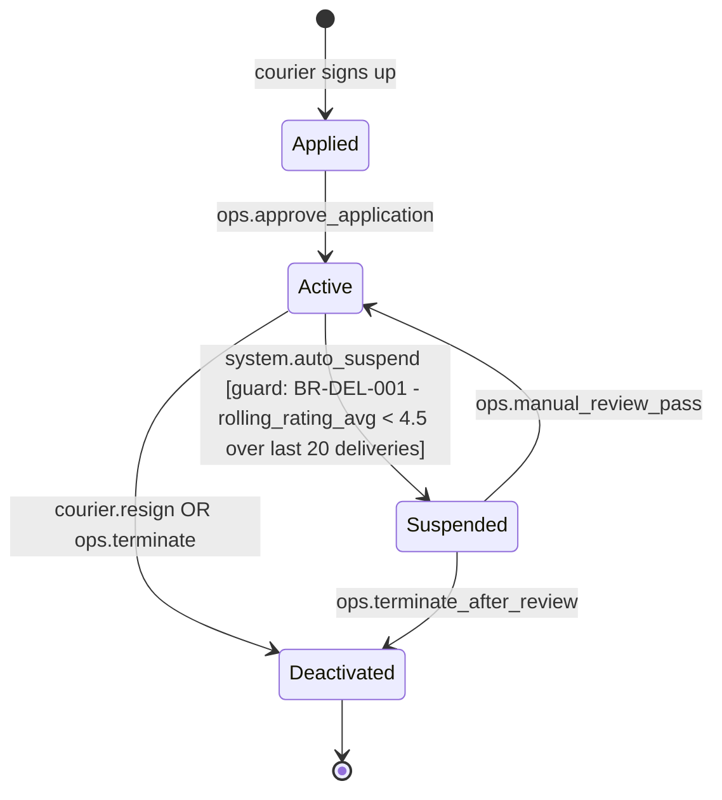
```mermaid
stateDiagram-v2
    [*] --> Applied : courier signs up
    Applied --> Active : ops.approve_application
    Active --> Suspended : system.auto_suspend [guard: BR-DEL-001 - rolling_rating_avg < 4.5 over last 20 deliveries]
    Suspended --> Active : ops.manual_review_pass
    Active --> Deactivated : courier.resign OR ops.terminate
    Suspended --> Deactivated : ops.terminate_after_review
    Deactivated --> [*]
```

`availability` (Online/Offline) is a sub-state that only exists while `status = Active` - it is not part of the lifecycle diagram above (per brief: "not a full lifecycle state").

### Events

| Event | Trigger | Payload fields |
|---|---|---|
| `courier.activated` | Applied → Active | `courier_id` |
| `courier.suspended` | Active → Suspended | `courier_id`, `rolling_rating_avg`, `reason: "BR-DEL-001"` |
| `courier.reinstated` | Suspended → Active | `courier_id`, `reviewed_by` |
| `courier.deactivated` | → Deactivated | `courier_id`, `reason` |

### Enums

| Enum | Values | Description |
|---|---|---|
| `status` | `applied`, `active`, `suspended`, `deactivated` | Lifecycle state |
| `availability` | `online`, `offline` | Sub-state while Active |

### Derived Fields

| Field | Derived from | Business meaning |
|---|---|---|
| `rolling_rating_avg` | Last 20 `Delivery.customer_rating` values | Feeds BR-DEL-001 auto-suspend guard |

### ERD Diagram

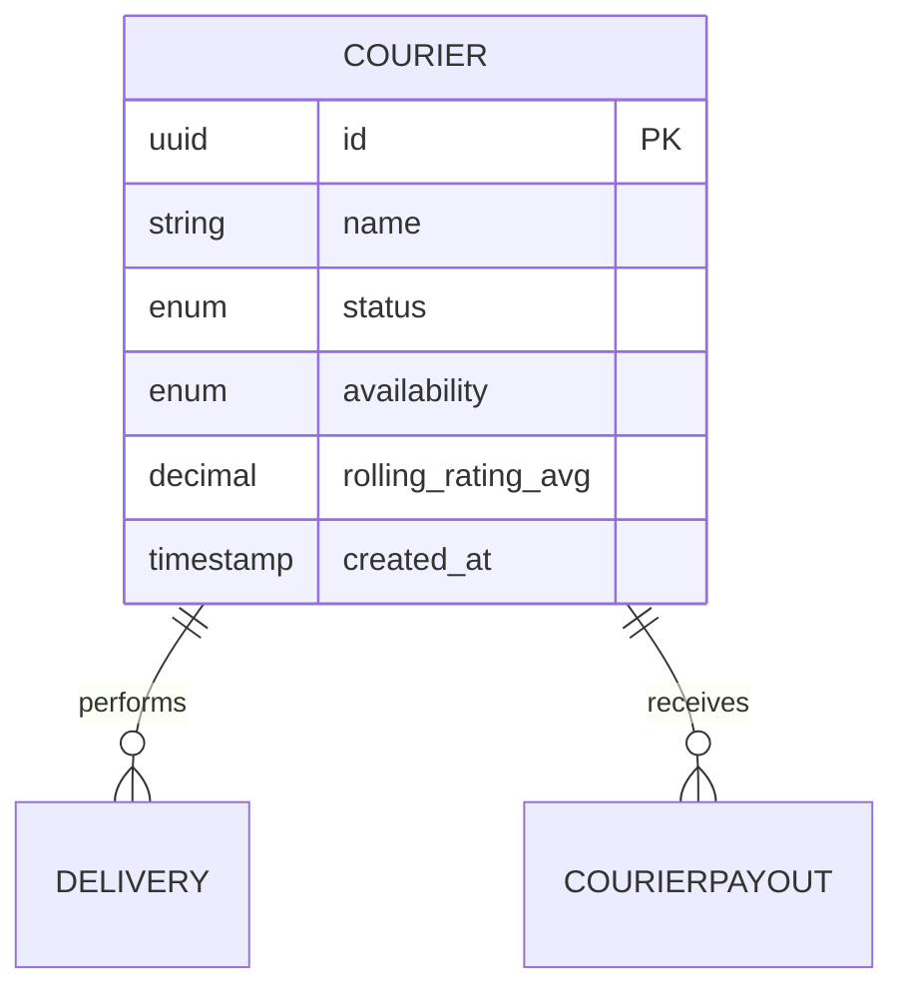
```mermaid
erDiagram
  COURIER {
    uuid id PK
    string name
    enum status
    enum availability
    decimal rolling_rating_avg
    timestamp created_at
  }
  COURIER ||--o{ DELIVERY : "performs"
  COURIER ||--o{ COURIERPAYOUT : "receives"
```

### Notes

`rolling_rating_avg` is stored (not purely computed on read) because BR-DEL-001's auto-suspend check must run cheaply on every delivery completion, not recompute a 20-row average every time.

---

## ENT-007: Delivery

**Domain:** Delivery & Dispatch
**Description:** The courier-facing execution record tied 1:1 to an Order once a courier accepts the job.

### Attributes

| Attribute | Type | Required | Description | Notes |
|---|---|---|---|---|
| `id` | UUID | Yes | Unique identifier | PK |
| `created_at` | Timestamp | Yes | Record creation time | |
| `updated_at` | Timestamp | Yes | Last modification time | |
| `order_id` | UUID | Yes | FK to Order | |
| `courier_id` | UUID | Yes | FK to Courier | |
| `status` | Enum | Yes | See States below | |
| `distance_miles` | Decimal | Yes | From RouteEstimate (EXT-002) | Drives $1.25/mile pay |
| `customer_rating` | Integer | No | 1-5, set by customer after Delivered | Feeds Courier.rolling_rating_avg |
| `gps_confirmed_dropoff` | Boolean | No | True if within 150m of address at completion | BR-DEL-003 |

### Identifiers

| Type | Attribute |
|---|---|
| Primary Key | `id` |
| Business Key | N/A |
| External ID | N/A |

### Relationships

| Relationship | Target | Type | Cardinality | Description |
|---|---|---|---|---|
| Belongs to | ENT-004 Order | Ownership | 1:1 | A delivery fulfills exactly one order |
| Belongs to | ENT-006 Courier | Association | N:1 | A delivery is performed by one courier |

### States (if entity has a lifecycle)

| State | Description | Entry conditions |
|---|---|---|
| Assigned | Courier accepted the dispatch offer | Courier taps "Accept" on a job offer |
| EnRoute-to-Restaurant | Courier navigating to pickup | Courier starts navigation |
| PickedUp | Food collected from restaurant | Courier confirms pickup (BR-DEL-002) |
| EnRoute-to-Customer | Courier navigating to drop-off | Courier starts drop-off navigation |
| Completed | Delivered to customer | Courier confirms drop-off (BR-DEL-003) |
| Cancelled | Courier declined/timed out after accepting | Courier cancels or misses pickup SLA |

**State transitions:**
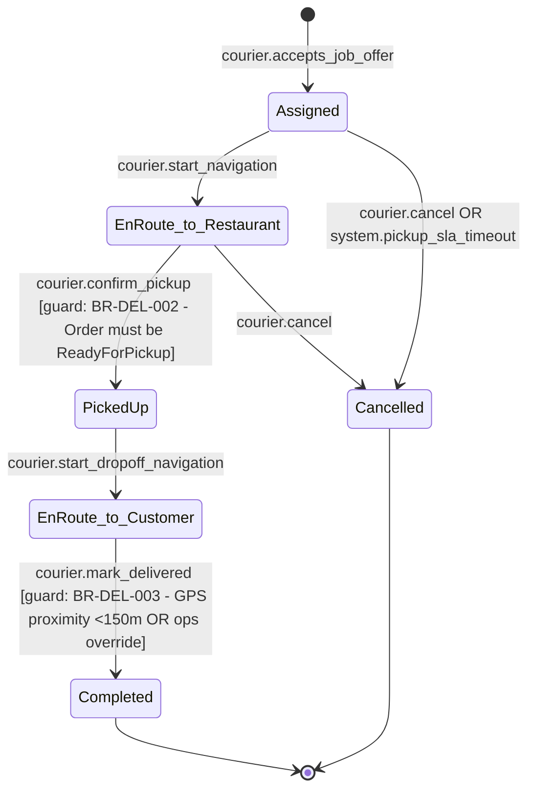
```mermaid
stateDiagram-v2
    [*] --> Assigned : courier.accepts_job_offer
    Assigned --> EnRoute_to_Restaurant : courier.start_navigation
    Assigned --> Cancelled : courier.cancel OR system.pickup_sla_timeout
    EnRoute_to_Restaurant --> PickedUp : courier.confirm_pickup [guard: BR-DEL-002 - Order must be ReadyForPickup]
    EnRoute_to_Restaurant --> Cancelled : courier.cancel
    PickedUp --> EnRoute_to_Customer : courier.start_dropoff_navigation
    EnRoute_to_Customer --> Completed : courier.mark_delivered [guard: BR-DEL-003 - GPS proximity <150m OR ops override]
    Completed --> [*]
    Cancelled --> [*]
```

**Illegal transitions:**
- `Completed`, `Cancelled` → any state (terminal)
- `Assigned` → `PickedUp` directly (must pass through `EnRoute-to-Restaurant`; also blocked because the underlying Order cannot be `OutForDelivery` without first being `ReadyForPickup`, BR-DEL-002)
- A `Cancelled` Delivery does not resurrect - dispatch creates a **new** Delivery record against the same Order for the next courier offer (adversarial pass: this is the reassignment path, not a transition back to `Assigned`)

### Events

| Event | Trigger | Payload fields |
|---|---|---|
| `delivery.assigned` | → Assigned | `delivery_id`, `order_id`, `courier_id` |
| `delivery.picked_up` | EnRoute-to-Restaurant → PickedUp | `delivery_id`, `picked_up_at` |
| `delivery.completed` | EnRoute-to-Customer → Completed | `delivery_id`, `customer_rating`, `distance_miles` |
| `delivery.cancelled` | → Cancelled | `delivery_id`, `reason` |

### Enums

| Enum | Values | Description |
|---|---|---|
| `status` | `assigned`, `enroute_to_restaurant`, `picked_up`, `enroute_to_customer`, `completed`, `cancelled` | Lifecycle state |

### ERD Diagram

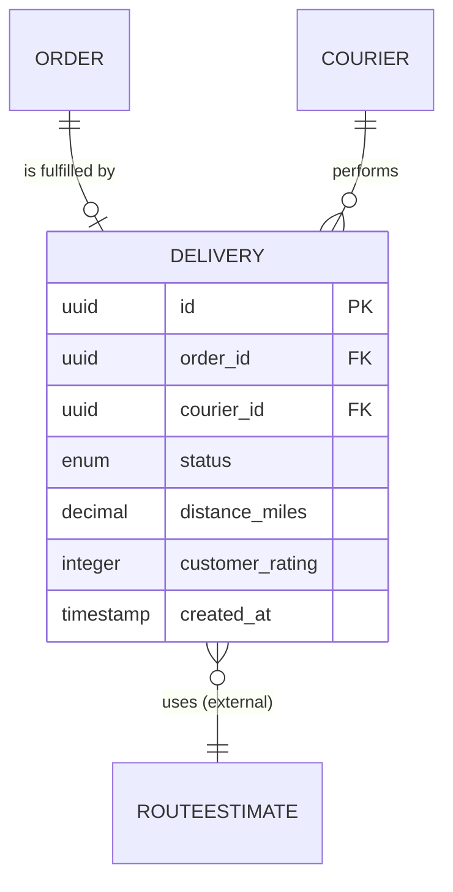
```mermaid
erDiagram
  DELIVERY {
    uuid id PK
    uuid order_id FK
    uuid courier_id FK
    enum status
    decimal distance_miles
    integer customer_rating
    timestamp created_at
  }
  ORDER ||--o| DELIVERY : "is fulfilled by"
  COURIER ||--o{ DELIVERY : "performs"
  DELIVERY }o--|| ROUTEESTIMATE : "uses (external)"
```

### Notes

`delivery.completed`'s payload carries `customer_rating` which is the direct input to Courier.rolling_rating_avg and, transitively, BR-DEL-001's auto-suspend guard - this is the clearest example in the domain of one event driving a downstream state transition on a different entity.

---

## ENT-008: Payment

**Domain:** Payments & Payouts
**Description:** The financial transaction (auth → capture → refund) tied 1:1 to an Order.

### Attributes

| Attribute | Type | Required | Description | Notes |
|---|---|---|---|---|
| `id` | UUID | Yes | Unique identifier | PK |
| `created_at` | Timestamp | Yes | Record creation time | |
| `updated_at` | Timestamp | Yes | Last modification time | |
| `order_id` | UUID | Yes | FK to Order | 1:1 |
| `stripe_payment_intent_id` | String | Yes | Tokenized reference to EXT-001 | BR-GOV-001 - no raw card data stored |
| `authorized_amount` | Decimal | Yes | Amount authorized at Cart → Placed | |
| `captured_amount` | Decimal | No | Amount actually captured, set on capture | |
| `refunded_amount` | Decimal | No | Cumulative amount refunded | BR-PAY-004 - never exceeds `captured_amount` |
| `status` | Enum | Yes | `authorized`, `captured`, `refunded`, `partially_refunded` | |

### Identifiers

| Type | Attribute |
|---|---|
| Primary Key | `id` |
| Business Key | N/A |
| External ID | `stripe_payment_intent_id` |

### Relationships

| Relationship | Target | Type | Cardinality | Description |
|---|---|---|---|---|
| Belongs to | ENT-004 Order | Ownership | 1:1 | Each order has exactly one payment |

### States (if entity has a lifecycle)

| State | Description | Entry conditions |
|---|---|---|
| Authorized | Card hold placed, no funds captured | Order placed (Cart → Placed) |
| Captured | Funds actually captured | Restaurant accepts the order (BR-PAY-001) |
| Refunded | Full amount returned (or hold released pre-capture) | Cancellation, timeout, or post-delivery refund |
| PartiallyRefunded | Part of the captured amount returned | Ops issues partial refund |

**State transitions:**
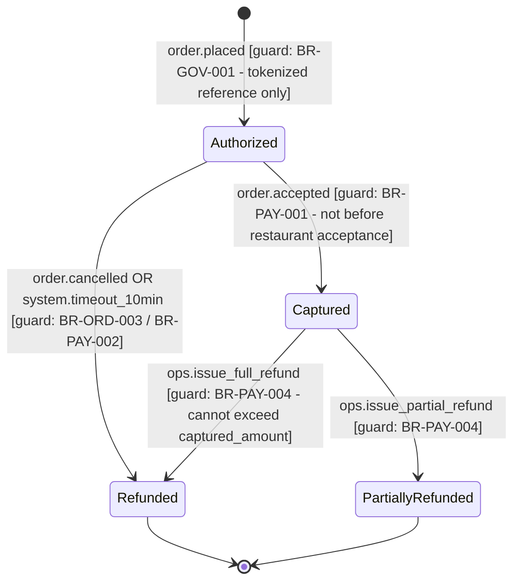
```mermaid
stateDiagram-v2
    [*] --> Authorized : order.placed [guard: BR-GOV-001 - tokenized reference only]
    Authorized --> Captured : order.accepted [guard: BR-PAY-001 - not before restaurant acceptance]
    Authorized --> Refunded : order.cancelled OR system.timeout_10min [guard: BR-ORD-003 / BR-PAY-002]
    Captured --> Refunded : ops.issue_full_refund [guard: BR-PAY-004 - cannot exceed captured_amount]
    Captured --> PartiallyRefunded : ops.issue_partial_refund [guard: BR-PAY-004]
    Refunded --> [*]
    PartiallyRefunded --> [*]
```

**Illegal transitions:**
- `Refunded`, `PartiallyRefunded` → any state (terminal - no re-capture)
- `Authorized` → `Captured` without a preceding `order.accepted` event (hard-blocked, BR-PAY-001 - this is the platform's core "never charge for an unconfirmed order" commitment)

### Events

| Event | Trigger | Payload fields |
|---|---|---|
| `payment.authorized` | → Authorized | `payment_id`, `order_id`, `authorized_amount` |
| `payment.captured` | Authorized → Captured | `payment_id`, `captured_amount` |
| `payment.refunded` | → Refunded | `payment_id`, `refunded_amount`, `reason` |
| `payment.partially_refunded` | → PartiallyRefunded | `payment_id`, `refunded_amount` |

### Enums

| Enum | Values | Description |
|---|---|---|
| `status` | `authorized`, `captured`, `refunded`, `partially_refunded` | Lifecycle state |

### ERD Diagram

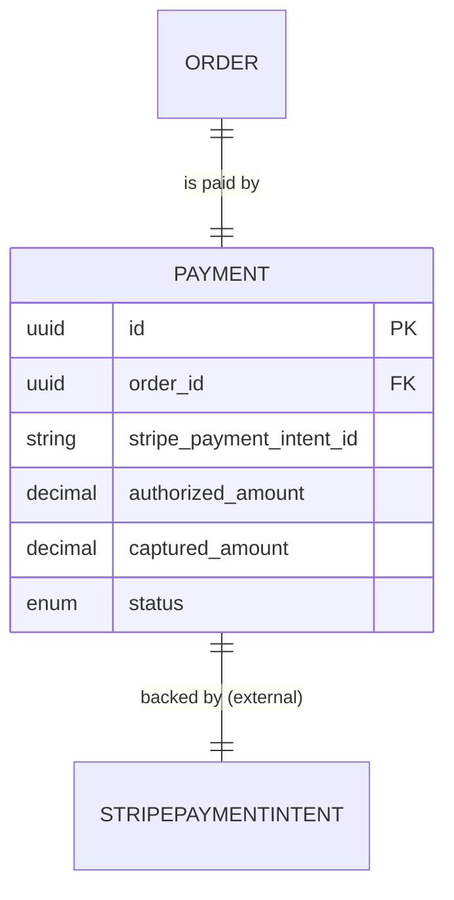
```mermaid
erDiagram
  PAYMENT {
    uuid id PK
    uuid order_id FK
    string stripe_payment_intent_id
    decimal authorized_amount
    decimal captured_amount
    enum status
  }
  ORDER ||--|| PAYMENT : "is paid by"
  PAYMENT ||--|| STRIPEPAYMENTINTENT : "backed by (external)"
```

### Notes

`Authorized → Refunded` covers two distinct real-world cases under one state name (customer self-cancel per BR-ORD-003, and system auto-refund per BR-PAY-002 on restaurant non-response) - both release the hold without ever capturing funds. This was a deliberate merge (not a "twins" violation): both cases behave identically from the Payment entity's perspective, the difference is only in *why*, which is captured in the event payload's `reason` field, not in a separate state.

---

## ENT-009: CourierPayout

**Domain:** Payments & Payouts
**Description:** A daily batch payout record aggregating one Courier's completed Deliveries for a single calendar day. Differentiator vs. competitors: paid daily, not weekly.

### Attributes

| Attribute | Type | Required | Description | Notes |
|---|---|---|---|---|
| `id` | UUID | Yes | Unique identifier | PK |
| `created_at` | Timestamp | Yes | Record creation time | |
| `updated_at` | Timestamp | Yes | Last modification time | |
| `courier_id` | UUID | Yes | FK to Courier | |
| `payout_date` | Date | Yes | The calendar day being paid out | |
| `delivery_ids` | UUID[] | Yes | Deliveries included in this batch | |
| `base_pay_total` | Decimal | Yes | Sum of $4 base per delivery | |
| `mileage_pay_total` | Decimal | Yes | Sum of $1.25/mile across deliveries | |
| `tips_total` | Decimal | Yes | 100% passthrough of customer tips | |
| `status` | Enum | Yes | `pending`, `processing`, `paid`, `failed` | |

### Identifiers

| Type | Attribute |
|---|---|
| Primary Key | `id` |
| Business Key | `courier_id` + `payout_date` |
| External ID | Stripe Connect transfer ID (post-`paid`) |

### Relationships

| Relationship | Target | Type | Cardinality | Description |
|---|---|---|---|---|
| Belongs to | ENT-006 Courier | Association | N:1 | A payout batch belongs to one courier |
| Aggregates | ENT-007 Delivery | Derivation | 1:N | Sums pay across a day's completed deliveries |

### States (if entity has a lifecycle)

| State | Description | Entry conditions |
|---|---|---|
| Pending | Batch created at day-end cutoff, not yet submitted | Daily cutoff job runs |
| Processing | Submitted to the payment processor for transfer | Batch submitted |
| Paid | Funds confirmed transferred to courier's account | Processor confirms transfer |
| Failed | Transfer rejected (e.g. bad bank details) | Processor reports failure |

**State transitions:**
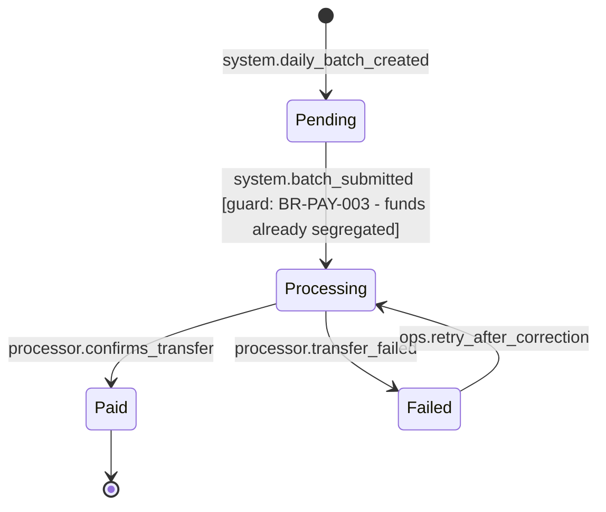
```mermaid
stateDiagram-v2
    [*] --> Pending : system.daily_batch_created
    Pending --> Processing : system.batch_submitted [guard: BR-PAY-003 - funds already segregated]
    Processing --> Paid : processor.confirms_transfer
    Processing --> Failed : processor.transfer_failed
    Failed --> Processing : ops.retry_after_correction
    Paid --> [*]
```

**Illegal transitions:**
- `Paid` → any state (terminal)
- `Pending` → `Paid` directly (must always pass through `Processing` - no shortcut around the processor confirmation, which is the detection point for BR-PAY-003)

### Events

| Event | Trigger | Payload fields |
|---|---|---|
| `payout.pending` | → Pending | `payout_id`, `courier_id`, `payout_date`, `delivery_ids` |
| `payout.paid` | Processing → Paid | `payout_id`, `total_amount` |
| `payout.failed` | Processing → Failed | `payout_id`, `failure_reason` |

### Enums

| Enum | Values | Description |
|---|---|---|
| `status` | `pending`, `processing`, `paid`, `failed` | Lifecycle state |

### Derived Fields

| Field | Derived from | Business meaning |
|---|---|---|
| `total_amount` | `base_pay_total + mileage_pay_total + tips_total` | Actual daily transfer amount |
| Annual `tax_paid_ytd` (on Courier) | Sum of `total_amount` across a courier's `Paid` payouts in the calendar year | Feeds BR-REG-002 1099-NEC threshold check |

### ERD Diagram

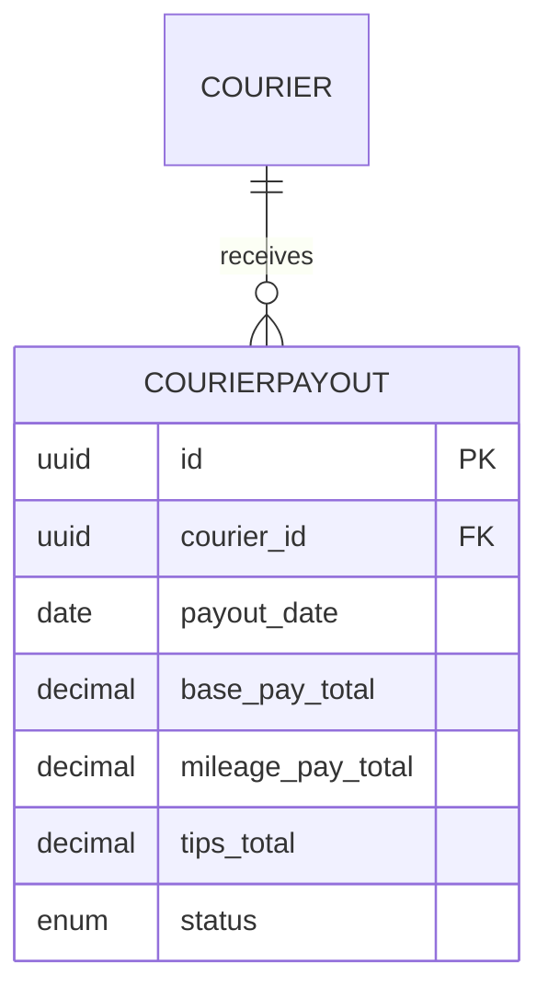
```mermaid
erDiagram
  COURIERPAYOUT {
    uuid id PK
    uuid courier_id FK
    date payout_date
    decimal base_pay_total
    decimal mileage_pay_total
    decimal tips_total
    enum status
  }
  COURIER ||--o{ COURIERPAYOUT : "receives"
```

### Notes

Invented beyond the brief's canonical entity list (which only fixes Order/Restaurant/Courier/Delivery/Payment states) - `Pending → Processing → Paid / Failed` follows the same "clean business states, no technical flags" convention as the canonical entities, per the CANONICAL entity states instruction to keep additions "in the same style."

---

## 10. Full ERD

Cross-entity ERD showing all internal entities and their relationships. Use this as the single reference for database schema design.

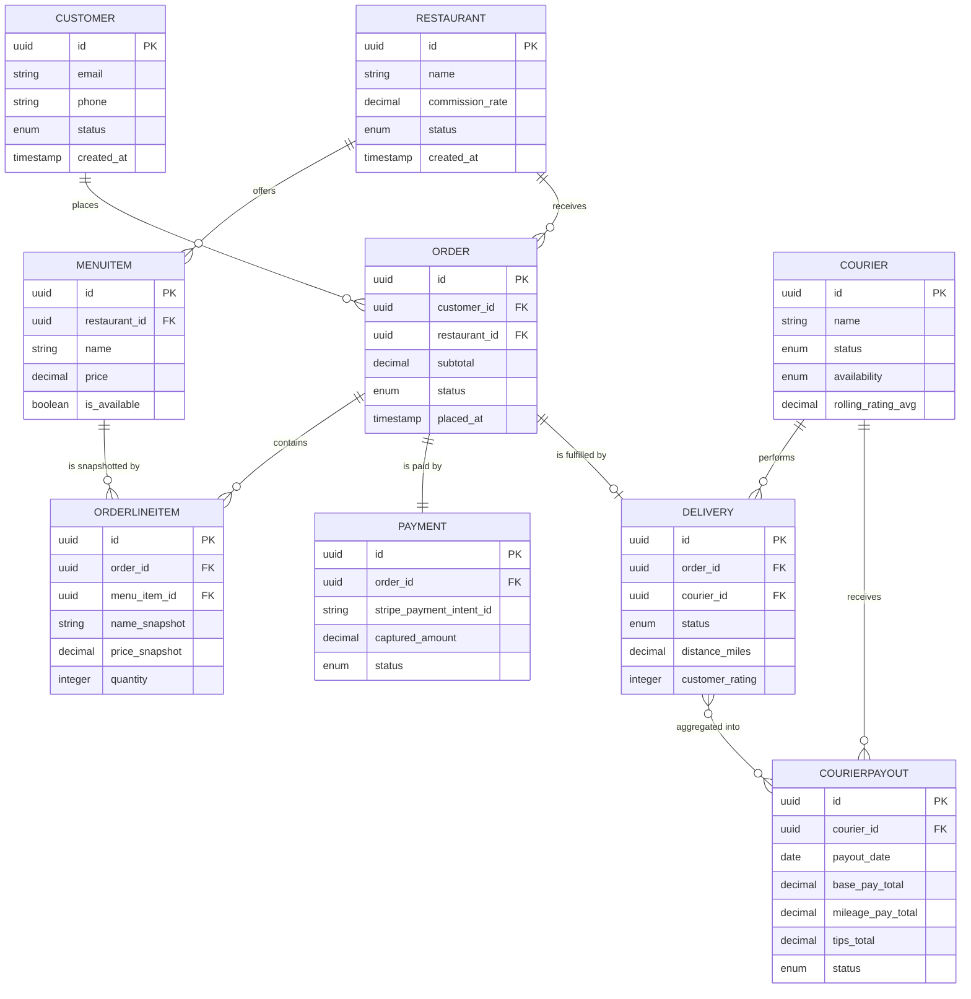
```mermaid
erDiagram
  CUSTOMER {
    uuid id PK
    string email
    string phone
    enum status
    timestamp created_at
  }
  RESTAURANT {
    uuid id PK
    string name
    decimal commission_rate
    enum status
    timestamp created_at
  }
  MENUITEM {
    uuid id PK
    uuid restaurant_id FK
    string name
    decimal price
    boolean is_available
  }
  ORDER {
    uuid id PK
    uuid customer_id FK
    uuid restaurant_id FK
    decimal subtotal
    enum status
    timestamp placed_at
  }
  ORDERLINEITEM {
    uuid id PK
    uuid order_id FK
    uuid menu_item_id FK
    string name_snapshot
    decimal price_snapshot
    integer quantity
  }
  COURIER {
    uuid id PK
    string name
    enum status
    enum availability
    decimal rolling_rating_avg
  }
  DELIVERY {
    uuid id PK
    uuid order_id FK
    uuid courier_id FK
    enum status
    decimal distance_miles
    integer customer_rating
  }
  PAYMENT {
    uuid id PK
    uuid order_id FK
    string stripe_payment_intent_id
    decimal captured_amount
    enum status
  }
  COURIERPAYOUT {
    uuid id PK
    uuid courier_id FK
    date payout_date
    decimal base_pay_total
    decimal mileage_pay_total
    decimal tips_total
    enum status
  }

  CUSTOMER ||--o{ ORDER : "places"
  RESTAURANT ||--o{ MENUITEM : "offers"
  RESTAURANT ||--o{ ORDER : "receives"
  ORDER ||--o{ ORDERLINEITEM : "contains"
  MENUITEM ||--o{ ORDERLINEITEM : "is snapshotted by"
  ORDER ||--|| PAYMENT : "is paid by"
  ORDER ||--o| DELIVERY : "is fulfilled by"
  COURIER ||--o{ DELIVERY : "performs"
  COURIER ||--o{ COURIERPAYOUT : "receives"
  DELIVERY }o--o{ COURIERPAYOUT : "aggregated into"
```

---

## Handoff

**Čo si teraz má:** Domain Model - hranice domén (5), entity catalogue (9 internal, 3 external, 3 TBD), plné entity definitions a cross-domain ERD.

**Ďalší krok:** `/pm-entity-registry` - preklop entity do registra `entities.md` (R1) so state machines (already reflected below in `domain/entities.md` for this example).

**Môžeš preskočiť ak:** Projekt je malý/jednodoménový - tu to neplatí, PureHunger je 5-doménový trojstranný marketplace.
