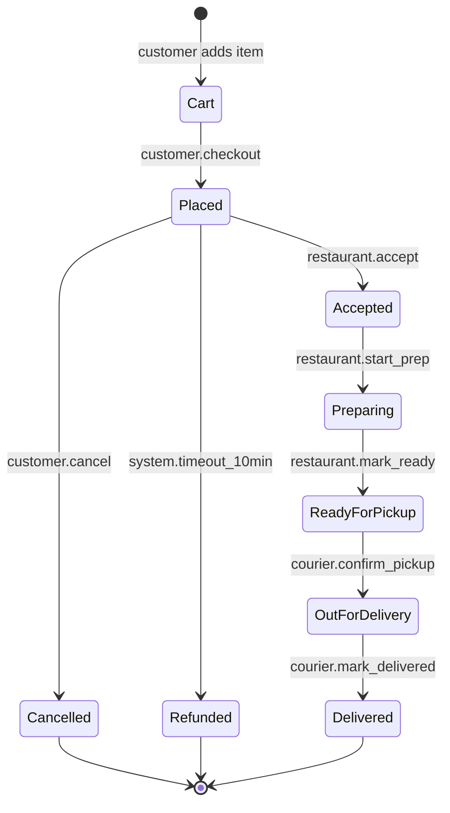
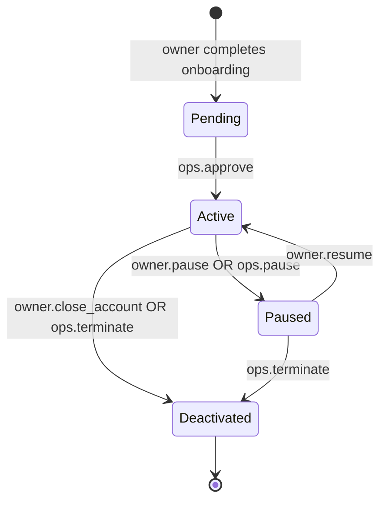
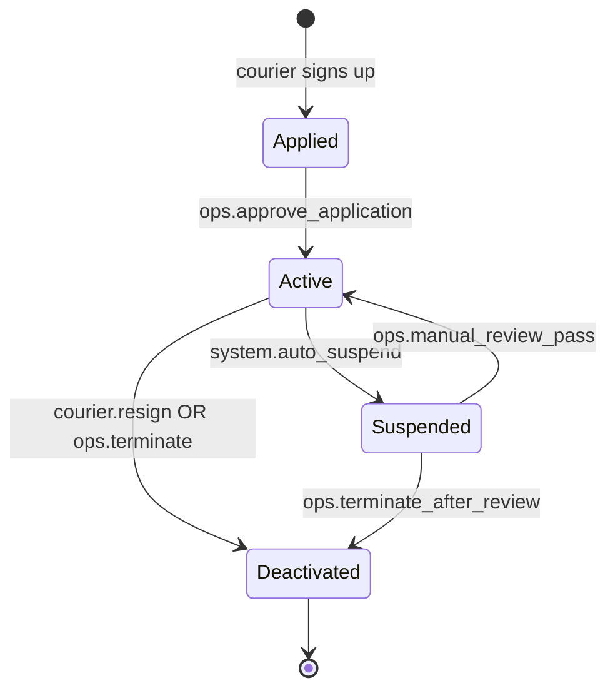
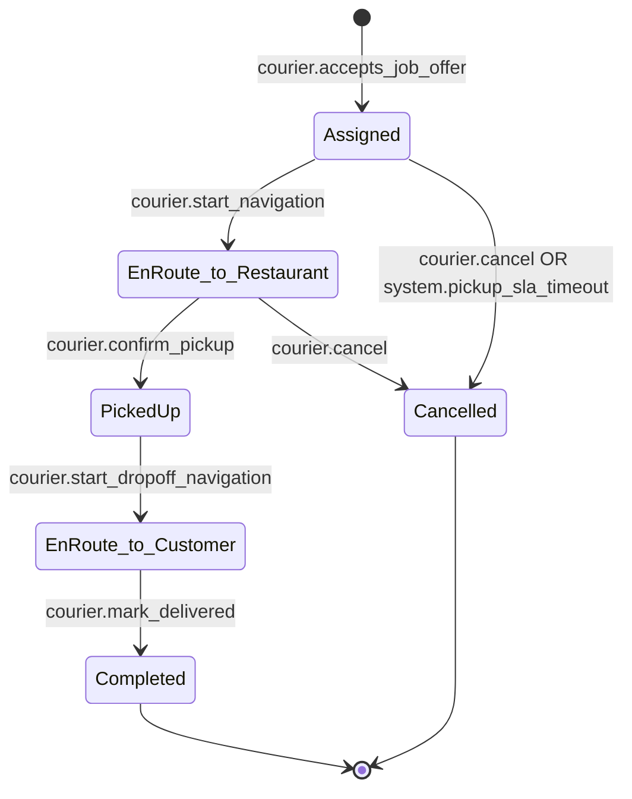
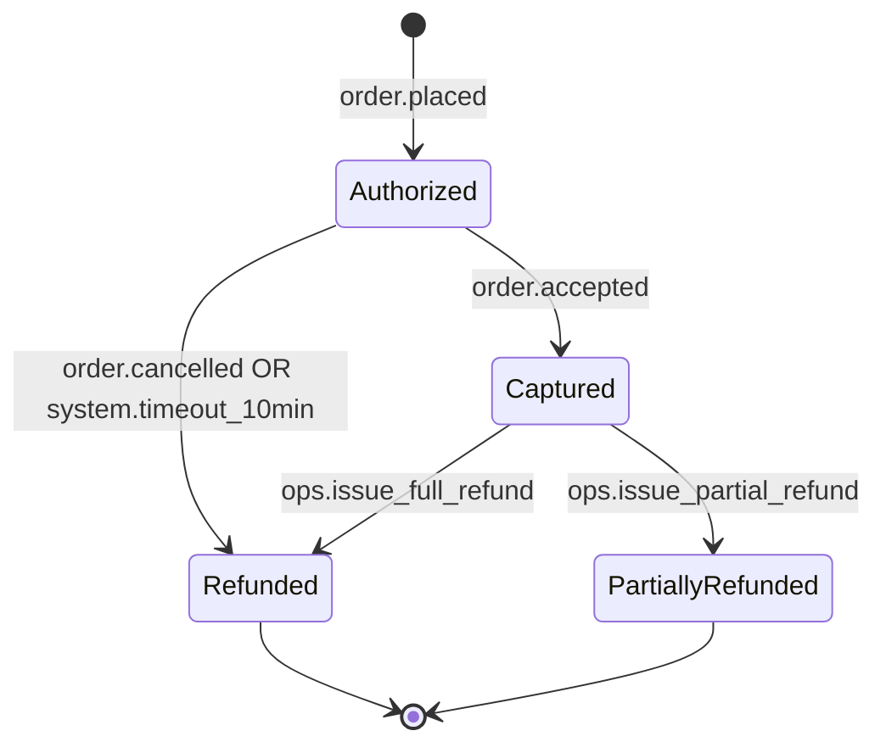
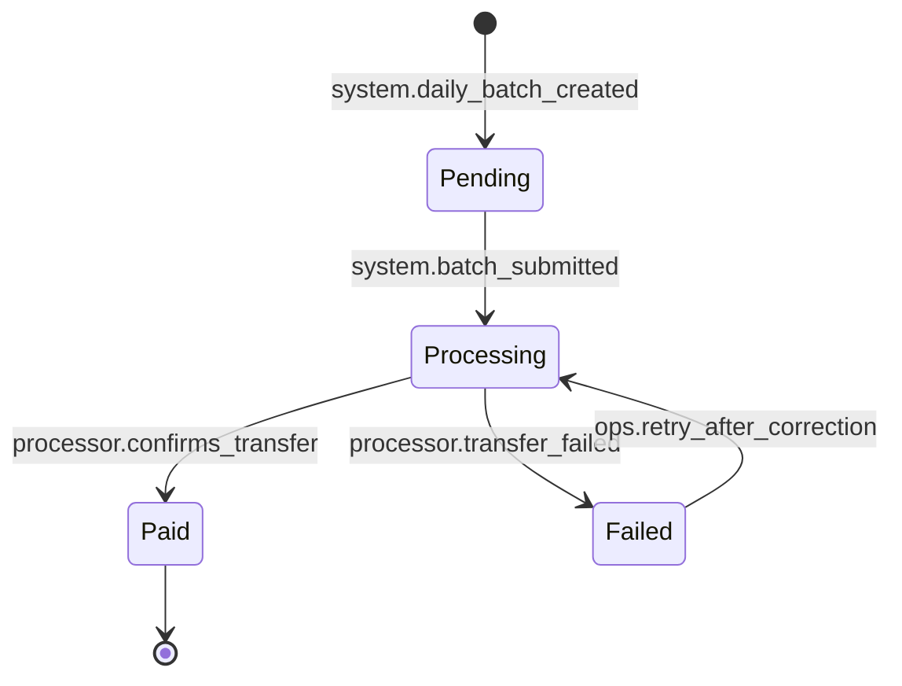

# Entity & State Registry
# Live Register 1 of 5 - FDD+SDD Framework

> **Product:** PureHunger
> **Version:** 1.2
> **Last updated:** 2026-03-04
> **Maintained by:** pm-entity-registry skill + pm-feature-design (JIT guard conditions)

---

> **How to read this register:**
> - States: business lifecycle states (not technical flags)
> - Transitions: trigger (what causes it) + emits (event produced) + guard (business rule that must hold)
> - Guard conditions below are already JIT-enriched for FEAT-ORD-001 (6_Shipped) and partially for FEAT-DEL-002 (3_Ready_to_Build) - this register is an architectural guardrail, Claude Code reads it before implementing any feature.

---

## Order

**Business role:** A customer's order for one or more MenuItems from one Restaurant - the central object of the MVP ordering loop.
**Owned by Feature Set:** FS-01: Ordering & Checkout (FEAT-ORD-001)

**States:**

| State | Meaning | Terminal? |
|---|---|---|
| Cart | Being assembled, not yet submitted | No |
| Placed | Submitted, awaiting restaurant response | No |
| Accepted | Restaurant confirmed the order | No |
| Preparing | Kitchen actively preparing | No |
| ReadyForPickup | Food ready, awaiting courier | No |
| OutForDelivery | Courier has picked up the order | No |
| Delivered | Completed successfully | Yes |
| Cancelled | Terminated by customer before acceptance | Yes |
| Refunded | Restaurant did not respond within SLA | Yes |

**State machine:**

**Transitions:**

| From | To | Trigger | Emits | Guard condition |
|---|---|---|---|---|
| Cart | Placed | customer.checkout | order.placed | BR-ORD-001 (Restaurant must be Active) AND BR-ORD-002 (every cart item must be `is_available = true`) AND BR-ORD-004 (subtotal ≥ restaurant's minimum, default $10) |
| Placed | Accepted | restaurant.accept | order.accepted | Must occur within 10 minutes of `placed_at`, else system forces Refunded (BR-PAY-002) |
| Placed | Cancelled | customer.cancel | order.cancelled | BR-ORD-003 (only while status = Placed - blocked once Accepted) |
| Placed | Refunded | system.timeout_10min | order.refunded | BR-PAY-002 (no restaurant response within 10 minutes - automatic, no admin action needed) |
| Accepted | Preparing | restaurant.start_prep | order.preparing | - |
| Preparing | ReadyForPickup | restaurant.mark_ready | order.ready_for_pickup | - |
| ReadyForPickup | OutForDelivery | courier.confirm_pickup | order.out_for_delivery | BR-DEL-002 (Order must already be ReadyForPickup - the corresponding Delivery cannot move to PickedUp otherwise) |
| OutForDelivery | Delivered | courier.mark_delivered | order.delivered | BR-DEL-003 (GPS-confirmed proximity <150m to delivery address, or Ops manual override) |

**Illegal transitions:**
- Delivered → any state (terminal)
- Cancelled → any state (terminal)
- Refunded → any state (terminal)
- Accepted → Cancelled (customer self-cancel is blocked once the restaurant has accepted; only an Ops-issued refund against BR-PAY-004 can unwind an Accepted order - flagged `[TODO - post-MVP Ops refund flow, not yet a Feature Card]`)
- Any state → OutForDelivery skipping ReadyForPickup (blocked at the Delivery entity's PickedUp guard, BR-DEL-002)

---

## Restaurant

**Business role:** An independent restaurant partner listed on PureHunger, owning its own menu and availability.
**Owned by Feature Set:** FS-02: Restaurant Onboarding & Menu Management

**States:**

| State | Meaning | Terminal? |
|---|---|---|
| Pending | Onboarded, not yet visible to customers | No |
| Active | Live and orderable | No |
| Paused | Temporarily hidden, new orders blocked | No |
| Deactivated | Permanently removed from platform | Yes |

**State machine:**

**Transitions:**

| From | To | Trigger | Emits | Guard condition |
|---|---|---|---|---|
| Pending | Active | ops.approve | restaurant.activated | BR-REST-001 (at least 1 MenuItem with `is_available = true`) AND BR-REG-003 (current food-service permit on file) |
| Active | Paused | owner.pause OR ops.pause | restaurant.paused | - |
| Paused | Active | owner.resume | restaurant.reactivated | BR-REST-001 must still hold (re-checked, not assumed carried over) |
| Active | Deactivated | owner.close_account OR ops.terminate | restaurant.deactivated | Commission-rate or policy-driven terminations must follow BR-REG-001's 30-day notice if initiated by PureHunger |
| Paused | Deactivated | ops.terminate | restaurant.deactivated | - |

**Illegal transitions:**
- Deactivated → any state (terminal - requires full re-onboarding as a new Restaurant record, not a reactivation)
- Pending → Paused (a restaurant that was never Active cannot be "paused" - it must reach Active first, or be rejected and stay Pending)

---

## MenuItem

**Business role:** A single sellable dish belonging to a Restaurant. Value object with an availability toggle, not a full lifecycle entity.
**States:** No lifecycle state machine - `is_available` is a boolean flag (BR-ORD-002 gates whether it can enter a cart), mutable by the owning Restaurant's staff at any time. This passes the behavior test only on one axis (can/cannot be ordered), which does not warrant a full state diagram.

---

## Courier

**Business role:** An independent contractor who delivers Orders.
**Owned by Feature Set:** FS-03: Delivery Dispatch & Tracking (FEAT-DEL-002)

**States:**

| State | Meaning | Terminal? |
|---|---|---|
| Applied | Application submitted, background check pending | No |
| Active | Approved, can go online and accept jobs | No |
| Suspended | Blocked from accepting new jobs pending review | No |
| Deactivated | Permanently removed | Yes |

**State machine:**

**Transitions:**

| From | To | Trigger | Emits | Guard condition |
|---|---|---|---|---|
| Applied | Active | ops.approve_application | courier.activated | Background check passed (out of framework scope - handled by 3rd-party vendor) |
| Active | Suspended | system.auto_suspend | courier.suspended | BR-DEL-001 (rolling average rating over last 20 completed deliveries falls below 4.5 stars) - automatic, no admin trigger required |
| Suspended | Active | ops.manual_review_pass | courier.reinstated | Manual Ops review completed and passed |
| Active | Deactivated | courier.resign OR ops.terminate | courier.deactivated | - |
| Suspended | Deactivated | ops.terminate_after_review | courier.deactivated | Manual Ops review completed and failed |

**Illegal transitions:**
- Deactivated → any state (terminal)
- Applied → Suspended (a courier who never reached Active cannot be "suspended" - only rejected, staying Applied, or activated)

**Availability sub-state (not a lifecycle state):**
While `status = Active`, the courier also toggles `availability`: `Offline ↔ Online` via `courier.toggle_availability`. This does not appear in the state machine above per the brief's instruction that it is "not a full lifecycle state" - it is tracked as a flat attribute alongside `status`.

---

## Delivery

**Business role:** The courier-facing execution record tied 1:1 to an Order once a courier accepts the job.
**Owned by Feature Set:** FS-03: Delivery Dispatch & Tracking (FEAT-DEL-002)

**States:**

| State | Meaning | Terminal? |
|---|---|---|
| Assigned | Courier accepted the dispatch offer | No |
| EnRoute-to-Restaurant | Courier navigating to pickup | No |
| PickedUp | Food collected from restaurant | No |
| EnRoute-to-Customer | Courier navigating to drop-off | No |
| Completed | Delivered to customer | Yes |
| Cancelled | Courier declined/timed out after accepting | Yes |

**State machine:**

**Transitions:**

| From | To | Trigger | Emits | Guard condition |
|---|---|---|---|---|
| - | Assigned | courier.accepts_job_offer | delivery.assigned | Only one active (non-terminal) Delivery per Order at a time |
| Assigned | EnRoute-to-Restaurant | courier.start_navigation | delivery.enroute_to_restaurant | - |
| Assigned | Cancelled | courier.cancel OR system.pickup_sla_timeout | delivery.cancelled | Triggers dispatch to reassign a **new** Delivery record to the next available courier |
| EnRoute-to-Restaurant | PickedUp | courier.confirm_pickup | delivery.picked_up | BR-DEL-002 (the linked Order must already be in ReadyForPickup state - prevents couriers marking pickup before food is ready) |
| EnRoute-to-Restaurant | Cancelled | courier.cancel | delivery.cancelled | Triggers reassignment (new Delivery record) |
| PickedUp | EnRoute-to-Customer | courier.start_dropoff_navigation | delivery.enroute_to_customer | - |
| EnRoute-to-Customer | Completed | courier.mark_delivered | delivery.completed | BR-DEL-003 (GPS-confirmed proximity <150m to the delivery address, or an Ops manual override with logged reason) |

**Illegal transitions:**
- Completed → any state (terminal)
- Cancelled → any state (terminal - a cancelled Delivery is never resurrected; dispatch always creates a fresh Delivery record for reassignment, keeping a clean audit trail of who declined/failed the job)
- Assigned → PickedUp directly (must pass through EnRoute-to-Restaurant; also structurally blocked by BR-DEL-002 since the Order cannot yet be ReadyForPickup in most such cases)

---

## Payment

**Business role:** The financial transaction (auth → capture → refund) tied 1:1 to an Order.
**Owned by Feature Set:** FS-04: Payments & Payouts (FEAT-ORD-001 checkout leg)

**States:**

| State | Meaning | Terminal? |
|---|---|---|
| Authorized | Card hold placed, no funds captured yet | No |
| Captured | Funds actually captured | No |
| Refunded | Full amount returned (or hold released pre-capture) | Yes |
| PartiallyRefunded | Part of the captured amount returned | Yes |

**State machine:**

**Transitions:**

| From | To | Trigger | Emits | Guard condition |
|---|---|---|---|---|
| - | Authorized | order.placed | payment.authorized | BR-GOV-001 (only the payment processor's tokenized reference is stored - never a raw card number) |
| Authorized | Captured | order.accepted | payment.captured | BR-PAY-001 (must NOT capture until the linked Order transitions to Accepted - protects customers from being charged for orders restaurants never confirm) |
| Authorized | Refunded | order.cancelled OR system.timeout_10min | payment.refunded | BR-ORD-003 (customer-initiated, while Order still Placed) OR BR-PAY-002 (system auto-refund after 10 min, no restaurant response) |
| Captured | Refunded | ops.issue_full_refund | payment.refunded | BR-PAY-004 (refund amount must never exceed `captured_amount`) |
| Captured | PartiallyRefunded | ops.issue_partial_refund | payment.partially_refunded | BR-PAY-004 |

**Illegal transitions:**
- Refunded → any state (terminal - no re-capture)
- PartiallyRefunded → any state (terminal for this rule set; a second partial refund on top is out of MVP scope, flagged `[TODO - multi-step refund not yet modeled]`)
- Authorized → Captured without a preceding `order.accepted` event (hard-blocked - this is BR-PAY-001, the platform's single most safety-critical guard)

---

## CourierPayout

**Business role:** A daily batch payout record aggregating one Courier's completed Deliveries for a single calendar day.
**Owned by Feature Set:** FS-04: Payments & Payouts

**States:**

| State | Meaning | Terminal? |
|---|---|---|
| Pending | Batch created at day-end cutoff, not yet submitted | No |
| Processing | Submitted to the payment processor for transfer | No |
| Paid | Funds confirmed transferred to the courier's account | Yes |
| Failed | Transfer rejected by the processor | No |

**State machine:**

**Transitions:**

| From | To | Trigger | Emits | Guard condition |
|---|---|---|---|---|
| - | Pending | system.daily_batch_created | payout.pending | Runs at the daily cutoff for all couriers with ≥1 Completed Delivery that day |
| Pending | Processing | system.batch_submitted | payout.processing | BR-PAY-003 (funds must already be held in a segregated ledger account, separate from platform operating funds, before submission) |
| Processing | Paid | processor.confirms_transfer | payout.paid | - |
| Processing | Failed | processor.transfer_failed | payout.failed | e.g. invalid bank details on file |
| Failed | Processing | ops.retry_after_correction | payout.retry | Courier has corrected payout details |

**Illegal transitions:**
- Paid → any state (terminal)
- Pending → Paid directly (must always pass through Processing - this is the detection point for BR-PAY-003; skipping it would remove the only checkpoint that confirms segregated funds actually moved)

---

## Customer (simple entity)

**Business role:** A person who has created a PureHunger account to browse restaurants and place orders.
**States:** No lifecycle state machine - `status` is a flat flag (`active` / `deactivated`). Deactivation is either self-service or an Ops action under BR-GOV-002 (logged with actor and reason); there is no multi-step lifecycle to model.

---

## OrderLineItem (simple entity)

**Business role:** A snapshot of one MenuItem's name/price/quantity at the moment an Order was placed.
**States:** No lifecycle - immutable once written at Order placement. Exists so later MenuItem price edits never retroactively change a historical Order's total.

---

## Entity Relationship Overview

| Entity | Relates to | Relationship |
|---|---|---|
| Order | Customer | Many Orders per Customer |
| Order | Restaurant | Many Orders per Restaurant |
| Order | OrderLineItem | One Order has many line items |
| Order | Payment | One Payment per Order |
| Order | Delivery | At most one active Delivery per Order (new record created on reassignment) |
| Restaurant | MenuItem | One Restaurant has many MenuItems |
| Courier | Delivery | One Courier performs many Deliveries |
| Courier | CourierPayout | One Courier receives many daily payouts |
| Delivery | CourierPayout | Many completed Deliveries aggregate into one daily CourierPayout |

---

## Changelog

| Version | Date | Change | Reason |
|---|---|---|---|
| 1.0 | 2026-02-10 | Initial extraction from PRD Business Capabilities (Order, Restaurant, Courier, MenuItem, Delivery, Payment) | Phase 4 kickoff |
| 1.1 | 2026-02-18 | Added CourierPayout entity + state machine | Payments & Payouts capability required a payout record beyond Payment |
| 1.2 | 2026-03-04 | Guard conditions finalized for FEAT-ORD-001 (all Order/Payment transitions) and partially for FEAT-DEL-002 (Delivery, Courier suspend guard) | JIT pm-feature-design |
