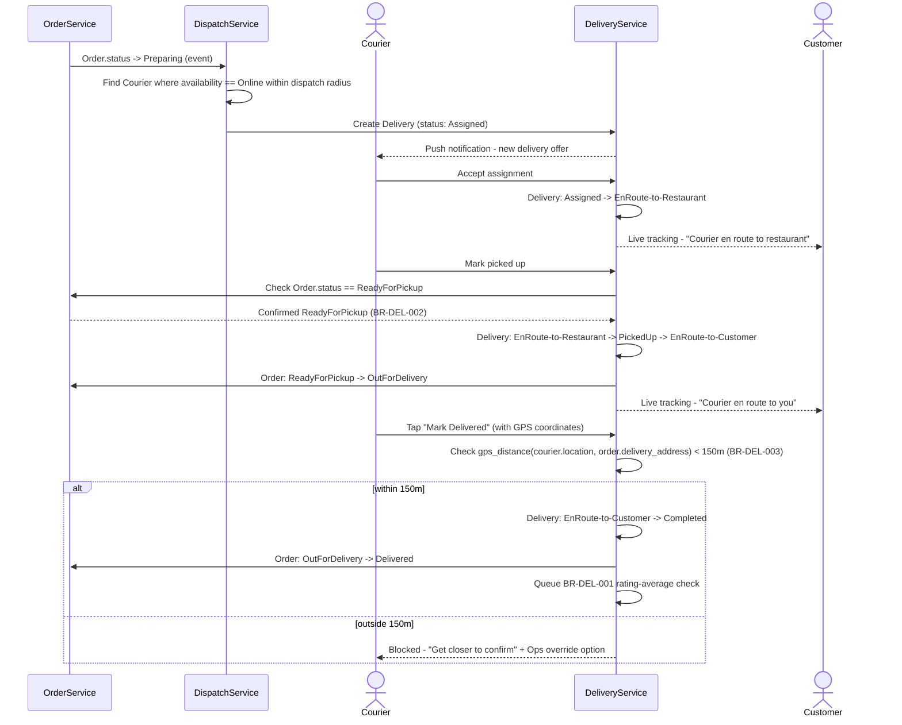

# Feature Card: Track assigned delivery in real time

---

## Description

Dispatches a Delivery to an available courier once an order enters preparation, then carries that Delivery through pickup and drop-off while surfacing live location to the customer. This is the second half of the MVP loop that [FEAT-ORD-001](/features/cards/FEAT-ORD-001.md) starts - without it, an order can be placed and prepared but never actually reaches the customer. Primary actor is the Courier (e.g., Priya Nair), whose accept/pickup/drop-off actions drive the Delivery state machine; the Customer is a secondary consumer viewing the live tracking map.

---

## 1. Biznis Mantinely (SDD Input)

*Populated by pm-feature-design (JIT). Links to live registers as source of truth.*

**Rules enforced in this feature:**

| Rule ID | Rule | Priority | Enforcement point |
|---|---|---|---|
| [BR-DEL-002](/domain/business_rules.md#br-del-002) | A Delivery cannot move to PickedUp until the Order is in ReadyForPickup state | Critical | `DeliveryService.markPickedUp` guard - blocks the transition server-side even if the courier has physically arrived early |
| [BR-DEL-001](/domain/business_rules.md#br-del-001) | A Courier whose rolling average rating over the last 20 deliveries falls below 4.5 stars is automatically suspended pending manual review | Critical | `CourierRatingService` - evaluated as a post-completion hook once this feature's Delivery reaches `Completed`; the suspension decision itself is [FEAT-DEL-004](/features/cards/FEAT-DEL-004.md), which this feature triggers but does not implement |
| [BR-DEL-003](/domain/business_rules.md#br-del-003) | A Delivery cannot be marked Completed unless GPS confirms the courier is within 150m of the delivery address, or an Ops staff member manually overrides with a logged reason | Critical | `DeliveryService.markCompleted` guard - client blocks the "Mark Delivered" action outside the radius; server re-validates GPS distance before accepting the transition. Business rules register names this feature as the enforcement point directly. |

**Entity guard conditions (from entities.md):**

| Entity | Transition | Guard condition |
|---|---|---|
| [Delivery](/domain/entities.md#delivery) | (none) → Assigned | `Order.status == Preparing` AND ≥ 1 `Courier` with `availability == Online` within the dispatch radius of the Restaurant |
| [Delivery](/domain/entities.md#delivery) | Assigned → EnRoute-to-Restaurant | Courier accepts the dispatch offer |
| [Delivery](/domain/entities.md#delivery) | EnRoute-to-Restaurant → PickedUp | `Order.status == ReadyForPickup` (BR-DEL-002 - blocks premature pickup even if the courier has already arrived at the restaurant) |
| [Delivery](/domain/entities.md#delivery) | PickedUp → EnRoute-to-Customer | Courier confirms pickup complete (immediate, same courier action as the transition above) |
| [Delivery](/domain/entities.md#delivery) | EnRoute-to-Customer → Completed | GPS-confirmed courier location within 150m of the delivery address (BR-DEL-003), OR an Ops staff override with a logged reason |
| [Order](/domain/entities.md#order) | ReadyForPickup → OutForDelivery | Mirrors `Delivery` reaching `PickedUp` - the two transitions fire together |
| [Order](/domain/entities.md#order) | OutForDelivery → Delivered | Mirrors `Delivery` reaching `Completed` |

**Decision model:** None - this feature is a state-machine progression gated by guard conditions, not a multi-branch decision table.

**What this feature does NOT do:**
- Does not calculate the courier's per-delivery payout - that's [FEAT-PAY-004](/features/cards/FEAT-PAY-004.md), which consumes this feature's completed Deliveries as input
- Does not support delivery reassignment if a courier goes offline mid-route (Post-MVP - a completed Delivery stuck mid-route requires manual dispatcher intervention for MVP)
- Does not include in-app courier-customer chat (Post-MVP)
- Does not implement the courier-suspension decision itself (rating threshold, review workflow) - that logic lives in [FEAT-DEL-004](/features/cards/FEAT-DEL-004.md); this feature only supplies the completed-delivery event that triggers the check

---

## 2. Acceptance Criteria

*Derived from register state + business rules by pm-feature-design. Used for human Black-box testing.*

### AC-01: Happy path - dispatch through completion
- **Given** an Order reaches `Preparing` and at least one Courier has `availability == Online` within the dispatch radius
- **When** the dispatch algorithm runs
- **Then** a Delivery record is created (`Assigned`), the courier is notified of the offer, and upon acceptance the Delivery moves to `EnRoute-to-Restaurant` with live location visible to the customer
  - **And** once the Order reaches `ReadyForPickup` and the courier marks pickup, the Delivery progresses PickedUp → EnRoute-to-Customer, and on drop-off confirmation moves to `Completed` while the Order mirrors to `Delivered`

### AC-02: Guard failure - premature pickup
- **Given** `Delivery.status == EnRoute-to-Restaurant` and `Order.status` is still `Preparing` (not yet `ReadyForPickup`)
- **When** the courier attempts to mark the order picked up
- **Then** the system blocks the transition (BR-DEL-002), the Delivery remains `EnRoute-to-Restaurant`, and the courier sees "Order not ready yet"

### AC-03: Feature Flag OFF
- **Given** flag `delivery.live-tracking` is OFF
- **When** an Order reaches `Preparing`
- **Then** dispatch falls back to the pre-launch manual process (restaurant calls/texts a courier directly) and no automated Delivery record or tracking UI is created

### AC-04: Guard failure - no available courier
- **Given** no Courier has `availability == Online` within the dispatch radius when an Order reaches `Preparing`
- **When** the dispatch algorithm runs and finds zero matches
- **Then** the Delivery remains unassigned, the restaurant dashboard shows a "Searching for courier" state, and the dispatch algorithm retries on a fixed interval until a match is found

### AC-05: Completion triggers downstream check
- **Given** `Delivery.status == EnRoute-to-Customer` and the courier's GPS location is within 150m of the delivery address
- **When** the courier taps "Mark Delivered"
- **Then** the Delivery transitions to `Completed`, the Order transitions to `Delivered`, and a BR-DEL-001 rating-average check is queued for evaluation against the courier's rolling 20-delivery average

### AC-06: Guard failure - drop-off confirmation outside proximity radius
- **Given** `Delivery.status == EnRoute-to-Customer` and the courier's GPS location is more than 150m from the delivery address
- **When** the courier attempts to mark the delivery complete
- **Then** the client blocks the action locally, the server re-validates and rejects the transition (BR-DEL-003), and the courier is shown "Get closer to the delivery address to confirm" with an "Request Ops override" fallback that requires a logged reason

---

## Subtasks (helper notes)

*Lightweight nuance / spec helpers for the developer - NOT deliverables, NOT sub-features.*

- [ ] Define default dispatch radius (proposal: 3 miles for the Boise pilot; make it configurable per market ahead of Phase 3 expansion)
- [ ] Confirm GPS accuracy tolerance and retry UX when a courier is genuinely at the address but device GPS reports >150m (BR-DEL-003 exception path - Ops override, not a feature bypass)
- [ ] Reuse the existing `MapView` component built for restaurant search/discovery for the live tracking display - avoid a second map integration
- [ ] Push notification copy for "Courier is on the way" / "Courier has arrived" milestones
- [ ] Retry/backoff interval when dispatch finds zero available couriers (AC-04) - proposal: retry every 30 seconds, escalate to restaurant dashboard alert after 3 failed attempts

> **Subtask-count signal:** 5 subtasks - within normal range, no atomicity concern.

---

## 3. JIT Technical Design (FDD Design)

*Populated by pm-feature-design just before build. Approved during Design Inspection.*

### Data flow and object interaction

### Files to modify
- `services/dispatch-service/src/handlers/assignCourier.ts` (new)
- `services/delivery-service/src/handlers/updateDeliveryStatus.ts` (new)
- `services/delivery-service/src/validators/readyForPickupGuard.ts` (new)
- `services/delivery-service/src/validators/proximityConfirmationGuard.ts` (new - BR-DEL-003 GPS distance check + Ops override path)
- `apps/mobile-courier/src/screens/ActiveDeliveryScreen.tsx` (new)
- `apps/web/src/features/tracking/LiveTrackingMap.tsx` (new - reuses `MapView` from restaurant search)
- `services/order-service/src/events/orderPreparingEvent.ts` (modify - emit event consumed by DispatchService)

---

## 4. Realizacny Protokol (Build Verification)

*TBD - populated after build and Code Inspection*
