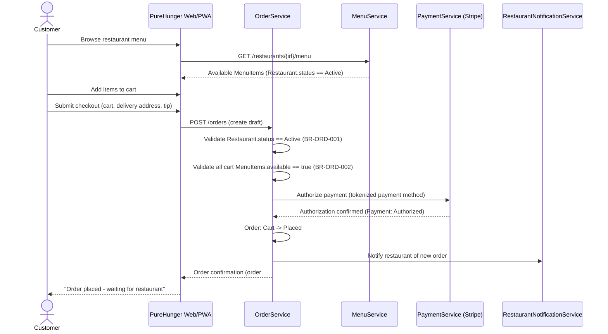

# Feature Card: Place order from restaurant cart

---

## Description

Lets a Boise customer discover an Active restaurant, build a cart from its available menu items, and complete checkout end-to-end - authorizing payment and confirming order placement. This is the MVP entry point: every other ordering, restaurant, delivery, and payment feature exists to fulfill the order this feature creates. Used by the Customer persona (e.g., Maya Torres) on the customer-facing web/PWA app.

---

## 1. Biznis Mantinely (SDD Input)

**Rules enforced in this feature:**

| Rule ID | Rule | Priority | Enforcement point |
|---|---|---|---|
| [BR-ORD-001](/domain/business_rules.md#br-ord-001) | An Order cannot be placed if the Restaurant is not in Active state | Critical | `OrderService.createOrder` guard (checked at submit, re-checked server-side - not trusted from client state) |
| [BR-ORD-002](/domain/business_rules.md#br-ord-002) | A MenuItem must be marked available to be added to a cart | Critical | `CartService.addItem` (client-side UX block) + `OrderService.createOrder` (server-side re-validation at submit, since availability can change between add-to-cart and checkout) |
| [BR-PAY-001](/domain/business_rules.md#br-pay-001) | Payment must be authorized at Order placement but captured in full only when the Restaurant accepts the order | Critical | `PaymentService.authorizePayment` - this feature performs the **Authorize** half only; Capture is [FEAT-PAY-002](/features/cards/FEAT-PAY-002.md), triggered by restaurant acceptance ([FEAT-ORD-010](/features/cards/FEAT-ORD-010.md)) |
| [BR-GOV-001](/domain/business_rules.md#br-gov-001) | Customer payment data (card details) must never be stored directly - only the processor's tokenized reference | Critical | `PaymentService` integration - card entry happens in the payment processor's hosted field; PureHunger's database stores only the returned payment-method token |

**Entity guard conditions (from entities.md):**

| Entity | Transition | Guard condition |
|---|---|---|
| [Order](/domain/entities.md#order) | Cart → Placed | `Restaurant.status == Active` AND all cart `MenuItem.available == true` AND `Payment.status == Authorized` |
| [Payment](/domain/entities.md#payment) | (none) → Authorized | Valid tokenized payment method on file AND a draft Order exists to authorize against |

**Decision model:** None - this feature is straight guard-condition validation (Restaurant active + items available + payment authorized), no branching decision table is needed.

**What this feature does NOT do:**
- Does not capture payment in full - capture happens only on Restaurant acceptance ([FEAT-ORD-010](/features/cards/FEAT-ORD-010.md), [FEAT-PAY-002](/features/cards/FEAT-PAY-002.md))
- Does not handle courier assignment or delivery tracking (see [FEAT-DEL-002](/features/cards/FEAT-DEL-002.md))
- Does not support scheduled/future orders (Post-MVP, see `product/product-roadmap-v3.md` "What We Are Not Building")
- Does not support group ordering or split payments across multiple payers (Post-MVP)

---

## 2. Acceptance Criteria

### AC-01: Happy path - order placed successfully
- **Given** a Restaurant in `Active` state with at least one `available` MenuItem, and a customer with a valid tokenized payment method
- **When** the customer adds items to cart and submits checkout
- **Then** the Order transitions Cart → Placed, the Payment transitions to Authorized, and the restaurant is notified of a new order
  - **And** the customer sees an order confirmation with estimated prep time

### AC-02: Guard failure - Restaurant not Active
- **Given** a Restaurant with `status != Active` (Pending, Paused, or Deactivated)
- **When** a customer attempts to submit checkout against that restaurant
- **Then** the system blocks order creation server-side (BR-ORD-001), the Order is never created, and the customer sees "This restaurant is currently unavailable"

### AC-03: Feature Flag OFF
- **Given** flag `ordering.checkout` is OFF
- **When** a customer attempts to check out
- **Then** the checkout button is hidden entirely (browse-only mode) - since this is the MVP entry point, there is no prior "existing behavior" to fall back to

### AC-04: Guard failure - MenuItem became unavailable mid-session
- **Given** a MenuItem in the customer's cart was marked unavailable by the restaurant after it was added but before checkout submit
- **When** the customer submits checkout
- **Then** the system blocks the transition (BR-ORD-002), returns an itemized error identifying the affected item(s), and the Order is not created
  - **And** the cart is adjusted to remove the unavailable item(s) so the customer can retry immediately

### AC-05: Guard failure - payment authorization declined
- **Given** a customer's payment method is declined by the processor at authorization time
- **When** checkout is submitted
- **Then** the Order remains uncommitted (no Cart → Placed transition), no state change occurs, and the customer is shown a retry-payment-method prompt

---

## Subtasks (helper notes)

- [x] Show itemized error identifying which cart item(s) became unavailable mid-session (AC-04)
- [x] Debounce/re-check restaurant-active status at submit time to close the race window if a restaurant pauses mid-checkout
- [x] Display estimated prep time on the order confirmation screen (pulled from restaurant's average prep time, not a hard SLA)
- [x] Reuse the existing Stripe tokenization flow already built for restaurant payout onboarding - no new PCI scope introduced

---

## 3. JIT Technical Design (FDD Design)

### Data flow and object interaction

### Files to modify
- `apps/web/src/features/checkout/CheckoutPage.tsx`
- `apps/web/src/features/checkout/CartSummary.tsx`
- `services/order-service/src/handlers/createOrder.ts`
- `services/order-service/src/validators/restaurantActiveGuard.ts`
- `services/order-service/src/validators/menuItemAvailableGuard.ts`
- `services/payment-service/src/stripe/authorizePayment.ts`
- `services/notification-service/src/handlers/notifyRestaurantNewOrder.ts`

---

## 4. Realizacny Protokol (Build Verification)

- **Production code commits:**
  - `feat(checkout): implement cart-to-checkout UI with itemized error handling (a1b2c3d)`
  - `feat(order-service): add restaurant-active and menu-availability guards to order creation (d4e5f6a)`
  - `feat(payment-service): integrate Stripe payment authorization at checkout (7g8h9i0)`

- **Test files:**
  - `tests/unit/OrderService_FEAT-ORD-001_spec.ts`
  - `tests/unit/PaymentService_FEAT-ORD-001_spec.ts`
  - `tests/e2e/checkout_flow_FEAT-ORD-001.spec.ts`

- **Feature flag OFF verification:** yes - confirmed checkout entry point is hidden and no draft Order/Payment records are created when `ordering.checkout` is OFF

- **Code Inspection:** Approved by Lena Vogt on 2026-03-14
