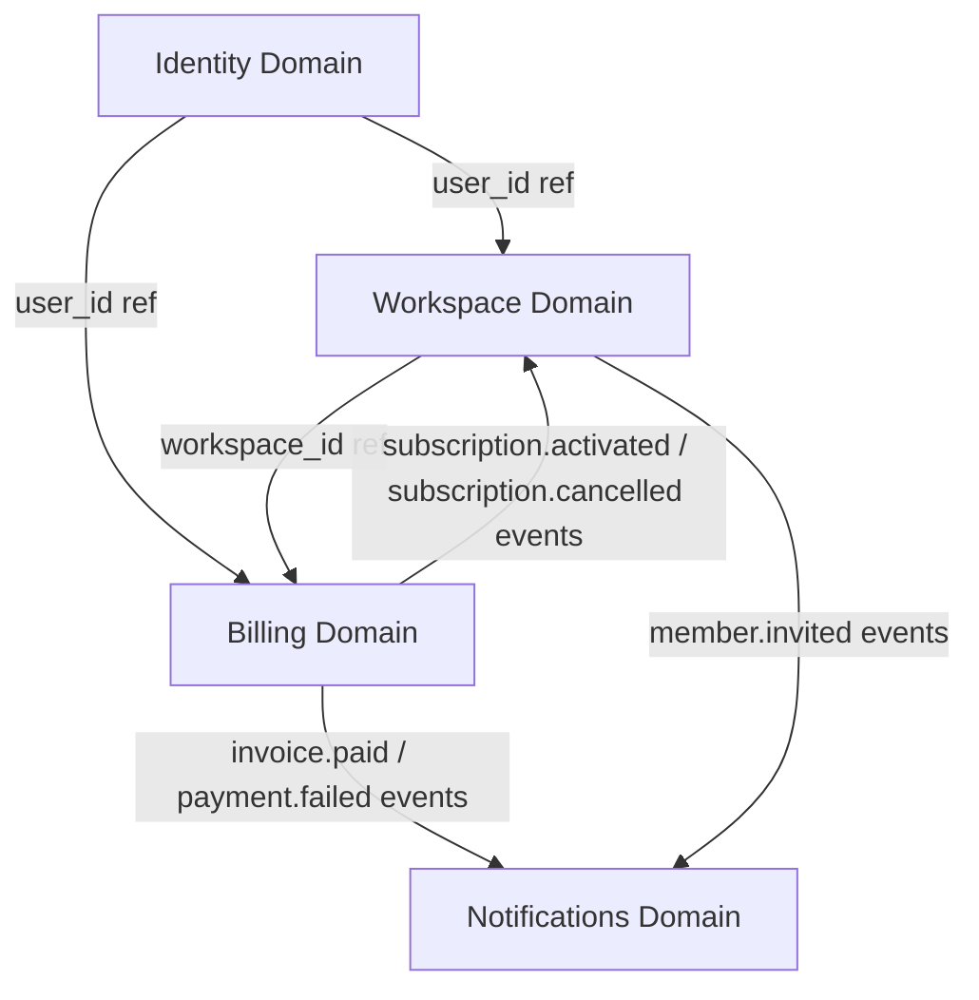
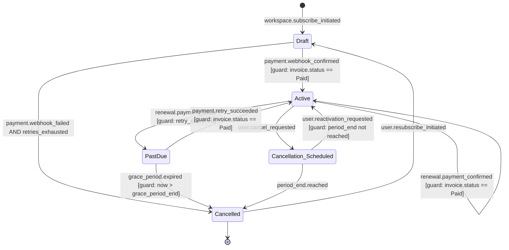
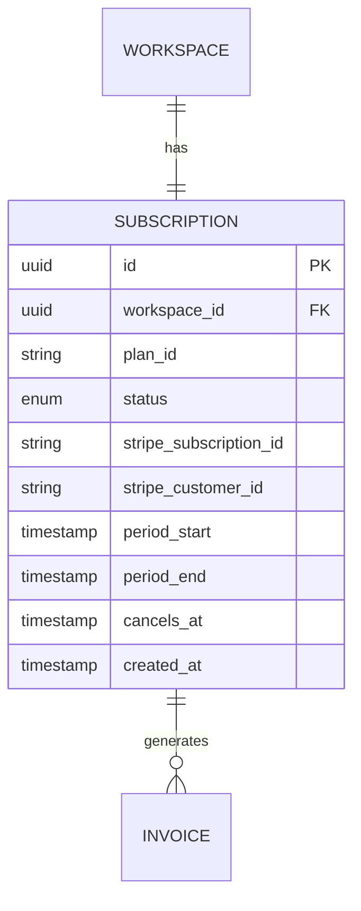
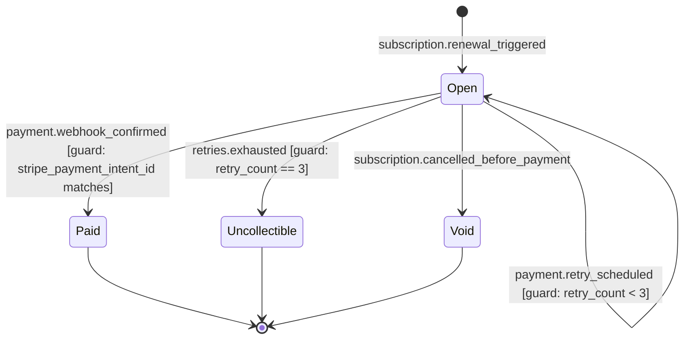
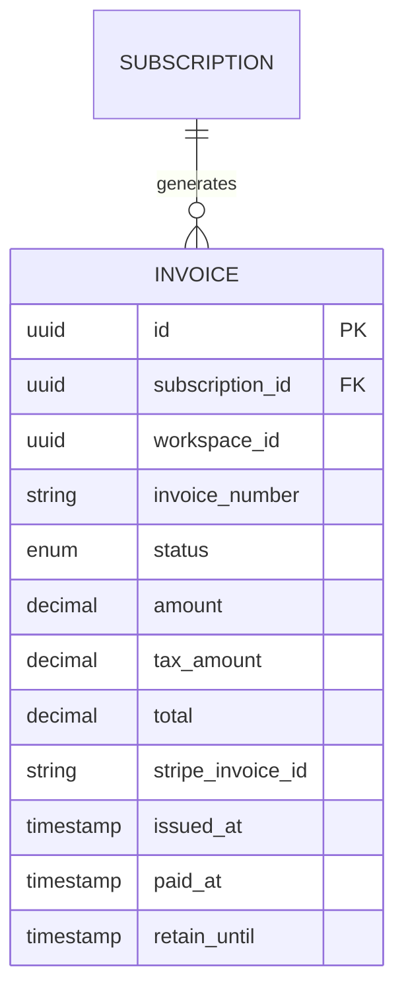
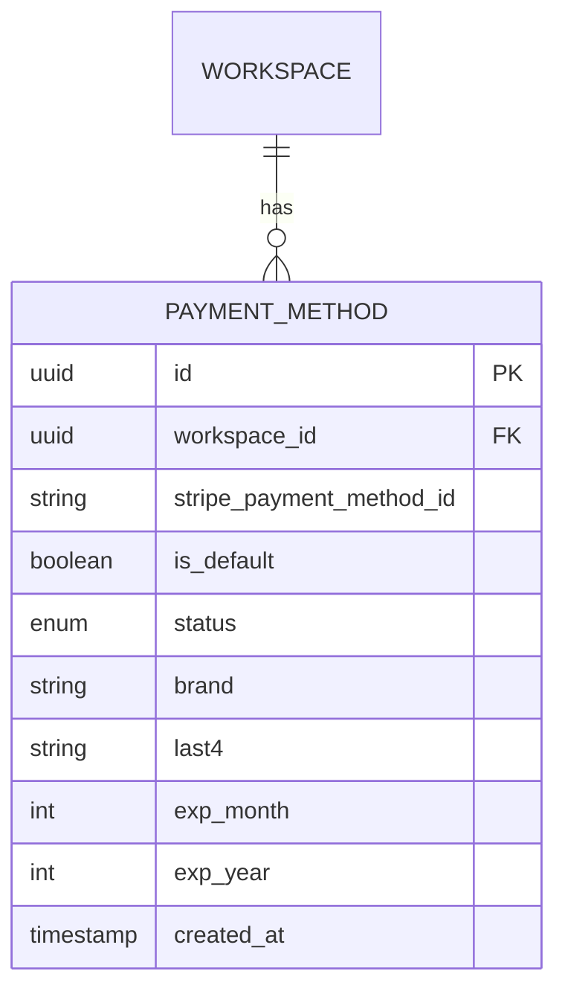
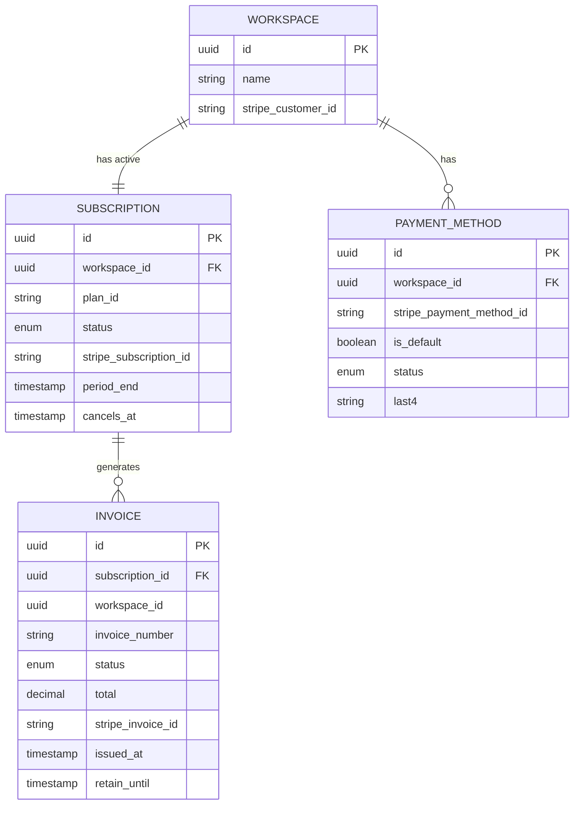

# Domain Model - ProjectFlow SaaS
# Subscription Billing Initiative Addendum

**Version:** 1.2
**Date:** 2026-06-01
**Status:** Final - Stage 2 complete

---

> **Note:** This example shows a domain model in **append mode** - the Billing domain was added for the
> subscription-billing initiative. The existing Identity and Workspace domains (Users, Workspaces, Teams)
> are referenced but not detailed here for brevity. The full domain model would include all domains.

---

## 1. Business Domains

| Domain | Responsibility | Key entities |
|---|---|---|
| Identity | User accounts, authentication, profiles, sessions | User, Profile, Session |
| Workspace | Workspace lifecycle, membership, seat management, settings | Workspace, Member, Seat |
| Billing | Subscription lifecycle, payment processing, invoicing | Subscription, Invoice, PaymentMethod |
| Notifications | Email and in-app notification delivery | Notification, NotificationTemplate |

---

## 2. Domain Boundaries

**Principles:**
- Each entity has one owner domain - the source of truth.
- Domains communicate via references (IDs) and events, not direct data access.
- Billing domain does not own Workspace access logic - it emits events; Workspace domain enforces access.
- Identity domain owns User authentication; Billing domain references User only by ID for audit trail.
- Stripe objects (PaymentIntent, Customer, Subscription) are external entities - Billing domain stores only IDs and essential display data.

---

## 3. High-Level Domain Diagram

---

## 4. Entity Catalogue

### Internal Entities

| ID | Entity | Domain | Description |
|---|---|---|---|
| ENT-001 | User | Identity | Person with an account - can be a member of multiple workspaces |
| ENT-002 | Workspace | Workspace | A team's isolated environment - unit of billing |
| ENT-003 | Member | Workspace | Relationship between a User and a Workspace with a role |
| ENT-004 | Subscription | Billing | A Workspace's commercial relationship with the product - governs access and billing cycle |
| ENT-005 | Invoice | Billing | A billing record for one subscription period - immutable once Paid |
| ENT-006 | PaymentMethod | Billing | A stored card or payment instrument linked to a Workspace via Stripe |

### External / Integration Entities

| ID | Entity | Source system | Description |
|---|---|---|---|
| EXT-001 | StripeCustomer | Stripe | Stripe's customer object - one per Workspace. Stores Stripe payment methods and billing details. |
| EXT-002 | StripeSubscription | Stripe | Stripe's subscription object - mirrors our Subscription entity. Source of truth for billing cycle dates. |
| EXT-003 | StripePaymentIntent | Stripe | Stripe's payment intent - created per renewal attempt. Referenced on Invoice. |
| EXT-004 | StripePaymentMethod | Stripe | Stripe's vaulted card object - referenced by our PaymentMethod entity via stripe_payment_method_id. |

### Entities Flagged as TBD

| Entity | Why flagged | Priority |
|---|---|---|
| CreditNote | Needed for invoice corrections - not in v1 (manual Stripe dashboard) | Post-MVP |
| DiscountCode | Promo/coupon system mentioned in roadmap but out of scope for billing initiative v1 | Post-MVP |

---

## 5. Entity Definitions

---

### ENT-004: Subscription

**Domain:** Billing
**Description:** Represents a Workspace's commercial relationship with the product. Governs which features the workspace can access and whether access is currently active. One Subscription per Workspace at a time.

#### Attributes

| Attribute | Type | Required | Description | Notes |
|---|---|---|---|---|
| `id` | UUID | Yes | Unique identifier | PK |
| `workspace_id` | UUID | Yes | Owner workspace | FK to ENT-002 |
| `plan_id` | String | Yes | Plan code (starter / pro / business) | Enum - see below |
| `status` | Enum | Yes | Lifecycle state | See states |
| `stripe_subscription_id` | String | Yes | Stripe subscription object ID | External ID, unique |
| `stripe_customer_id` | String | Yes | Stripe customer ID for this workspace | FK to EXT-001 |
| `period_start` | Timestamp | Yes | Start of current billing period | From Stripe |
| `period_end` | Timestamp | Yes | End of current billing period | From Stripe |
| `cancels_at` | Timestamp | No | Date access will end - set on cancellation | NULL unless Cancellation_Scheduled |
| `trial_ends_at` | Timestamp | No | Trial expiry date | NULL if not on trial |
| `created_at` | Timestamp | Yes | Record creation time | |
| `updated_at` | Timestamp | Yes | Last modification time | |

#### Identifiers

| Type | Attribute |
|---|---|
| Primary Key | `id` |
| Business Key | `workspace_id` (one active subscription per workspace) |
| External ID | `stripe_subscription_id` |

#### Relationships

| Relationship | Target | Type | Cardinality | Description |
|---|---|---|---|---|
| Belongs to | ENT-002 Workspace | Ownership | N:1 | A subscription belongs to one workspace |
| Has many | ENT-005 Invoice | Association | 1:N | A subscription generates invoices per billing period |
| Has many | ENT-006 PaymentMethod | Association | 1:N | Via workspace - workspace holds payment methods |

#### States

| State | Description | Entry conditions |
|---|---|---|
| Draft | Created, awaiting first payment confirmation | Workspace initiates subscribe flow |
| Active | Payment confirmed, full product access granted | `payment_intent.succeeded` webhook received |
| PastDue | Renewal payment failed, in 7-day grace period | Renewal invoice payment fails (retry count = 0) |
| Cancellation_Scheduled | User requested cancellation, active until period_end | User confirms cancellation |
| Cancelled | Access ended - grace period expired or period_end reached | Grace period expires OR period_end reached after cancellation |

**State transitions:**

#### Events

| Event | Trigger | Payload fields |
|---|---|---|
| `subscription.activated` | Subscription transitions to Active | `subscription_id`, `workspace_id`, `plan_id`, `period_end` |
| `subscription.cancelled` | Subscription transitions to Cancelled | `subscription_id`, `workspace_id`, `cancelled_at` |
| `subscription.past_due` | Subscription transitions to PastDue | `subscription_id`, `workspace_id`, `grace_period_end` |
| `subscription.cancellation_scheduled` | User schedules cancellation | `subscription_id`, `workspace_id`, `cancels_at` |

#### Enums

| Enum | Values | Description |
|---|---|---|
| `plan_id` | `starter`, `pro`, `business` | Available plan tiers |
| `status` | `draft`, `active`, `past_due`, `cancellation_scheduled`, `cancelled` | Lifecycle state |

#### ERD Diagram

---

### ENT-005: Invoice

**Domain:** Billing
**Description:** A billing record for one subscription period. Immutable once status reaches Paid (BR-INV-001). Must be retained for 7 years (BR-REG-001).

#### Attributes

| Attribute | Type | Required | Description | Notes |
|---|---|---|---|---|
| `id` | UUID | Yes | Unique identifier | PK |
| `subscription_id` | UUID | Yes | Associated subscription | FK to ENT-004 |
| `workspace_id` | UUID | Yes | Denormalized workspace ref | For retention after workspace deletion |
| `invoice_number` | String | Yes | Human-readable invoice reference | e.g., INV-2026-00042 |
| `status` | Enum | Yes | Payment lifecycle state | See states |
| `amount` | Decimal | Yes | Invoice total before tax (EUR) | Immutable after Paid |
| `tax_amount` | Decimal | Yes | Tax component (EUR) | Immutable after Paid |
| `total` | Decimal | Yes | amount + tax_amount | Derived, immutable after Paid |
| `currency` | String | Yes | ISO 4217 currency code | Default: EUR |
| `stripe_invoice_id` | String | Yes | Stripe invoice object ID | External ID |
| `stripe_payment_intent_id` | String | No | Stripe PaymentIntent ID for this attempt | NULL until payment attempted |
| `period_start` | Timestamp | Yes | Billing period start | From Stripe subscription |
| `period_end` | Timestamp | Yes | Billing period end | From Stripe subscription |
| `issued_at` | Timestamp | Yes | Invoice generation date | |
| `paid_at` | Timestamp | No | Payment confirmation timestamp | NULL until Paid |
| `retain_until` | Timestamp | Yes | issued_at + 7 years | BR-REG-001 retention requirement |
| `created_at` | Timestamp | Yes | Record creation time | |

#### Identifiers

| Type | Attribute |
|---|---|
| Primary Key | `id` |
| Business Key | `invoice_number` |
| External ID | `stripe_invoice_id`, `stripe_payment_intent_id` |

#### Relationships

| Relationship | Target | Type | Cardinality | Description |
|---|---|---|---|---|
| Belongs to | ENT-004 Subscription | Ownership | N:1 | Invoice belongs to one subscription |
| References | ENT-002 Workspace | Association | N:1 | Denormalized for retention after workspace deletion |

#### States

| State | Description | Entry conditions |
|---|---|---|
| Open | Invoice generated, payment not yet confirmed | Subscription renewal triggered |
| Paid | Payment confirmed via Stripe webhook | `payment_intent.succeeded` webhook received |
| Uncollectible | Retries exhausted, payment not recovered | Retry count reaches 3 without success |
| Void | Cancelled before payment - e.g., subscription cancelled in Draft state | Subscription cancelled before first payment |

**State transitions:**

#### Events

| Event | Trigger | Payload fields |
|---|---|---|
| `invoice.paid` | Invoice transitions to Paid | `invoice_id`, `subscription_id`, `workspace_id`, `amount`, `paid_at` |
| `invoice.payment_failed` | Payment attempt fails | `invoice_id`, `subscription_id`, `retry_count` |
| `invoice.uncollectible` | Invoice marked Uncollectible | `invoice_id`, `subscription_id`, `workspace_id` |

#### Enums

| Enum | Values | Description |
|---|---|---|
| `status` | `open`, `paid`, `uncollectible`, `void` | Payment lifecycle state |

#### Derived Fields

| Field | Derived from | Business meaning |
|---|---|---|
| `total` | `amount + tax_amount` | Final billable amount |
| `retain_until` | `issued_at + 7 years` | Earliest date this invoice may be hard-deleted (BR-REG-001) |

#### Notes

Invoices survive workspace deletion. When a workspace is deleted, `workspace_id` is set to NULL and billing details (amount, address, invoice_number) are retained. This is required by BR-REG-001 (7-year tax retention). Do not cascade-delete invoices on workspace deletion.

#### ERD Diagram

---

### ENT-006: PaymentMethod

**Domain:** Billing
**Description:** A stored payment instrument (card) linked to a Workspace via Stripe. Local record stores only display data - full card details are vaulted exclusively in Stripe (BR-REG-002 / PCI DSS).

#### Attributes

| Attribute | Type | Required | Description | Notes |
|---|---|---|---|---|
| `id` | UUID | Yes | Unique identifier | PK |
| `workspace_id` | UUID | Yes | Owner workspace | FK to ENT-002 |
| `stripe_payment_method_id` | String | Yes | Stripe PaymentMethod object ID | External ID, unique |
| `stripe_customer_id` | String | Yes | Stripe Customer ID for this workspace | FK to EXT-001 |
| `is_default` | Boolean | Yes | Whether this is the active default for renewals | Only one true per workspace |
| `status` | Enum | Yes | Availability state | See enums |
| `brand` | String | Yes | Card brand (visa, mastercard, amex) | Display only |
| `last4` | String | Yes | Last 4 digits of card | Display only |
| `exp_month` | Integer | Yes | Card expiry month (1-12) | Display + expiry warning |
| `exp_year` | Integer | Yes | Card expiry year (4-digit) | Display + expiry warning |
| `created_at` | Timestamp | Yes | Record creation time | |
| `updated_at` | Timestamp | Yes | Last modification time | |

#### Identifiers

| Type | Attribute |
|---|---|
| Primary Key | `id` |
| External ID | `stripe_payment_method_id` |

#### Relationships

| Relationship | Target | Type | Cardinality | Description |
|---|---|---|---|---|
| Belongs to | ENT-002 Workspace | Ownership | N:1 | Payment method belongs to one workspace |

#### States

| State | Description | Entry conditions |
|---|---|---|
| Active | Valid and available for use | Card added and confirmed via Stripe |
| Expired | Past expiry date | exp_month/exp_year in the past (checked weekly) |
| Removed | Detached by user | User removes card; local record soft-deleted |

#### Events

| Event | Trigger | Payload fields |
|---|---|---|
| `payment_method.added` | User adds new card | `payment_method_id`, `workspace_id`, `brand`, `last4` |
| `payment_method.set_default` | User changes default | `payment_method_id`, `workspace_id` |
| `payment_method.expired` | Weekly expiry check detects expired card | `payment_method_id`, `workspace_id`, `exp_month`, `exp_year` |
| `payment_method.removed` | User removes card | `payment_method_id`, `workspace_id` |

#### Enums

| Enum | Values | Description |
|---|---|---|
| `status` | `active`, `expired`, `removed` | Availability state |

#### Notes

Never store full PAN, CVV, or any card data beyond the fields listed above (BR-REG-002). On removal: call `stripe.paymentMethods.detach(stripe_payment_method_id)` before soft-deleting the local record. Cannot remove default card while workspace has an Active or PastDue subscription - must set a new default first (BR-PAY-002).

#### ERD Diagram

---

## 6. Full ERD - Billing Domain

