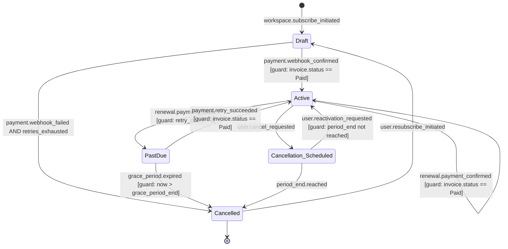
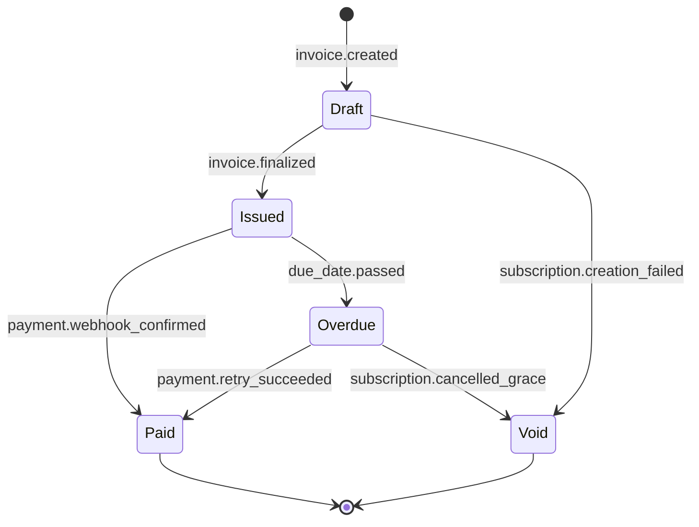
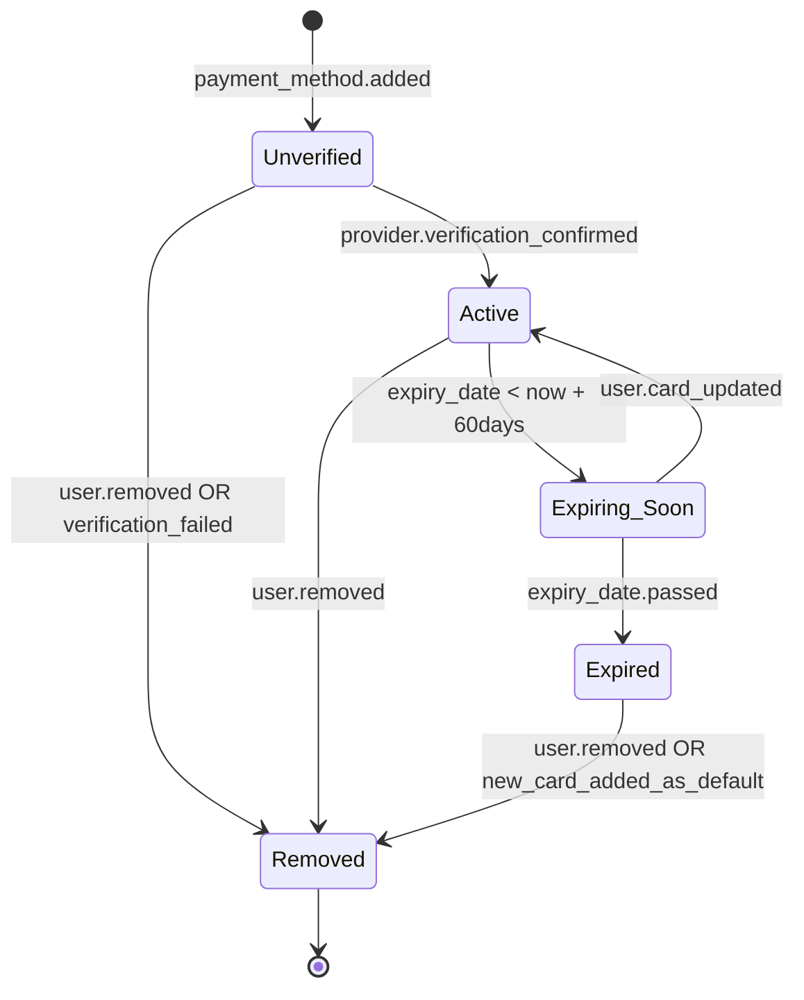

# Entity & State Registry
# Live Register 1 of 4 - FDD+SDD Framework

> **Product:** ProjectFlow SaaS
> **Version:** 1.2
> **Last updated:** 2026-06-01
> **Maintained by:** pm-entity-registry skill + pm-feature-design (JIT guard conditions)

---

> **How to read this register:**
> - States: business lifecycle states (not technical flags)
> - Transitions: trigger (what causes it) + emits (event produced) + guard (added JIT in Phase 6)
> - This register is an architectural guardrail - Claude Code reads it before implementing any feature

---

> **Note:** This example shows entities.md in **append mode** - the Subscription, Invoice, and PaymentMethod
> entities were added by pm-entity-registry for the subscription-billing initiative. Existing entities
> (User, Workspace, Team) from the original product are above - not shown here for brevity.

---

## Subscription

**Business role:** Represents a Workspace's commercial relationship with the product. Governs which features the workspace can access and whether access is currently active.
**Owned by Feature Set:** Subscription Stripe (FEAT-SUB-*)
**Domain code:** SUB

**States:**

| State | Meaning | Terminal? |
|---|---|---|
| Draft | Created, awaiting first payment confirmation | No |
| Active | Payment confirmed, full access granted | No |
| PastDue | Renewal payment failed, in grace period (7 days) | No |
| Cancellation_Scheduled | User requested cancellation, active until period_end | No |
| Cancelled | Grace period expired or period_end reached after cancellation | Yes |

**State machine:**

**Transitions:**

| From | To | Trigger | Emits | Guard condition |
|---|---|---|---|---|
| Draft | Active | payment.webhook_confirmed | subscription.activated | invoice.status == Paid (finalized: FEAT-SUB-001) |
| Draft | Cancelled | payment.webhook_failed + retries_exhausted | subscription.creation_failed | retry_count >= 3 |
| Active | PastDue | renewal.payment_failed | subscription.past_due | retry_count < 3 (finalized: FEAT-SUB-005) |
| Active | Cancellation_Scheduled | user.cancel_requested | subscription.cancellation_scheduled | - |
| Active | Active | renewal.payment_confirmed | subscription.renewed | invoice.status == Paid |
| PastDue | Active | payment.retry_succeeded | subscription.reactivated | invoice.status == Paid |
| PastDue | Cancelled | grace_period.expired | subscription.cancelled_grace | now > grace_period_end (finalized: FEAT-SUB-005) |
| Cancellation_Scheduled | Active | user.reactivation_requested | subscription.reactivated | period_end not reached (finalized: FEAT-SUB-003) |
| Cancellation_Scheduled | Cancelled | period_end.reached | subscription.cancelled | - |
| Cancelled | Draft | user.resubscribe_initiated | subscription.resubscribe_started | - |

**Illegal transitions:**
- Active → Cancelled (must go through Cancellation_Scheduled or PastDue first)
- Cancelled → Active (must create new subscription Draft)
- PastDue → Cancellation_Scheduled (not allowed during grace period)

**Attributes (key):**
- `plan`: starter | pro | enterprise
- `billing_cycle`: monthly | annual
- `period_start`, `period_end`: current billing period
- `grace_period_end`: period_end + 7 days (set on PastDue entry)
- `stripe_subscription_id`: external reference
- `workspace_id`: owning workspace

---

## Invoice

**Business role:** Financial record of a payment attempt. Must exist for every payment event - successful or failed. Immutable after status reaches Issued.
**Owned by Feature Set:** Subscription Stripe (FEAT-SUB-*)
**Domain code:** INV

**States:**

| State | Meaning | Terminal? |
|---|---|---|
| Draft | Being prepared, not yet sent to customer | No |
| Issued | Sent to customer, awaiting payment | No |
| Paid | Payment confirmed by provider webhook | Yes |
| Overdue | Not paid after due date | No |
| Void | Cancelled before payment (e.g., subscription creation failed) | Yes |

**State machine:**

**Transitions:**

| From | To | Trigger | Emits | Guard condition |
|---|---|---|---|---|
| Draft | Issued | invoice.finalized | invoice.issued | all required fields present (finalized: FEAT-SUB-001) |
| Draft | Void | subscription.creation_failed | invoice.voided | - |
| Issued | Paid | payment.webhook_confirmed | invoice.paid | stripe webhook event = payment_intent.succeeded |
| Issued | Overdue | due_date.passed | invoice.overdue | now > due_date |
| Overdue | Paid | payment.retry_succeeded | invoice.paid | - |
| Overdue | Void | subscription.cancelled_grace | invoice.voided | - |

**Illegal transitions:**
- Paid → any state (terminal - immutable after payment confirmed per BR-INV-001)
- Void → any state (terminal)

**Attributes (key):**
- `invoice_number`: sequential, human-readable (INV-2026-0001)
- `subscription_id`: linked subscription
- `amount_due`, `tax_amount`, `total`: financial fields
- `stripe_invoice_id`: external reference
- `issued_at`, `due_date`, `paid_at`: timeline

---

## PaymentMethod

**Business role:** A verified payment instrument belonging to a Workspace. Used for automatic renewal charges. At least one PaymentMethod must be Active for a Subscription to remain active.
**Owned by Feature Set:** Subscription Stripe (FEAT-SUB-*)
**Domain code:** PAY

**States:**

| State | Meaning | Terminal? |
|---|---|---|
| Unverified | Added but not yet confirmed by provider | No |
| Active | Verified, can be charged | No |
| Expiring_Soon | Active but card expires within 60 days | No |
| Expired | Card expiry date passed | No |
| Removed | Explicitly removed by user | Yes |

**State machine:**

**Illegal transitions:**
- Active → Expired (must go through Expiring_Soon)
- Removed → any state (terminal)

---

## Entity Relationship Overview

| Entity | Relates to | Relationship |
|---|---|---|
| Subscription | Workspace | One Subscription per Workspace (one active at a time) |
| Subscription | Invoice | One Subscription has many Invoices (one per billing period) |
| Subscription | PaymentMethod | One Subscription uses one default PaymentMethod |
| Invoice | Subscription | Belongs to one Subscription |
| PaymentMethod | Workspace | One Workspace has many PaymentMethods (one default) |

---

## Changelog

| Version | Date | Change | Reason |
|---|---|---|---|
| 1.0 | 2026-05-01 | Initial extraction from PRD - User, Workspace, Team entities | Phase 4 kickoff |
| 1.1 | 2026-05-15 | Guard conditions added for FEAT-USR-001, FEAT-WS-003 | JIT pm-feature-design |
| 1.2 | 2026-06-01 | Subscription, Invoice, PaymentMethod entities added | subscription-billing initiative append |
