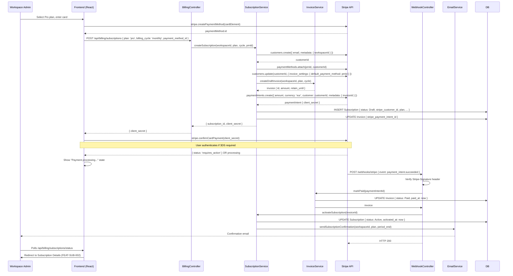

# FEAT-SUB-001: Subscribe to a plan

> **Status:** 6_Promoted_to_Build - immutable after code inspection
> **Stripe:** Subscription Billing - Stripe 1
> **Feature flag:** `billing-subscription-create` (OFF by default, flipped after Code Inspection)

---

## Section 1: Biznis Mantinely

*Business constraints that bound this feature. Referenced from domain/business_rules.md and domain/entities.md.*

**Rules enforced in this feature:**

| Rule ID | Rule | Priority | Enforcement point |
|---|---|---|---|
| BR-SUB-001 | Subscription activates only on Stripe webhook confirmation, never on direct API response | Critical | Webhook handler: payment_intent.succeeded |
| BR-PAY-001 | Invoice status set to Paid only on webhook confirmation with valid signature | Critical | Webhook handler: payment_intent.succeeded |
| BR-INV-001 | Invoice is immutable after reaching Paid status | Critical | InvoiceService - block all writes on Paid invoices |
| BR-REG-001 | Invoice must be retained for 7 years | Critical | Invoice.retain_until = issued_at + 7 years (set on creation) |
| BR-REG-002 | Card data must not be stored locally - Stripe vaults all card data | Critical | PaymentMethodService - store only stripe_payment_method_id, brand, last4, exp_month, exp_year |

**Entity guard conditions (from entities.md):**

| Entity | Transition | Guard condition |
|---|---|---|
| Subscription | Draft → Active | `invoice.status == Paid` AND `stripe_webhook.event == payment_intent.succeeded` |
| Invoice | Draft → Issued | all required VAT fields present (workspace billing address, seller details, line items) |
| Invoice | Issued → Paid | `stripe_webhook.payment_intent_id == invoice.stripe_payment_intent_id` AND `webhook.signature_valid == true` |

**What this feature does NOT do:**
- Does not support immediate Enterprise plan self-serve (Enterprise = "Contact sales" CTA only)
- Does not store or handle raw card numbers at any point
- Does not activate subscription based on Stripe API response - only webhook
- Does not issue refunds (out of scope in v1)

---

## Section 2: Acceptance Criteria

**Happy path - successful subscription creation:**

```
GIVEN a Workspace Admin on the Pricing page with billing-subscription-create flag ON
WHEN they select the Pro plan (monthly)
AND enter valid card details (4242 4242 4242 4242 for test)
AND confirm payment
THEN a PaymentIntent is created in Stripe
AND the user is shown a payment processing state
WHEN the payment_intent.succeeded webhook is received and signature is valid
THEN Subscription.status transitions Draft → Active
AND Invoice.status transitions Draft → Issued → Paid
AND Invoice.retain_until is set to Invoice.issued_at + 7 years
AND a subscription confirmation email is sent to the admin
AND the workspace gains full product access
AND the user is redirected to the Subscription Details page (FEAT-SUB-002)
```

**Guard failure - payment fails:**

```
GIVEN a Workspace Admin completing subscription checkout
WHEN Stripe returns a payment failure (card declined: 4000 0000 0000 0002)
THEN no Subscription is created (or Subscription stays in Draft, not activated)
AND Invoice is voided
AND the user sees an error: "Payment failed. Please check your card details and try again."
AND the workspace does not gain product access
AND the user can retry with a different card
```

**Guard failure - webhook signature invalid:**

```
GIVEN a payment_intent.succeeded webhook arrives
WHEN Stripe-Signature header verification fails
THEN the webhook is rejected with HTTP 400
AND no subscription state change occurs
AND the failure is logged with the webhook payload for investigation
```

**Feature flag OFF:**

```
GIVEN a user visits the Pricing page
WHEN billing-subscription-create flag is OFF
THEN all plan selection and checkout UI is hidden
AND the Pricing page shows a "Coming soon - contact us" message
AND no Stripe API calls are made
```

**Edge cases:**

| Scenario | Expected behavior |
|---|---|
| User closes browser during payment processing | Webhook arrives after timeout → subscription activates → user sees Active status on next visit |
| Duplicate webhook delivery (Stripe retries) | Idempotency check: if subscription already Active, discard duplicate |
| Enterprise plan selected | "Contact sales" modal appears, no checkout flow initiated |
| Annual plan selected | Invoice amount = monthly_price × 12 × 0.8 (20% annual discount) |

---

## Section 3: Technical Design

**Sequence diagram:**



**Files to create or modify:**

| File | Action | Notes |
|---|---|---|
| `src/billing/subscription.service.ts` | CREATE | createSubscription, activateSubscription, getSubscriptionStatus |
| `src/billing/invoice.service.ts` | CREATE | createDraftInvoice, markIssued, markPaid - enforces BR-INV-001 immutability |
| `src/billing/payment-method.service.ts` | CREATE | attachPaymentMethod - stores only allowed fields per BR-REG-002 |
| `src/billing/webhook.controller.ts` | CREATE | POST /webhooks/stripe - signature verification + event routing |
| `src/api/billing/subscriptions.controller.ts` | CREATE | POST /api/billing/subscriptions, GET /api/billing/subscriptions/status |
| `src/middleware/billing-access.middleware.ts` | MODIFY | Add subscription.status check to workspace access gate |
| `src/db/migrations/NNNN_create_billing_tables.ts` | CREATE | subscriptions, invoices, payment_methods tables |
| `frontend/src/pages/pricing/PricingPage.tsx` | MODIFY | Add plan selection UI, Stripe Elements integration, feature flag check |
| `frontend/src/pages/billing/CheckoutPage.tsx` | CREATE | Payment form, confirmation state, polling |

---

## Section 4: Realizacny Protokol

*Immutable after status reaches 6_Promoted_to_Build.*

**Commits:**

| # | Hash | Message | Date |
|---|---|---|---|
| 1 | `a3f1c8e` | `spec(FEAT-SUB-001): guard conditions + BR finalization` | 2026-06-02 |
| 2 | `b7d2a1f` | `spec(FEAT-SUB-001): feature design complete` | 2026-06-02 |
| 3 | `c9e4b2d` | `feat(FEAT-SUB-001): billing DB schema + SubscriptionService + InvoiceService` | 2026-06-04 |
| 4 | `d1a5c3e` | `feat(FEAT-SUB-001): Stripe webhook controller + signature verification` | 2026-06-05 |
| 5 | `e2b6d4f` | `feat(FEAT-SUB-001): billing API controller + workspace access middleware` | 2026-06-05 |
| 6 | `f3c7e5a` | `feat(FEAT-SUB-001): pricing page + checkout UI + Stripe Elements` | 2026-06-06 |
| 7 | `g4d8f6b` | `test(FEAT-SUB-001): unit + integration tests` | 2026-06-06 |

**Tests:**

| Test | Type | Result |
|---|---|---|
| SubscriptionService.createSubscription - happy path | Unit | Pass |
| SubscriptionService.activateSubscription - validates invoice.status == Paid | Unit | Pass |
| InvoiceService.markPaid - blocks write on already Paid invoice (BR-INV-001) | Unit | Pass |
| WebhookController - rejects invalid signature | Unit | Pass |
| WebhookController - idempotency on duplicate webhook | Unit | Pass |
| Full checkout flow with Stripe test mode (4242 card) | Integration | Pass |
| Full checkout flow - card declined (4000 card) | Integration | Pass |
| Billing access middleware - blocks workspace when Subscription.status != Active | Integration | Pass |
| Invoice.retain_until = issued_at + 7 years | Unit | Pass |
| PaymentMethodService - rejects attempt to store full PAN | Unit | Pass |

**Feature flag verification:**
- Flag `billing-subscription-create`: confirmed OFF in production before merge
- Flag behavior verified: Pricing page shows "Coming soon" with flag OFF
- Flag flip procedure: Ops team flips via LaunchDarkly dashboard → 0% → 5% → 25% → 100%

**Code Inspection:**
- Reviewer: Martin K.
- Date: 2026-06-07
- Findings: Webhook idempotency key added (missed in initial implementation). Stripe signature verification moved before any DB access. Both resolved before promotion.
- Status: Passed

**Status:** 6_Promoted_to_Build
**Promoted on:** 2026-06-07
**Promoted by:** Lukas K.
