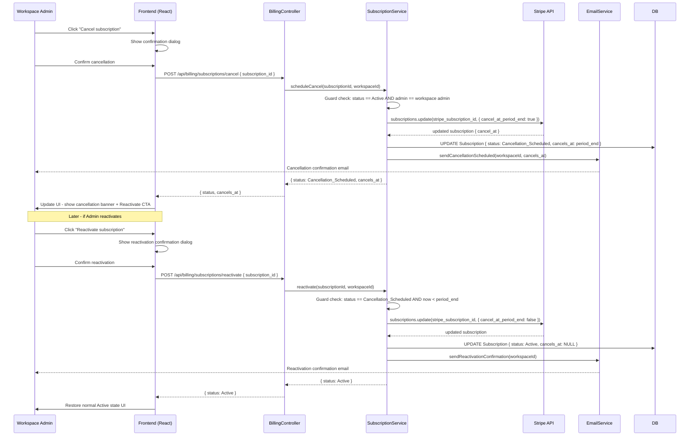

# FEAT-SUB-003: Cancel subscription

> **Status:** 3_Ready_to_Build - ready to enter build after Feature Card Section 4 is written
> **Stripe:** Subscription Billing - Stripe 1
> **Feature flag:** `billing-subscription-cancel` (OFF by default)

---

## Section 1: Biznis Mantinely

*Business constraints that bound this feature. Referenced from domain/business_rules.md and domain/entities.md.*

**Rules enforced in this feature:**

| Rule ID | Rule | Priority | Enforcement point |
|---|---|---|---|
| BR-SUB-003 | Cancellation takes effect at period_end, not immediately - no refunds issued | High | SubscriptionService.scheduleCancel - sets status = Cancellation_Scheduled, cancels_at = period_end |
| BR-SUB-004 | User can reactivate while in Cancellation_Scheduled state, before period_end | High | SubscriptionService.reactivate - guard: status == Cancellation_Scheduled AND now < period_end |

**Entity guard conditions (from entities.md):**

| Entity | Transition | Guard condition |
|---|---|---|
| Subscription | Active → Cancellation_Scheduled | authenticated user is Workspace Admin of the workspace |
| Subscription | Cancellation_Scheduled → Active | `subscription.status == Cancellation_Scheduled` AND `now < subscription.period_end` |
| Subscription | Cancellation_Scheduled → Cancelled | `period_end.reached` (scheduled job - not triggered by this feature) |

**What this feature does NOT do:**
- Does not cancel immediately and issue a refund (out of scope in v1 - Enterprise support path only)
- Does not handle the actual transition to Cancelled (that is triggered by the renewal scheduler - FEAT-SUB-005)
- Does not cancel the underlying Stripe subscription immediately - cancels at `period_end` via Stripe API `cancel_at_period_end: true`
- Does not allow cancellation while subscription is in PastDue state (access to cancel is blocked during grace period)

---

## Section 2: Acceptance Criteria

**Happy path - cancellation scheduled:**

```
GIVEN a Workspace Admin on the Subscription Details page (FEAT-SUB-002)
AND the subscription status is Active
AND billing-subscription-cancel flag is ON
WHEN they click "Cancel subscription"
AND confirm in the cancellation confirmation dialog
THEN Subscription.status transitions Active → Cancellation_Scheduled
AND Subscription.cancels_at is set to current period_end
AND Stripe subscription is updated with cancel_at_period_end: true
AND a cancellation confirmation email is sent to the admin
AND the Subscription Details page shows:
  - Status: "Active until [period_end date]"
  - Banner: "Your subscription will cancel on [date]. You can reactivate before then."
  - CTA: "Reactivate subscription" (replaces "Cancel subscription")
```

**Happy path - reactivation (reversal):**

```
GIVEN a Workspace Admin on the Subscription Details page
AND the subscription status is Cancellation_Scheduled
AND now < period_end
WHEN they click "Reactivate subscription"
AND confirm in the reactivation dialog
THEN Subscription.status transitions Cancellation_Scheduled → Active
AND Subscription.cancels_at is set to NULL
AND Stripe subscription cancel_at_period_end is set back to false
AND a reactivation confirmation email is sent to the admin
AND the Subscription Details page returns to normal Active state view
AND "Cancel subscription" CTA is restored
```

**Guard failure - cancellation attempt while PastDue:**

```
GIVEN a Workspace Admin with a subscription in PastDue status
WHEN they attempt to access the cancellation flow
THEN the "Cancel subscription" option is not shown
AND the page shows: "Update your payment method to restore access before cancelling."
```

**Guard failure - reactivation attempt after period_end:**

```
GIVEN a Workspace Admin with a subscription in Cancellation_Scheduled status
WHEN period_end has already passed
THEN reactivation is not possible (subscription already Cancelled)
AND the page shows the resubscribe flow (FEAT-SUB-009 - Reactivate cancelled subscription)
```

**Feature flag OFF:**

```
GIVEN a user visits the Subscription Details page
WHEN billing-subscription-cancel flag is OFF
THEN the "Cancel subscription" option is not shown
AND no cancellation API calls are made
```

**Edge cases:**

| Scenario | Expected behavior |
|---|---|
| User cancels then reactivates multiple times | Each cycle is valid - no limit enforced in v1 |
| Annual plan cancellation | cancels_at = annual period_end (same rule, longer wait) |
| Workspace has multiple admins | Any admin can cancel; email sent to the admin who triggered the action |
| Stripe webhook cancel_at_period_end confirmation fails | Local status update rolled back; user sees error: "Unable to process cancellation. Please try again." |

---

## Section 3: Technical Design

**Sequence diagram:**



**Files to create or modify:**

| File | Action | Notes |
|---|---|---|
| `src/billing/subscription.service.ts` | MODIFY | Add scheduleCancel() and reactivate() methods with guard checks |
| `src/api/billing/subscriptions.controller.ts` | MODIFY | Add POST /api/billing/subscriptions/cancel and /reactivate endpoints |
| `frontend/src/pages/billing/SubscriptionDetailsPage.tsx` | MODIFY | Add cancel/reactivate CTA, confirmation dialogs, cancellation banner, PastDue guard |
| `frontend/src/components/billing/CancellationBanner.tsx` | CREATE | Banner shown when status = Cancellation_Scheduled (period end date + reactivate CTA) |

---

## Section 4: Realizacny Protokol

*Written just before build enters. Immutable after status reaches 6_Shipped.*

**Commits:**

| # | Hash | Message | Date |
|---|---|---|---|
| - | - | - | - |

**Tests:**

| Test | Type | Result |
|---|---|---|
| - | - | - |

**Feature flag verification:**
- Flag `billing-subscription-cancel`: not yet verified

**Code Inspection:**
- Reviewer: -
- Date: -
- Status: Pending

**Status:** 3_Ready_to_Build
