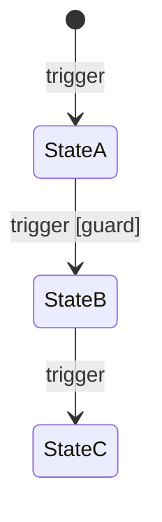

# PM - Business Requirements Document (BRD)

## What this skill does

Defines how the system behaves from a business perspective. The BRD is the authoritative source for:
- Business rules (RULE-A/B/C library)
- Entity state machines (lifecycle transitions)
- Business processes (conceptual level)
- Events and their business meaning
- Governance, compliance, and retention principles

**Document stack position:**
- Domain Model → *what the system is made of* (entities, attributes, relationships)
- **BRD → *how the system behaves*** (rules, states, processes, events)
- FSD → *how a specific Feature Set implements the BRD*

BRD never defines: entities/attributes (Domain Model), API endpoints (FSD/tech docs), UI flows (design docs), algorithms (FSD).

**Living document pattern:**
- Phase 4: BRD Skeleton - system boundary, capability map, state machine overview
- Phase 6: BRD Full Detail - written per Feature Set, one section at a time. Run this skill again for each Feature Set.

**Notion output - four connected databases (all pushed automatically after approval):**
- BRD page - full document content pushed to the BRD Notion page
- Business Rules DB - one entry per RULE-A/B/C defined in this run
- Decision Models DB - one entry per decision point / branching logic
- Event Catalogue DB - one entry per business event emitted or consumed by this Feature Set
- Data Sensitivity DB - one entry per RULE-C rule with compliance/data-retention context

---

## Dependencies

**Required before running (Phase 4 skeleton):**
- `pm-domain-model` - entities and their lifecycles are the input for state machines

**Required before running (Phase 6 detail):**
- BRD Skeleton must exist
- `pm-feature-set-overview` - Feature Set scope defines which rules and states to specify
- `pm-mvp-scope` - Feature Set list determines BRD scope per stripe

**Produces artifacts used by:**
- `pm-fsd` - BRD rules and state machines are referenced in every FSD section
- `pm-business-rule-critical/core/governance` - rules are added to the BRD Rules Library
- `pm-privacy-requirements` - data retention and governance rules go here
- Phase 7 build - developers implement behavior defined in BRD

---

## Step 0: Current state check

Check for existing artifacts:
- BRD (any version / any Feature Set)

Identify: does a BRD skeleton exist (Phase 4)? If yes, which Feature Sets have been detailed (Phase 6)? Which are still TBD?

Look for: state machines without guard conditions, business rules without RULE-ID codes, rules that duplicate Domain Model content (attributes, enums), missing edge case handling in state transitions, no events section, compliance rules not captured.

Apply the standard skill interaction pattern (CLAUDE.md). Options should reflect current state:
- A) Generate Phase 4 Skeleton (if no BRD exists)
- B) Add Phase 6 detail for Feature Set [X] (if skeleton exists)
- C) Update existing section (if BRD exists and needs revision)
- D) Something specific

---

## Step 1: Gather inputs

Questions depend on whether generating Phase 4 skeleton or Phase 6 detail.

### For Phase 4 Skeleton:

```
I need inputs for the BRD Skeleton (Phase 4).

1. DOMAIN MODEL
   Paste the Domain Model or confirm it's in context.
   I need the entity list and their lifecycle states.
   [paste or "in context"]

2. SYSTEM SCOPE
   What does the system own end-to-end?
   What is explicitly out of scope? (what does NOT belong to this system to manage)

3. USER ROLES
   What roles interact with the system?
   What can each role do (high level)?

4. KEY BUSINESS CONSTRAINTS
   Are there any non-negotiable rules you already know?
   (e.g., "payment must never release without delivery confirmation",
    "a booking cannot be double-confirmed", "user data must be deleted within 30 days of request")

5. EXTERNAL SYSTEMS
   What external systems trigger events in our system or receive events from us?
```

### For Phase 6 Detail (per Feature Set):

```
I need inputs for BRD detail - Feature Set: [FS-ID: Name]

1. FEATURE SET OVERVIEW
   Paste the Feature Set Overview or confirm it's in context.
   [paste or "in context"]

2. BUSINESS RULES FOR THIS FEATURE SET
   What are the key business rules that govern this Feature Set?
   (any constraints, invariants, policies that must hold)

3. STATE MACHINES
   Which entities change state within this Feature Set?
   Walk me through each transition: from state → trigger → to state (+ any guard conditions)

4. EDGE CASES AND FAILURES
   What can go wrong? What should the system do?
   (e.g., "what if payment fails?", "what if host doesn't respond within 24h?")

5. EVENTS
   What business-significant events does this Feature Set emit?
   What events does it consume from other Feature Sets?
```

---

## Step 2: Generate artifact

Generate in English.

---

### PHASE 4 SKELETON TEMPLATE

```markdown
# Business Requirements Document - [Product Name]

**Version:** 0.1 (skeleton)
**Date:** [date]
**Status:** Phase 4 - Skeleton. Full detail added per Feature Set in Phase 6.
**Based on:** Domain Model v[X]

---

## 0. Document Scope

### What this BRD defines
- Business rules (RULE-A/B/C library)
- Entity state machines (lifecycle transitions)
- Business processes (conceptual level)
- Business events and their meaning
- Governance, compliance, and data retention principles

### What this BRD does NOT define
- Entities, attributes, enums → Domain Model
- API endpoints, payloads, integrations → FSD / Tech Docs
- UI/UX flows → Design Docs
- Infrastructure, retries → ADRs

---

## 1. System Boundary & Business Capabilities

### User Roles

| Role | Type | Business responsibility |
|---|---|---|
| [Host] | Primary | [Creates listings, manages bookings, receives payouts] |
| [Guest] | Primary | [Searches, books, pays, communicates with host] |
| [Admin] | Support | [Resolves disputes, manages users, monitors platform] |
| [System] | Automated | [Processes payments, sends notifications, enforces rules] |

### System Boundary

**In scope:** [What the system owns and manages]
**Out of scope:** [What the system does NOT handle - explicitly stated]

### Business Capability Map

| Capability | Description | Key entities |
|---|---|---|
| [Property Management] | [Host creates and manages listings] | ENT-002 Listing |
| [Booking Orchestration] | [End-to-end booking flow from request to confirmation] | ENT-003 Booking |
| [Payment Processing] | [Payments, payouts, refunds] | ENT-004 Payment |

---

## 2. State Machine Overview (Phase 4 - high level)

| Entity | States | Key transitions | Detailed in |
|---|---|---|---|
| ENT-002 Listing | Draft → Active → Archived | Host publishes, Host archives | Phase 6 - FS-01 |
| ENT-003 Booking | Requested → Confirmed → Completed → Cancelled | Host approves/declines, Guest cancels | Phase 6 - FS-02 |
| ENT-004 Payment | Pending → Captured → Released → Refunded | Booking confirmed, Booking completed | Phase 6 - FS-03 |

Full state machine diagrams → added per Feature Set in Phase 6.

---

## 3. Business Rules Library - Overview (Phase 4)

Rules are added in Phase 6 per Feature Set. Structure defined here.

### RULE-A: Critical Invariants (non-negotiable, no exceptions)

| ID | Name | Scope | Defined in |
|---|---|---|---|
| RULE-A-001 | [TBD - payment release invariant] | Payments | Phase 6 - FS-03 |

### RULE-B: Core Business Rules (standard behavior, may have edge cases)

| ID | Name | Domain | Defined in |
|---|---|---|---|
| RULE-B-001 | [TBD - booking approval window] | Booking | Phase 6 - FS-02 |

### RULE-C: Governance / Policy / UX Rules

| ID | Name | Context | Defined in |
|---|---|---|---|
| RULE-C-001 | [TBD - data retention policy] | Compliance | Phase 6 - FS-XX |

---

## Version History

| Version | Date | Changes |
|---|---|---|
| 0.1 | [date] | Phase 4 skeleton |
```

---

### PHASE 6 DETAIL TEMPLATE (added per Feature Set)

```markdown
---

## Feature Set: [FS-ID] - [Name]

### State Machine: [Entity Name]

#### States

| State | Description | Entry conditions |
|---|---|---|
| [State] | [Business meaning] | [What must be true to enter this state] |

#### Transitions

| From | Trigger | Guard (condition) | To | Action |
|---|---|---|---|---|
| [State A] | [User action / System event] | [Condition that must hold] | [State B] | [What happens] |

#### State Diagram



---

### Business Rules - [FS-ID]

#### RULE-A-[ID]: [Name]

**Category:** A - Critical Invariant

**Intent:** [Why this rule must exist - what it protects]

**Invariant:**
> "The system MUST NOT [X] / MUST always [Y]"

**Scope:** [Which entities and states]

**Enforcement:** [How the system enforces it - block, freeze, incident alert]

**Violation handling:** [What happens if the invariant is about to be violated]

---

#### RULE-B-[ID]: [Name]

**Category:** B - Core Business Rule

**Intent:** [What behavior this governs]

**Logic:**
> "If [condition], then [outcome]"

**Edge cases:**
| Condition | Handling |
|---|---|
| [Edge case 1] | [How the system responds] |

**Related rules:** [RULE-A-XXX / RULE-C-XXX if relevant]

---

#### RULE-C-[ID]: [Name]

**Category:** C - Governance / Policy / UX

**Policy:**
> "[Actor] must / must not [action]"

**Context:** [Governance / Admin / UX / Operations / Compliance]

**Exception handling:** [Regional or time-bound variations if any]

---

### Business Events - [FS-ID]

| Event | Trigger | Business meaning | Consumers |
|---|---|---|---|
| `[entity.event]` | [What causes it] | [Why it matters in business terms] | [Which Feature Sets consume this event] |

---

### Business Processes - [FS-ID]

[Conceptual description of the main process this Feature Set owns. Step by step at business level - not implementation.]

**[Process name]:**
1. [Step 1 - business action]
2. [Step 2]
3. [Step 3 - decision point: if X → Y, if not X → Z]
4. [Step 4]

---

### Edge Cases and Failure Handling - [FS-ID]

| Scenario | What the system does | Rule reference |
|---|---|---|
| [Payment fails during booking confirmation] | [Booking reverts to Requested state, guest notified] | RULE-A-XXX |
| [Host does not respond within 48h] | [Booking request auto-expires, guest refunded] | RULE-B-XXX |
```

---

## Internal completeness checklist

<!-- Claude reference only - not shown to user.
     Use in Step 0 to identify gaps in existing artifacts.
     Use in Step 2 to verify full coverage before finalizing output. -->

**Phase 4 Skeleton must cover:**
- [ ] User roles defined with business responsibilities
- [ ] System boundary stated (in scope + out of scope)
- [ ] Business Capability Map
- [ ] State Machine Overview table (all entities with lifecycles listed)
- [ ] Rules Library structure established (even if TBD entries)

**Phase 6 Detail per Feature Set must cover:**
- [ ] Full state machine with all states, transitions, guards, and actions
- [ ] Mermaid state diagram
- [ ] All business rules coded (RULE-A/B/C-XXX format)
- [ ] Each rule has: intent, statement, scope, enforcement, edge cases
- [ ] Business events: emitted and consumed
- [ ] Business process: step-by-step at conceptual level
- [ ] Edge cases and failure handling explicitly addressed

**Rule quality:**
- [ ] RULE-A rules: are truly non-negotiable (financial, legal, integrity) - not just important
- [ ] RULE-B rules: have at least one edge case documented
- [ ] RULE-C rules: actor and policy clearly identified
- [ ] No rule duplicates Domain Model content (attributes, enums)
- [ ] No rule defines API or UI behavior (belongs in FSD)

**For SaaS/AI products:**
- [ ] Multi-tenant isolation rules (RULE-A: tenant A cannot access tenant B data)
- [ ] AI output governance (RULE-C: AI suggestions must be reviewable by user before execution)
- [ ] Rate limiting rules (RULE-B: API quota management, per-tenant limits)
- [ ] Data retention rules (RULE-C: user data deletion cascade, per GDPR requirements)
- [ ] Subscription state machine if applicable (Trial → Active → Cancelled → Expired)

**Notion push completeness:**
- [ ] BRD page content pushed (Phase 4: set; Phase 6: appended, not overwritten)
- [ ] All RULE-A/B/C entries pushed to Business Rules DB
- [ ] All decision points pushed to Decision Models DB
- [ ] All business events pushed to Event Catalogue DB (one entry per event in the Business Events section)
- [ ] RULE-C compliance/data-governance entries pushed to Data Sensitivity DB
- [ ] Skipped DBs (blank URL) noted in summary

## Notion push

**Runs after user approves the BRD artifact.**

Read all relevant keys from `pureinn-variables.md`. Check `state.json notion_ids` for cached data source IDs. Fetch and cache any missing IDs via `notion-fetch` before pushing.

---

### 1. BRD page content

Read `pureinn-variables.md` key "BRD" → get page URL.

- **Phase 4 skeleton:** Push the full skeleton markdown as the BRD page body via `notion-update-page` (replace/set content).
- **Phase 6 per-FS section:** Append the new FS section to the existing BRD page body. Do not overwrite existing content - add the new section at the end.

If BRD URL is blank: save locally only, note in summary.

---

### 2. Business Rules DB

Read `pureinn-variables.md` key "Business Rules" → get DB URL. Cache data source ID in `state.json notion_ids.business_rules`.

Push one entry per RULE-A, RULE-B, and RULE-C defined in this run via `notion-create-pages`:

| Notion property | Value | Source |
|---|---|---|
| `Artefact Name` | Rule name (e.g., "RULE-A-001: Payment Release Invariant") | BRD rule ID + name |
| `Artefact Type` | `"Business Rule"` | Fixed |
| `Short Description` | Rule statement (the invariant or logic line) | BRD rule statement |
| `Status` | `"Active"` | Fixed |
| Category property | `"Critical"` / `"Core"` / `"Governance"` | RULE-A/B/C |
| Feature Set reference | FS-ID if available | BRD FS scope field |

Skip if URL blank.

---

### 3. Decision Models DB

Read `pureinn-variables.md` key "Decision Models" → get DB URL. Cache in `state.json notion_ids.decision_models`.

Push one entry per decision point or branching logic in the BRD via `notion-create-pages`:

| Notion property | Value | Source |
|---|---|---|
| `Artefact Name` | Decision name (e.g., "Booking Approval Decision") | BRD decision point |
| `Artefact Type` | `"Decision Model"` | Fixed |
| `Short Description` | Condition + outcome summary (e.g., "If host approves within 24h → Confirmed; else → Expired") | BRD logic |
| `Status` | `"Active"` | Fixed |

Skip if URL blank.

---

### 4. Event Catalogue DB

Read `pureinn-variables.md` key "Event Catalogue" → get DB URL. Cache in `state.json notion_ids.event_catalogue`.

Push one entry per business event defined in the BRD "Business Events" section via `notion-create-pages`:

| Notion property | Value | Source |
|---|---|---|
| `Artefact Name` | Event name (e.g., `booking.confirmed`) | BRD event name |
| `Artefact Type` | `"Event"` | Fixed |
| `Short Description` | Trigger + business meaning (1 sentence) | BRD event description |
| `Status` | `"Active"` | Fixed |
| Producer | Feature Set that emits this event | BRD events table |
| Consumers | Feature Sets that consume this event | BRD events table |

Skip if URL blank.

---

### 5. Data Sensitivity DB

Read `pureinn-variables.md` key "Data Sensitivity Map" → get DB URL. Cache in `state.json notion_ids.data_sensitivity_map`.

Push one entry per RULE-C rule that has compliance, data-retention, or data-governance context via `notion-create-pages`:

| Notion property | Value | Source |
|---|---|---|
| `Artefact Name` | Rule name (e.g., "RULE-C-003: User Data Deletion on Account Close") | BRD RULE-C ID + name |
| `Artefact Type` | `"Data Governance Rule"` | Fixed |
| `Short Description` | Policy statement from the rule | BRD RULE-C policy |
| `Status` | `"Active"` | Fixed |
| Context | `"Compliance"` / `"Retention"` / `"GDPR"` / `"Operations"` | BRD RULE-C context field |

Only push RULE-C entries that have a compliance, retention, or data-handling context. Skip pure UX/policy rules. Skip if URL blank.

---

### 6. Confirm

After all pushes: report counts per target (BRD page updated, Business Rules created, Decision Models created, Events created, Data Governance Rules created, errors). Note any targets skipped due to missing URL in pureinn-variables.md.

## Save to

```
pureinn-workspace/[project-slug]/artifacts/phase-4/brd-skeleton.md
pureinn-workspace/[project-slug]/artifacts/phase-6/[fs-id]-brd.md
```
