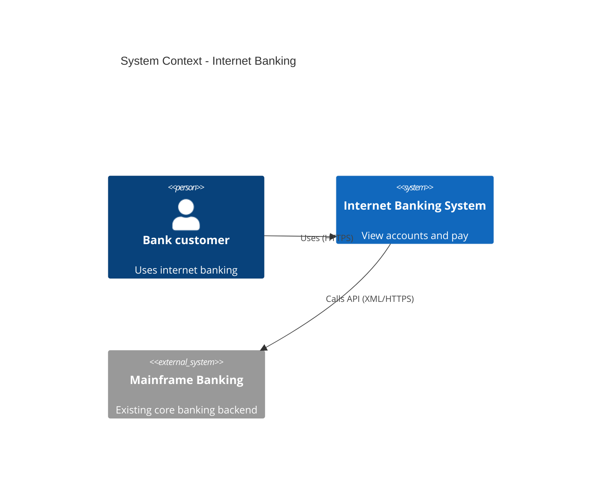

# C4 Model — composition reference

**Slug:** `c4` · **Tool:** Mermaid `C4Context` / `C4Container` / `C4Component` (or Excalidraw) · **Phase:** 4 · **Source of truth:** tech stack + system boundaries · **Standard:** Simon Brown's C4

## Purpose
A hierarchical set of static-structure diagrams. Each **level** answers a different question and zooms in one step: L1 System Context (where the system sits among users and other systems), L2 Container (the apps/databases that make it up), L3 Component (modules inside one container), L4 Code (rarely drawn). Communicates who uses what, with which technology, and why.

## When to use / when NOT
- **Use** to document architecture at multiple abstraction levels. L1 + L2 belong in almost any architecture doc; add L3 only for a container worth decomposing.
- **NOT** for pure user flows (→ `bpmn`/`flow`), deployment/ops detail, or a single module in isolation. When you just want an informal boxes-and-arrows overview, use **`architecture`**.

## Element vocabulary
| Element | Meaning | Rules |
|---|---|---|
| Stick figure | **Person** | External user/role. Outside the system. `Person_Ext` for external orgs. |
| Rectangle | **Software System** | A system/subsystem. Blue = in-scope, grey = existing/external (`System_Ext`). |
| Rectangle (w/ tech) | **Container** | A separately runnable unit (app, API, DB, queue). Name + technology + short description. |
| Cylinder | **ContainerDb** | Database container; state the technology. |
| Rectangle | **Component** | A module inside a container (L3). Name + tech + responsibility. |
| Dashed boundary | **System / Container boundary** | Encloses the in-scope system (L1/L2) or one container (L3). |
| One-way arrow | **Relationship** | Directed, verb-phrase label ("Sends email to"). For containers, include the tech/protocol. |

## Composition rules
- **Keep one level per diagram** — never mix Context and Component in one picture.
- **L1 Context:** exactly one in-scope Software System box + all external persons and systems it interacts with; label the interactions.
- **L2 Container:** a dashed `Container_Boundary` named after the system, holding all its containers (apps/DBs). External persons/`System_Ext` only if they interact directly. Each container: name + technology + short description.
- **L3 Component:** the inside of **one** container; components in that container's boundary; no external elements except important adapters.
- Relationships are **one-way**, active-voice labelled; for container relationships state the technology (JDBC, gRPC, HTTPS). Avoid bidirectional arrows.
- Every diagram has a title ("System Context – X") and a legend for colors/shapes.

## Canonical structure
- **L1:** one central Software System box; `Person`/other systems around it; arrows `Person → System`.
- **L2:** dashed system boundary; containers inside; a `Person` outside with an arrow to a container.
- **L3:** one container boundary; component boxes inside with descriptions and their relationships.

## Anti-patterns
- Mixing two levels in one diagram.
- Vague/unlabelled relationships ("Uses").
- Non-standard icons/colors with no legend.
- Bidirectional arrows (C4 recommends one-way).
- Missing system boundary (unclear what's in scope) or missing title.

## Rendering
- **Mermaid:** `C4Context` / `C4Container` / `C4Component`. Define `Person(...)`, `System(...)`, `System_Ext(...)`, `Container(...)`, `ContainerDb(...)`, `Component(...)`; relationships via `Rel(from, to, "label")`; boundaries via `Container_Boundary(...)`. Fallback to `flowchart` loses the C4 icons.
- **Excalidraw:** rectangles for systems/containers, stick figures for persons, cylinders for DBs. Colors: in-scope container blue, external grey, person green. Draw the dashed system boundary with containers inside; externals around it. Every element named + short description; add a legend.

## Required inputs
- System name.
- **L1:** external actors (`Person`) and external systems (`System_Ext`) + their roles.
- **L2:** containers (name, tech stack, short description).
- **L3:** for a chosen container, its internal components (name, tech, responsibility).
- Relationships: who calls what and how (direction + protocol + action).
- Legend/color meaning if non-obvious.

## Worked example (L1 System Context)

