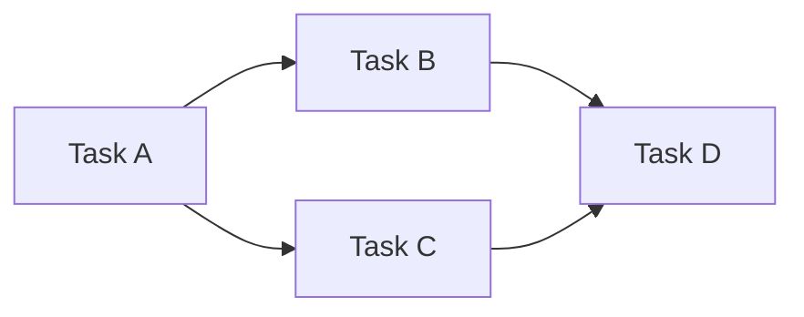

# Dependency Graph — composition reference

**Slug:** `dependency` · **Tool:** Mermaid `flowchart` · **Phase:** 5 · **Source of truth:** `/features/feature_list.md` (dependency analysis owned by `pm-features-list`)

## Purpose
A directed graph of work items (features/tasks) with "must-precede" edges. Reveals the partial order of work and bottlenecks. Answers "which items unlock others?".

## When to use / when NOT
- **Use** in planning/system design to model which items must finish before others start (PERT/CPM style).
- **NOT** for scheduling with dates/durations (→ `gantt`), for user goals (→ `storymap`), or when items have no strict ordering.

> This is the **visual** for a dependency analysis owned by `pm-features-list`. Read the dependency data from `feature_list.md`; if none exists, route to `pm-features-list` rather than inventing dependencies.

## Element vocabulary
| Element | Meaning | Rules |
|---|---|---|
| Box / circle | **Node (task/item)** | One work item. Unique label. No self-loops; one item per node. |
| Directed arrow | **Dependency (edge)** | `A → B` means "B depends on A" (A finishes before B starts). One-way; must not create a cycle. |
| Color / thick line | **Critical path highlight** | Marks the longest dependent chain. Style only, no semantic change. |
| Group box / diamond | **Group / Milestone** | Optional cluster or milestone marker. |

## Composition rules
- Consistent direction (left-to-right or top-down): every edge points prerequisite → dependent.
- Multiple in/out edges allowed; **no cycles** — the graph must be a DAG (topologically sortable). If a cycle appears, split tasks or remove a wrong edge.
- Default dependency is Finish-to-Start; annotate only if different.
- Root nodes (no incoming edges) on one side, dependents layered outward. Minimize crossings.
- Highlight the critical path (longest path by summed duration) distinctly.

## Canonical structure
Roots on the left branching outward to dependents. `A→B, A→C, B→D, C→D` = a diamond (A left, D right).

## Anti-patterns
- Any cycle (A→…→A) — invalid.
- Ambiguous arrow meaning — stick to prerequisite → dependent.
- Using a DAG to convey a schedule (that's a `gantt`).
- Mixed arrow directions.
- Overcrowding hundreds of ungrouped nodes — cluster.

## Rendering
- **Mermaid:** `graph LR`/`TD`; nodes `A[Task A]`, edges `A --> B`. Mermaid does **not** check acyclicity — ensure it beforehand. No native edge weights or critical-path; use a `crit` class / styling. Group via `subgraph`.
- **Excalidraw:** each task a labelled box; arrows to dependents. Colors: normal tasks blue, critical-path red outline, optional grey; milestones as diamonds/larger nodes. Groups as light background rectangles/swimlanes. Equal spacing between levels; arrows mostly rightward/downward.

## Required inputs
- Task list (unique ID + name).
- Dependency pairs (B depends on A).
- Optional durations/weights (for critical path).
- Grouping info (phase/team).
- Direction convention (prerequisite → dependent).

## Worked example

A has no prerequisites; B and C depend on A; D depends on both. Acyclic; critical path A–B–D vs A–C–D (both length 3).
