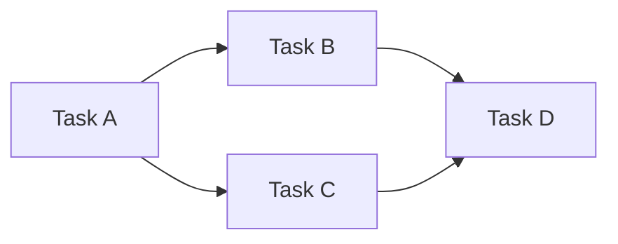
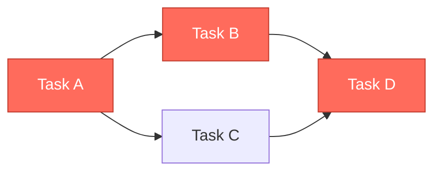
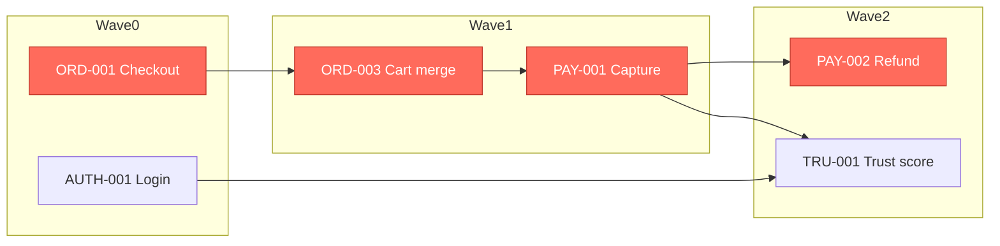

# Dependency Graph — composition reference

**Slug:** `dependency` · **Tool:** Mermaid `flowchart` · **Phase:** 5 · **Source of truth:** `/features/feature_list.md` (dependency analysis owned by `pm-features-list`)

## Purpose
A directed graph of work items (features/tasks) with "must-precede" edges. Reveals the partial order of work and bottlenecks. Answers "which items unlock others?".

## When to use / when NOT
- **Use** in planning/system design to model which items must finish before others start (PERT/CPM style).
- **NOT** for scheduling with dates/durations (→ `gantt`), for user goals (→ `storymap`), or when items have no strict ordering.

> This is the **visual** for a dependency analysis owned by `pm-features-list`. Read the dependency data from `feature_list.md`; if none exists, route to `pm-features-list` rather than inventing dependencies.

## Element vocabulary
| Element | Meaning | Rules |
|---|---|---|
| Box / circle | **Node (task/item)** | One work item. Unique label. No self-loops; one item per node. |
| Directed arrow | **Dependency (edge)** | `A → B` means "B depends on A" (A finishes before B starts). One-way; must not create a cycle. |
| Color / thick line | **Critical path highlight** | Marks the longest dependent chain. Style only, no semantic change. |
| Group box / diamond | **Group / Milestone** | Optional cluster or milestone marker. |

## Composition rules
- Consistent direction (left-to-right or top-down): every edge points prerequisite → dependent.
- Multiple in/out edges allowed; **no cycles** — the graph must be a DAG (topologically sortable). If a cycle appears, split tasks or remove a wrong edge.
- Default dependency is Finish-to-Start; annotate only if different.
- Root nodes (no incoming edges) on one side, dependents layered outward. Minimize crossings.
- **Highlight the critical path (required, not optional polish).** Compute the longest path by summed estimate/duration along dependency edges only (never lane-serialized - a capacity constraint is not a dependency), and style that chain distinctly (`crit` class → coral, matching the delivery-plan's other views). This is a **checked step**: a dependency graph without its critical path marked is incomplete, because the critical path is the single most-read output of the diagram. If durations are unknown, say so and mark the longest-by-edge-count path as a provisional critical path.
- **Wave-column layout above ~10 nodes (recommended).** Once the node count is non-trivial, group nodes by topological level into vertical wave columns — Wave 0 = no unfinished prerequisite, Wave 1 = depends only on a Wave-0 item, Wave N = longest prerequisite chain of length N — and read left to right, one column per wave (`subgraph Wave0 … Wave1 …`). A single chain with branches hanging off it stops being readable past ~10 nodes; wave columns keep the parallelism structure legible and line up with the delivery-plan's wave numbers.

## Canonical structure
Roots on the left branching outward to dependents. `A→B, A→C, B→D, C→D` = a diamond (A left, D right).

```mermaid
graph LR
    A["Task A"] --> B["Task B"]
    A --> C["Task C"]
    B --> D["Task D"]
    C --> D
```

## Anti-patterns
- Any cycle (A→…→A) — invalid.
- Ambiguous arrow meaning — stick to prerequisite → dependent.
- Using a DAG to convey a schedule (that's a `gantt`).
- Mixed arrow directions.
- Overcrowding hundreds of ungrouped nodes — cluster.
- **Critical path left unmarked** — the diagram's headline output is missing; mark it (required step above).
- **Lane-serialized "critical path"** — computing the longest chain with a one-item-per-lane capacity constraint added. That conflates logical blocking with team capacity and produces a path dominated by whichever lane has the most unrelated backlog, not the real bottleneck. Critical path follows dependency edges only.
- A tangled single chain with branches past ~10 nodes instead of wave columns.

## Rendering
- **Mermaid:** `graph LR`/`TD`; nodes `A[Task A]`, edges `A --> B`. Mermaid does **not** check acyclicity — ensure it beforehand. No native edge weights or critical-path; compute the longest dependency path yourself and apply a `crit` class (`classDef crit fill:#ff6b5c...; class A,B,D crit`) so the chain renders coral. Above ~10 nodes, wrap each topological wave in its own `subgraph WaveN` and let them lay out left-to-right.
- **Excalidraw:** each task a labelled box; arrows to dependents. Colors: normal tasks blue, critical-path red outline, optional grey; milestones as diamonds/larger nodes. Groups as light background rectangles/swimlanes. Equal spacing between levels; arrows mostly rightward/downward.

## Required inputs
- Task list (unique ID + name).
- Dependency pairs (B depends on A).
- Optional durations/weights (for critical path).
- Grouping info (phase/team).
- Direction convention (prerequisite → dependent).

## Worked example

```mermaid
graph LR
    A["Task A"] --> B["Task B"]
    A --> C["Task C"]
    B --> D["Task D"]
    C --> D
    classDef crit fill:#ff6b5c,stroke:#c0392b,color:#fff;
    class A,B,D crit;
```
A has no prerequisites; B and C depend on A; D depends on both. Acyclic; critical path A–B–D marked coral (tie with A–C–D at length 3; pick one and mark it).

## Worked example (wave columns, >10 nodes)
Each topological wave is its own column; read left to right; the critical-path chain is coral across columns.

```mermaid
graph LR
    subgraph Wave0
        ORD1["ORD-001 Checkout"]
        AUTH1["AUTH-001 Login"]
    end
    subgraph Wave1
        ORD3["ORD-003 Cart merge"]
        PAY1["PAY-001 Capture"]
    end
    subgraph Wave2
        PAY2["PAY-002 Refund"]
        TRU1["TRU-001 Trust score"]
    end
    ORD1 --> ORD3
    ORD3 --> PAY1
    PAY1 --> PAY2
    PAY1 --> TRU1
    AUTH1 --> TRU1
    classDef crit fill:#ff6b5c,stroke:#c0392b,color:#fff;
    class ORD1,ORD3,PAY1,PAY2 crit;
```
