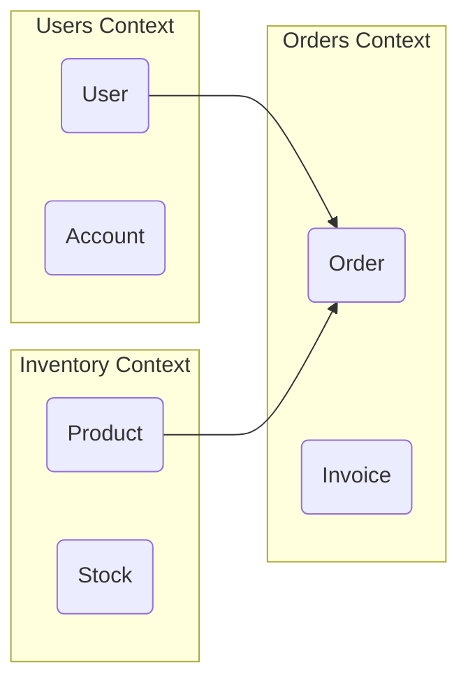

# Domain Model Overview — composition reference

**Slug:** `domain` · **Tool:** Excalidraw (Mermaid `flowchart` + `subgraph` fallback) · **Phase:** 4 · **Source of truth:** `/domain/entities.md`, `domain-model.md`

## Purpose
A high-level map of **domain boundaries** (bounded contexts), the key entities inside each, and cross-domain references. Communication-oriented, DDD-flavored. Emphasis is on *which entity belongs to which module* and *how modules reference each other* — not on exact cardinality.

## When to use / when NOT
- **Use** in strategic design of a larger system: identify modules/subdomains (bounded contexts) and their main entities, and show cross-context dependencies. Good for microservices / large-app scoping.
- **NOT** for low-level data relationships with cardinality (→ `erd`), for entity lifecycle (→ `state`), or for process flow. Purely conceptual — no numeric cardinalities.

## Element vocabulary
| Element | Meaning | Rules |
|---|---|---|
| Large zone rectangle | **Bounded Context** | A domain/module. Unique name (`Ordering Context`). Contains its related entities. Distinct fill color. |
| Small box inside a zone | **Domain entity** | A key concept in that context. Name only (no attributes). Belongs to exactly one context. |
| Arrow between entities/zones | **Cross-context reference** | Logical dependency ("uses", "publishes event"). No cardinality. Often dashed + labelled. |

## Composition rules
- Each entity lives in exactly **one** context (never drawn in two).
- Each bounded context has a unique name and holds its relevant entities.
- Cross-context links are labelled logical references (e.g. "places order", "publishes event") — never cardinality markers.
- Do **not** add PK/FK/attributes — that's ERD territory. Keep it semantic and abstract.

## Canonical structure
Several context zones, each with a title and its entities as small boxes inside; dashed labelled arrows between entities of different contexts show the cross-domain references.
```
[Users Context]      [Orders Context]      [Inventory Context]
 User, Account         Order, Invoice         Product, Stock
        User ─────────▶ Order ◀───────────── Product
```

## Anti-patterns
- Showing full entities with attributes (turns it into a class diagram — loses the purpose).
- Drawing one entity inside two contexts (breaks context isolation).
- Adding exact cardinalities (that's ERD).
- Rendering process/time flow here (wrong notation).
- Empty, fully isolated contexts with no references — show the collaboration.

## Rendering
- **Mermaid:** no native domain-model type. Closest is `flowchart` with `subgraph` per context: `subgraph Users [Users Context] ... end`, entities as boxes, arrows across subgraphs for references. Only standard flowchart shapes.
- **Excalidraw:** each context a large colored zone (opacity ~35) with a top-left title; entities as small white boxes inside; cross-context references as labelled arrows. Each context a different pastel color. Leave generous space between contexts for readable connectors.

## Required inputs
- List of bounded contexts / domains (names).
- Key entities per context.
- Cross-context references (who → whom, optional label like "uses", "syncs").
- Aggregate roots / clusters (optional).

## Worked example

Three contexts; `User→Order` and `Product→Order` mark the cross-domain references.
