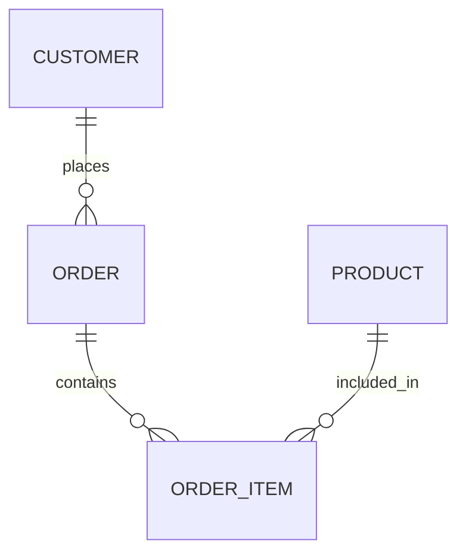

# ERD (Entity Relationship Diagram) — composition reference

**Slug:** `erd` · **Tool:** Mermaid `erDiagram` · **Phase:** 4 · **Source of truth:** `/domain/entities.md` (+ `domain-model.md` if present) · **Notation:** crow's-foot / Information Engineering

## Purpose
Show the **data structure**: entities, and the relationships between them with cardinality. Answers "what tables/objects exist, how are they related, and how many of one relate to another (1:1, 1:M, M:N)?". Conceptual/logical data model.

## When to use / when NOT
- **Use** for data/database modeling: entities and their cardinality-bearing relationships. Analysis + API/data-model design.
- **NOT** for behavior/process (→ `sequence`, `bpmn`), for a high-level bounded-context map without cardinality (→ `domain`), or for implementation detail (SQL joins).

## Element vocabulary
| Element | Meaning | Rules |
|---|---|---|
| Rectangle | **Strong entity** | Independent, own primary key. Singular name (`CUSTOMER`). Attributes optional. |
| Double rectangle | **Weak entity** | Existence depends on a strong entity; PK includes the parent's PK. Relationship to parent is **identifying**. |
| Rectangle (junction) | **Associative entity** | Resolves M:N into two 1:M. Named for the link (`ORDER_ITEM`), carries the FKs. |
| Line | **Relationship** | Connects two entities; cardinality shown at each end. Identifying (solid) vs non-identifying (dashed, per convention). |
| `|` (tick) | **One** | Exactly-one / at-least-one marker at the entity end. |
| `o` (circle) | **Zero** | Optionality (minimum 0). |
| Crow's foot | **Many (N)** | Fork = many at that end. |

Cardinality = combine min+max symbols: `o|` = 0..1, `||` = exactly 1, `o{` = 0..many, `|{` = 1..many.

## Composition rules
- Every relationship line starts and ends on an entity, with cardinality at **both** ends.
- Four valid cardinalities: `0..1`, `1..1`, `0..*`, `1..*`.
- Weak entity → exactly one identifying relationship to its strong parent.
- **No direct M:N** — always decompose via an associative/junction entity (A–J, B–J).
- Each entity appears once. No circular entity dependencies.
- Attributes optional in a conceptual ERD; if shown, mark the PK.

## Canonical structure
```
ENTITY1 ||--o{ ENTITY2                              (1 to 0..many)
ENTITY1 ||--o{ LINK }o--|| ENTITY2                  (M:N via LINK)
```
Place a weak/associative entity near its parents so lines don't cross.

## Anti-patterns
- Missing cardinality on either end.
- Direct M:N relationship (must go through a junction entity).
- Weak entity not marked (double box) or its relationship not identifying → PK ambiguity.
- Duplicate entities / redundant relationship paths.
- Inconsistent dashed-vs-solid convention (pick one: dashed = non-identifying).
- Mixing UML class-diagram arrows into crow's-foot.

## Rendering
- **Mermaid:** `erDiagram`. Relationship syntax `ENTITY1 <left><line><right> ENTITY2 : label`, where `|` `o` `{` build the cardinality. Example `CUSTOMER ||--|{ ORDER : places` = 1..1 to 1..many. Mermaid cannot draw a distinct "weak entity" double box — express strong/weak by convention/label. Attributes optional via block syntax.
- **Excalidraw:** rectangles for entities (single frame strong, double frame weak). Draw crow's-foot / tick / circle glyphs at line ends, or annotate `0..*`, `1..1`. Identifying relationship = thicker/solid line, non-identifying = dashed. Colors: strong entity light green, weak grey, junction yellow, lines black. Route lines to avoid crossing other shapes.

## Required inputs
- Entity names (singular), each flagged strong/weak.
- Primary keys (esp. for weak entities).
- Relationships: `(A, B, identifying?, cardinalityA, cardinalityB)`.
- Junction entities for any M:N (name + its two relationships).
- Attributes (optional).

## Worked example

`CUSTOMER` 1..* `ORDER`; `ORDER_ITEM` is the junction resolving the M:N between `ORDER` and `PRODUCT`.
