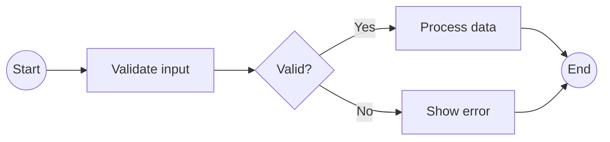
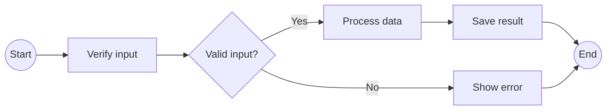

# User Flow / Flowchart — composition reference

**Slug:** `flow` · **Tool:** Mermaid `flowchart` (or Excalidraw) · **Phase:** 2, 6 · **Source of truth:** feature description / process steps

## Purpose
Capture the logical flow of activities (steps, decisions) in a process or user task. Answers "what is the first step, how does the system react to yes/no, where does it end?". Standard flowchart shapes. Lighter than BPMN; can double as a UX flow.

## When to use / when NOT
- **Use** for a decision/step flow — a universal, simple process notation without token semantics.
- **NOT** when you need full BPMN (event types, pools) → `bpmn`; when the flow is tied to roles/swimlanes → `bpmn`; when you want screens rather than steps → `wireflow`.

## Element vocabulary
| Element | Meaning | Rules |
|---|---|---|
| Oval terminator | **Start / End** | One start; at least one end. |
| Rectangle | **Process / Action** | A step. Follows a prior shape, leads to the next. |
| Diamond | **Decision** | One input, ≥2 labelled outputs (Yes/No), mutually exclusive. |
| Parallelogram | **Input / Output** | Data entry or output. |
| Small circle | **Connector** | Off-page/cross-row link; unique label. |
| Arrow | **Flowline** | Directed; label with condition if not obvious. |

## Composition rules
- Exactly one clear start; at least one explicit end.
- Every decision has one input and ≥2 labelled, mutually exclusive outputs.
- Loops = a back-arrow to an earlier step, always with an exit condition.
- Every shape except terminators has an incoming and an outgoing arrow.
- Never branch flow without a decision — a process box must not fork into multiple paths on its own.

## Canonical structure

## Anti-patterns
- Dangling arrows (no shape at the end) or a process box forking without a decision.
- No explicit start/end.
- Decision branches that aren't mutually exclusive.
- Multiple overlapping back-arrows / loops with no clear limit.

## Rendering
- **Mermaid:** `flowchart TD`/`LR`. Shapes: `((oval))`, `[rectangle]`, `{diamond}`, `[/parallelogram/]`. Label edges `-->|Yes|`. Choose direction by fit.
- **Excalidraw:** top-to-bottom by default. Ovals = terminators, rectangles = process, diamonds = decision, parallelograms = I/O. One-way labelled arrows. Colors: process blue, decision yellow, end green, connector grey. Keep logical rows aligned; put conditions on the arrows.

## Required inputs
- Ordered list of steps.
- Decision points + branch conditions/labels.
- Start and end(s).
- Data input/output points (if shown).

## Worked example

