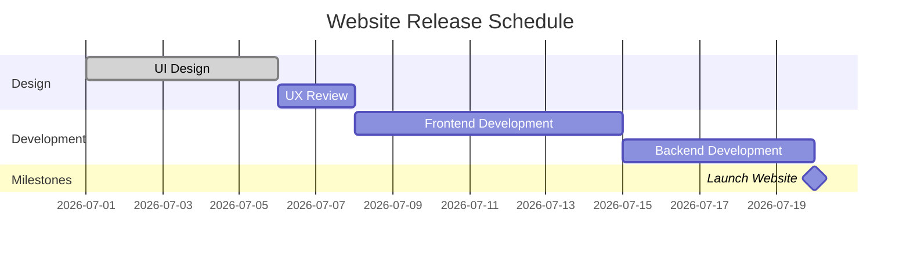

# Gantt / Timeline Roadmap — composition reference

**Slug:** `gantt` · **Tool:** Mermaid `gantt` · **Phase:** 3b, 5 · **Source of truth:** `pm-product-roadmap` output (roadmap owned there)

## Purpose
Show tasks and milestones on a **time axis**: start/end dates, durations, dependencies. Answers "when do tasks happen and how long do they take?". A tactical delivery/schedule view.

## When to use / when NOT
- **Use** when you have concrete tasks with durations and must manage execution (resource/sprint/phase planning).
- **NOT** for strategic vision or backlog work → a Now/Next/Later roadmap or `storymap`. If dates are uncertain, don't force false precision.

> The roadmap is owned by `pm-product-roadmap`. Render from its output; if no dated plan exists, route there rather than inventing dates.

## Element vocabulary
| Element | Meaning | Rules |
|---|---|---|
| Horizontal bar | **Task bar** | Length = duration, from start to end. Bars can overlap if parallel. |
| Diamond | **Milestone** | Zero-duration key event (release, deadline). Mermaid `milestone`. |
| Arrow / `after` | **Dependency** | Finish-to-Start by default. Mermaid `after <id>`. No cycles. |
| Section label | **Section / Swimlane** | Groups tasks (team/phase). Mermaid `section`. A task belongs to one section. |
| Date axis | **Time axis** | Follows `dateFormat`. |

## Composition rules
- One horizontal time axis; each task bar starts at a date and spans its duration.
- Dependencies via `after <id>` (Finish-to-Start); or give explicit start+end.
- Milestones = 0-duration tasks (`milestone`).
- Group with `section` (swimlanes); a task lives in one section.
- No cycles; at least one task must have an **absolute start date** to anchor the timeline; others may chain with `after`.

## Canonical structure
```
gantt
    dateFormat YYYY-MM-DD
    title Project Plan
    section Planning
    Task A      :a1, 2026-07-01, 3d
    Task B      :a2, after a1, 5d
    section Execution
    Task C      :c1, 2026-07-05, 4d
    section Milestones
    Release1    :milestone, m1, 2026-07-10, 0d
```

## Anti-patterns
- Task with no date/duration (Mermaid needs a date or `after`).
- Concurrent bars crammed on one row without separate rows/sections.
- Cyclic dependencies.
- Using a normal task for what should be a 0-duration milestone.
- No absolute start anchor (all `after`) → no fixed timeline.
- Forcing a Gantt when dates are uncertain (use Now/Next/Later instead).

## Rendering
- **Mermaid:** `gantt` type. `dateFormat YYYY-MM-DD`, optional `title`. `section <name>` for swimlanes. Task line: `Name :[id,] [status,] start, duration`. Status tags `done`/`active`/`crit` come first. `after <id>` for dependencies. Milestone: `:milestone, 0d` renders a diamond. `crit` colors a bar red. For a dateless high-level roadmap consider the `timeline` type instead.
- **Excalidraw:** horizontal date axis on top; each task a bar from start to end; arrows from bar-end to next bar-start for dependencies; diamonds for milestones on their own row; group by phase/team in horizontal bands. Colors: planned blue, done green, critical red. Label major time ticks. For Now/Next/Later, draw three columns instead of a continuous axis.

## Required inputs
- Task names + start dates or durations.
- Dependencies ("Task X after Task Y").
- Named milestones with dates.
- Sections/teams (optional).
- Timeline bounds (project start/end).

## Worked example

