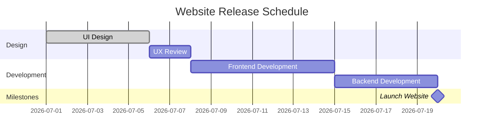
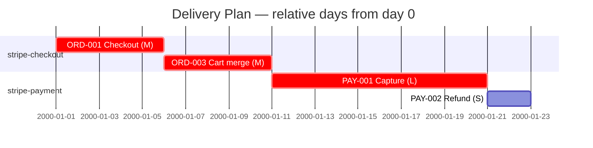

# Gantt / Timeline Roadmap — composition reference

**Slug:** `gantt` · **Tool:** Mermaid `gantt` · **Phase:** 3b, 5, 6 · **Source of truth:** `pm-product-roadmap` output (dated mode) **or** the delivery-plan estimate field (relative mode, owned by `pm-stripe`)

## Purpose
Show tasks and milestones on a **time axis**: start/end dates, durations, dependencies. Answers "when do tasks happen and how long do they take?". A tactical delivery/schedule view.

## Two modes
- **Dated mode** (default, owned by `pm-product-roadmap`) - real calendar dates. For committed roadmaps and execution planning where dates exist.
- **Relative mode** (delivery-plan / backlog context, owned by `pm-stripe`) - **no calendar dates**. Duration comes from each item's estimate field (default `S=2, M=5, L=10` relative days, configurable), sequenced against a single synthetic day-0 anchor that is **explicitly labelled relative and never presented as a real date**. This is the sanctioned exception to the "at least one absolute start date" rule below - see the Anti-patterns carve-out. Use it to render a delivery plan's timeline when features carry estimates but no committed dates yet.

## When to use / when NOT
- **Use (dated)** when you have concrete tasks with durations and must manage execution (resource/sprint/phase planning).
- **Use (relative)** when features have relative estimates (S/M/L) but no committed calendar dates - a delivery-plan timeline that shows shape and critical path without faking precision.
- **NOT** for strategic vision or pure backlog with no estimates at all → a Now/Next/Later roadmap or `storymap`. If you have neither dates nor estimates, don't force a bar chart.

> Dated mode is owned by `pm-product-roadmap`; relative mode by `pm-stripe`. Render from the owning artifact; if no dated plan and no estimate field exist, route rather than inventing either.

## Element vocabulary
| Element | Meaning | Rules |
|---|---|---|
| Horizontal bar | **Task bar** | Length = duration, from start to end. Bars can overlap if parallel. |
| Diamond | **Milestone** | Zero-duration key event (release, deadline). Mermaid `milestone`. |
| Arrow / `after` | **Dependency** | Finish-to-Start by default. Mermaid `after <id>`. No cycles. |
| Section label | **Section / Swimlane** | Groups tasks (team/phase). Mermaid `section`. A task belongs to one section. |
| Date axis | **Time axis** | Follows `dateFormat`. |

## Composition rules
- One horizontal time axis; each task bar starts at a date and spans its duration.
- Dependencies via `after <id>` (Finish-to-Start); or give explicit start+end.
- Milestones = 0-duration tasks (`milestone`).
- Group with `section` (swimlanes); a task lives in one section.
- No cycles; at least one task must have an **absolute start date** to anchor the timeline; others may chain with `after`. **Relative mode:** the anchor is one synthetic day-0 (`dateFormat` still `YYYY-MM-DD` mechanically, but the axis title declares it as relative days, and no bar is captioned with its raw date); durations = estimate mapping (`S=2, M=5, L=10`d, configurable); everything else chains with `after` off the critical path.

## Canonical structure
```
gantt
    dateFormat YYYY-MM-DD
    title Project Plan
    section Planning
    Task A      :a1, 2026-07-01, 3d
    Task B      :a2, after a1, 5d
    section Execution
    Task C      :c1, 2026-07-05, 4d
    section Milestones
    Release1    :milestone, m1, 2026-07-10, 0d
```

## Anti-patterns
- Task with no date/duration (Mermaid needs a date or `after`).
- Concurrent bars crammed on one row without separate rows/sections.
- Cyclic dependencies.
- Using a normal task for what should be a 0-duration milestone.
- No absolute start anchor (all `after`) → no fixed timeline. **Carve-out:** in **relative mode** this rule is deliberately relaxed - the single synthetic day-0 anchor stands in for the absolute start, and it must be labelled relative (e.g. title `Delivery Plan (relative days from day 0)`), never a real date. This is the one sanctioned exception; it does not license dateless bars in dated mode.
- Forcing a Gantt when dates are uncertain (use Now/Next/Later instead) - **unless** relative mode applies (estimates exist, dates don't): then a relative Gantt is correct, not forced precision, because it never claims a calendar date.

## Rendering
- **Mermaid (dated):** `gantt` type. `dateFormat YYYY-MM-DD`, optional `title`. `section <name>` for swimlanes. Task line: `Name :[id,] [status,] start, duration`. Status tags `done`/`active`/`crit` come first. `after <id>` for dependencies. Milestone: `:milestone, 0d` renders a diamond. `crit` colors a bar red. For a dateless high-level roadmap consider the `timeline` type instead.
- **Mermaid (relative):** same `gantt` syntax, but the `title` names the axis as relative (`Delivery Plan — relative days from day 0`), one anchor task starts at a synthetic `day 0` date, all others use `after`; durations are the S/M/L estimate mapping, not real spans. Tag the critical-path chain `crit` so it renders coral, matching the delivery-plan's other views. Never surface the underlying synthetic dates as if real.
- **Excalidraw:** horizontal date axis on top; each task a bar from start to end; arrows from bar-end to next bar-start for dependencies; diamonds for milestones on their own row; group by phase/team in horizontal bands. Colors: planned blue, done green, critical red. Label major time ticks. For Now/Next/Later, draw three columns instead of a continuous axis.

## Required inputs
- Task names + start dates or durations (dated), **or** estimate field per item (relative).
- Dependencies ("Task X after Task Y").
- Named milestones with dates (dated only).
- Sections/teams (optional).
- Timeline bounds (dated), **or** the estimate→duration mapping (relative, default `S=2/M=5/L=10`).

## Worked example (dated)

```mermaid
gantt
    dateFormat  YYYY-MM-DD
    title Website Release Schedule
    section Design
    UI Design             :done, des1, 2026-07-01, 5d
    UX Review             :after des1, 2d
    section Development
    Frontend Development  :dev1, 2026-07-08, 7d
    Backend Development   :after dev1, 5d
    section Milestones
    Launch Website        :milestone, m1, 2026-07-20, 0d
```

## Worked example (relative)
Durations from S/M/L estimates; day-0 is synthetic; the critical-path chain is tagged `crit` (renders coral). No bar carries a real date.

```mermaid
gantt
    dateFormat  YYYY-MM-DD
    title Delivery Plan — relative days from day 0
    section stripe-checkout
    ORD-001 Checkout (M)      :crit, o1, 2000-01-01, 5d
    ORD-003 Cart merge (M)    :crit, o3, after o1, 5d
    section stripe-payment
    PAY-001 Capture (L)       :crit, p1, after o3, 10d
    PAY-002 Refund (S)        :p2, after p1, 2d
```

