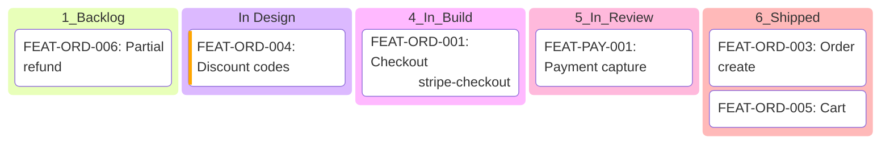

# Kanban Board — composition reference

**Slug:** `kanban` · **Tool:** Mermaid `kanban` (native, ≥ 10.9) · **Phase:** 6, 7 · **Source of truth:** `/features/feature_list.md` + Feature Card `status` (lifecycle owned by `pm-stripe`)

## Purpose
Show **where every feature is in the delivery lifecycle right now** - one column per status, one card per feature. Answers "what do we have, and what state is it in?". The "what exists" view, complementary to `gantt` (when) and `dependency` (what unlocks what). Especially load-bearing on a Rebuild first render, where the team needs "what do we have" before "what's next".

## When to use / when NOT
- **Use** to render the current lifecycle distribution across a stripe (or the whole board): onboarding a team to a half-built product, a standup snapshot, a "where is everything" review.
- **NOT** for sequencing or duration (→ `gantt`), for prerequisite structure (→ `dependency`), or for strategic phase framing (→ `storymap`). A Kanban shows state, not order.

> This is the **visual** for lifecycle state owned by `pm-stripe`. Read `status` from each Feature Card / `feature_list.md`; never invent or advance a status to fill a column. Status = code reality, never reset it for presentation (see pm-stripe's two-axes rule: status = code reality, plan order = schedule).

## Element vocabulary
| Element | Meaning | Rules |
|---|---|---|
| Column | **Lifecycle status** | One column per `status` value. Fixed left-to-right lifecycle order. Skip a column only if empty. |
| Card | **Feature** | One `FEAT-ID` + title. Lives in exactly one column = its current `status`. Never duplicated across columns. |
| Board | **Stripe** | One board per stripe (one isolated delivery channel). Render one `kanban` block per active stripe. |
| Card metadata | **Priority / assignee** | Optional Mermaid `@{ }` metadata (`priority`, `assigned`). Read from frontmatter, never guessed. |

## Composition rules
- **One column per lifecycle status**, in fixed lifecycle order: `1_Backlog` → `2_Spec_Done` → `2b_In_Design` → `3_Ready_to_Build` → `4_In_Build` → `5_In_Review` → `6_Shipped`. Compact mode: collapse the three design-phase statuses (`2_Spec_Done`, `2b_In_Design`, `3_Ready_to_Build`) into one "In Design" column when the board is wide - state that the compaction happened.
- **One board per stripe.** Do not merge multiple stripes into one board - the stripe is the unit of capacity and reads as one lane's worth of work.
- Each feature appears **once**, in the column matching its real `status`. No card in two columns.
- Skip any column with zero cards rather than rendering it empty.
- Colour by the same semantic mapping the delivery-plan uses everywhere (never a per-board scale): grey = not started, amber = part-built (`4_In_Build`), blue = needs review (`5_In_Review`), green = `6_Shipped`, coral = on the critical path (overrides column colour).

## Canonical structure
```
kanban
  Backlog[1_Backlog]
    f1[FEAT-ORD-005: Refund flow]
  Ready[3_Ready_to_Build]
    f2[FEAT-ORD-002: Cart merge]@{ priority: 'High' }
  Build[4_In_Build]
    f3[FEAT-ORD-001: Checkout]@{ assigned: 'stripe-checkout' }
  Review[5_In_Review]
    f4[FEAT-PAY-001: Payment capture]
  Shipped[6_Shipped]
    f5[FEAT-ORD-003: Order create]
```

## Anti-patterns
- One board mixing several stripes (loses the capacity-1 lane meaning).
- A card in a column that contradicts its real `status` (advancing status for a tidier board - forbidden; status = code reality).
- Rendering empty columns as filler instead of skipping them.
- Inventing a `status` for a feature that has none - route to `pm-stripe` instead.
- Per-board colour scales that drift from the shared delivery-plan semantics.
- Using Kanban to imply order within a column (Kanban has no intra-column ordering meaning - use `gantt`/`dependency` for that).

## Rendering
- **Mermaid:** native `kanban` type (Mermaid ≥ 10.9). Column: `id[Title]`. Card: `taskId[FEAT-ID: title]`, optional `@{ priority: 'High', assigned: 'name' }` metadata (values pulled from frontmatter only). One `kanban` block per stripe. Mermaid renders columns in declaration order - declare them in lifecycle order. If the runtime's Mermaid is older than 10.9 and rejects `kanban`, fall back to a `flowchart` with one `subgraph` per status column and note the fallback.
- **Excalidraw:** vertical columns titled by status, cards as labelled rectangles stacked in their column; colour per the shared semantics; one board region per stripe with the stripe name as a header band.

## Required inputs
- Feature list with `FEAT-ID`, title, `status`, `stripe` (from `feature_list.md` / Feature Cards).
- Optional `priority`, assignee/stripe for card metadata.
- Which stripe(s) to render (default: all active stripes, one board each).

## Worked example

One board = one stripe. The three design-phase statuses are collapsed into "In Design" (compact mode). Each feature sits in its real lifecycle status; empty columns are omitted.
