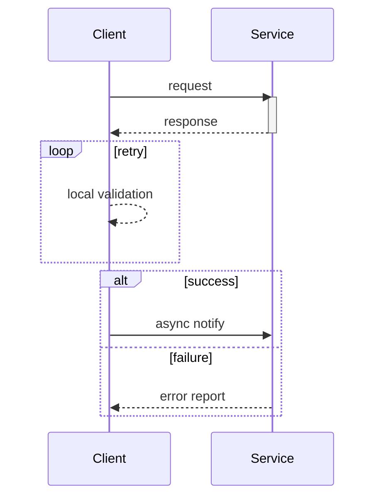
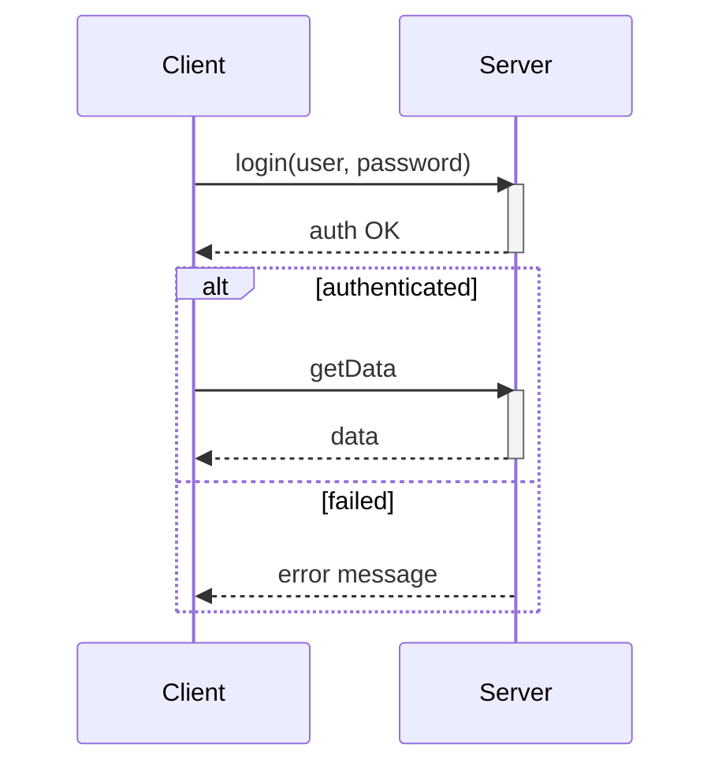

# Sequence Diagram (UML 2.5) — composition reference

**Slug:** `sequence` · **Tool:** Mermaid `sequenceDiagram` · **Phase:** 6 JIT · **Source of truth:** Feature Card Section 3 / `pm-feature-design`

## Purpose
Show the time-ordered messages between participants (services/components/actors) for **one** scenario or feature. Answers "which component calls which, with what message, and when does it get a reply?", including waits, parallelism, and alternatives.

## When to use / when NOT
- **Use** to detail one interaction (methods/messages) across objects/services for a single transaction or feature. Standard Phase 6 diagram embedded in a Feature Card.
- **NOT** for complex business logic (→ `bpmn`/`state`) or static structure (→ `architecture`/component diagram).

## Element vocabulary
| Element | Meaning | Rules |
|---|---|---|
| Rectangle head + dashed line | **Lifeline** | One participant over time. Named `alias:Class` or role. One lifeline per participant. |
| Stick figure | **Actor** | External participant lifeline. |
| Thin bar on lifeline | **Activation (execution)** | Period the participant is executing. Can nest. |
| Solid filled arrow | **Synchronous message** | Caller waits for reply. |
| Solid open arrow | **Asynchronous message** | Caller does not wait. |
| Dashed open arrow | **Reply** | Return after a sync call. |
| Dashed arrow to new lifeline | **Create** | Instantiate target. |
| ✕ on lifeline end | **Destroy** | Ends the lifeline; nothing below it. |
| Arrow back to self | **Self-call** | Nested activation on same lifeline. |
| Frame `alt/opt/loop/par/break` | **Combined fragment** | Control-flow operator; each operand carries a `[guard]`. |

## Composition rules
- Time flows **top → bottom**; every message goes to a later vertical position. Don't reorder confusingly.
- One lifeline per participant.
- `create` targets a new lifeline placed at the point of creation; after `destroy`/✕ nothing follows on that lifeline.
- Fragments: `alt` = ≥2 mutually exclusive operands with guards; `opt` = single conditional branch; `loop` = has an iteration bound/condition; `par` = parallel operands (no sequencing between them). Guards in `[ ]`.
- Don't mix message types: a reply to a sync call is a dashed (return) arrow, not a solid one.

## Canonical structure

## Anti-patterns
- Missing activations (loses processing duration).
- Messages without a clear sender and receiver (lost/found only for genuinely external events).
- `alt` branch with no guard; `loop` with no bound.
- Arrows pointing "up" (backwards in time).
- Sync/async arrows mixed incorrectly.

## Rendering
- **Mermaid:** `sequenceDiagram`; `participant <alias> as <name>`; arrows `->>` sync, `-)` async, `-->>` reply, `-x` destroy; `activate`/`deactivate` or `->>+`/`-->>-`; fragments `alt/else/end`, `opt/end`, `loop/end`, `par/and/end`. Not every UML operator is expressible (`ignore`/`consider`) — note the limit.
- **Excalidraw:** participants left-to-right, vertical dashed lifelines with header boxes; grey activation bars; solid arrow = sync, open = async, dashed = reply; fragments as labelled frames (`alt [cond]`). Keep even spacing, time strictly top-down.

## Required inputs
- Participants (objects/roles), each with name + type (object/actor).
- Ordered messages: type (sync/async), text, caller → callee.
- Where each participant is active (for activation bars).
- Conditions/iteration counts for alt/opt/loop.
- Create/destroy points, if any.

## Worked example

