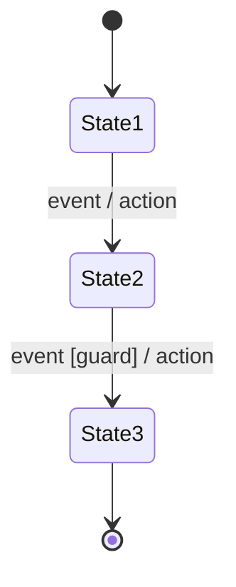
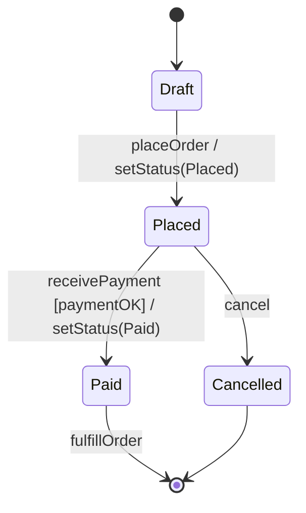

# Entity State Machine — composition reference

**Slug:** `state` · **Tool:** Mermaid `stateDiagram-v2` · **Phase:** 4 · **Source of truth:** `/domain/entities.md`

## Purpose
Model the lifecycle of a **single** business entity: the states it can occupy and the events that move it between them (e.g. Order: `draft → placed → paid → shipped`). Answers "what state is this entity in now, and where does it go on event X?".

## When to use / when NOT
- **Use** for state-dependent behavior of one entity (order, task, claim, subscription). This is the canonical Phase 4 diagram embedded per entity in `entities.md`.
- **NOT** for interaction between multiple entities (→ `sequence`), for a process/workflow (→ `bpmn` or `flow`), or for static data structure (→ `erd`).

## Element vocabulary
| Element | Meaning | Rules |
|---|---|---|
| Rounded rectangle | **State** | Unique name. Simple or composite (contains substates/regions). |
| Filled black dot | **Initial pseudostate** | Max one per region. Exactly one outgoing transition. No guard, no trigger. Mermaid: `[*]`. |
| Encircled dot | **Final state** | Max one per region. Signals the region/machine has ended. No outgoing transitions. Mermaid: target `[*]`. |
| Arrow | **Transition** | `trigger [guard] / action`. From state/pseudostate to state/pseudostate. |
| `[guard]` | **Guard** | Boolean in brackets; transition fires only if true. Read-only, no side effects. |
| Diamond | **Choice** | Dynamic branch: exactly one outgoing guard must be true (add `else`). |
| Bar (fork/join) | **Fork / Join** | Split into / merge parallel regions. No guards on fork outputs; join waits for all. |
| Composite state box | **Composite state** | Contains substates; each internal region needs its own initial pseudostate. |
| `entry/ do/ exit/` | **Internal activities** | Actions inside a state; reserved keywords. |
| H / H* | **Shallow / Deep history** | Resume last active substate (H) or full config (H*). Max one per region. |

## Composition rules
- Transition syntax: `event [guard] / action` — trigger first, guard in `[ ]`, action after `/`.
- Exactly one initial pseudostate per machine/region; it must point to a real state, never another pseudostate.
- Final state has no outgoing transitions. A machine without a final state is "open" (entity never terminates) — valid only if intended.
- Composite state: every orthogonal region must contain its own initial pseudostate.
- Multiple guarded transitions on the same event must be **mutually exclusive** (disjoint guards) or the choice is ambiguous.

## Canonical structure

Lay out left-to-right, chronological. Composite states drawn as a labelled box enclosing clearly separated substates.

## Anti-patterns
- Missing initial pseudostate (no clear entry) or more than one per region.
- Overlapping guards on the same event → nondeterminism.
- Isolated state (no in/out transitions).
- Infinite loop with no exit condition.
- Modeling process steps instead of an entity lifecycle (use `flow`/`bpmn` instead).

## Rendering
- **Mermaid:** `stateDiagram-v2`. `[*]` = start and end (distinguished by position). Composite: `state Name { [*] --> Sub ... }`. Not supported: entry/exit points, history are not fully drawn — note the limitation rather than faking it.
- **Excalidraw:** rounded rectangles for states, small filled circle for initial, encircled dot for final, labelled arrows for transitions. One color for states (e.g. blue), pseudostates black. Composite = larger frame with substates inside (divider line per region). Order left-to-right.

## Required inputs
- Entity name (diagram title, optional).
- List of all states (incl. composite).
- Which state is initial; which is/are final (if any).
- Transitions: `from → to, trigger, guard?, action?`.
- Composite/parallel regions and their internal transitions (if any).

## Worked example

