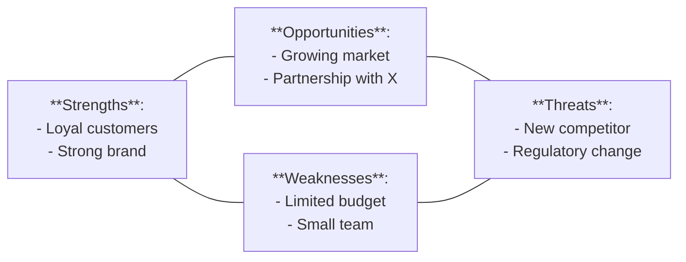

# SWOT — composition reference

**Slug:** `swot` · **Tool:** Excalidraw (Mermaid `flowchart` as a rough grid) · **Phase:** 2 · **Source of truth:** `pm-market-analysis` output

## Purpose
Classify a company's/product's **internal** vs **external** factors and their **positive** vs **negative** impact: Strengths and Weaknesses (internal), Opportunities and Threats (external). Gives a clear read on competitive position — what works, what doesn't, and which external trends help or hurt.

## When to use / when NOT
- **Use** to summarize strengths/weaknesses against competition and market before market entry, a big investment, or restructuring.
- **NOT** for detailed process analysis or task breakdown. For specific user problems use personas or a journey map.

> The SWOT analysis is owned by `pm-market-analysis`. Render from its output; if none exists, route there rather than inventing factors.

## Element vocabulary
| Element | Meaning | Placement |
|---|---|---|
| Horizontal axis | **Internal ↔ External** | Internal (S, W) left; External (O, T) right. |
| Vertical axis | **Positive ↕ Negative** | Positive (S, O) top; Negative (W, T) bottom. |
| Quadrant | **Strengths** | Internal + positive → top-left. |
| Quadrant | **Weaknesses** | Internal + negative → bottom-left. |
| Quadrant | **Opportunities** | External + positive → top-right. |
| Quadrant | **Threats** | External + negative → bottom-right. |

## Composition rules
- Horizontal axis splits internal (left) / external (right); vertical splits positive (top) / negative (bottom). Label both.
- Four fixed quadrants with those meanings; each clearly labelled.
- Fill each quadrant with items in the correct category (internal → S/W, external → O/T).
- **Strategy, not a list:** each item should carry a strategic implication (why it's a strength/weakness, what threat/opportunity it represents, what to do). Not a random bullet dump.
- Consistency: an "opportunity" that is actually internal belongs in S/W.

## Canonical structure
A 2×2 table: top = positives, bottom = negatives, left = internal, right = external. Top-left "Strengths", bottom-left "Weaknesses", top-right "Opportunities", bottom-right "Threats". Each cell a short bulleted list. Optionally color the best (S, green) and worst (T, red).

## Anti-patterns
- A bullet list with no strategy (each item needs a strategic context).
- Misplacing factors (a competitive threat in the Weaknesses cell).
- Unbalanced categories (all internal, no O/T) — SWOT is about balance.
- Empty quadrants (something is being overlooked or miscategorized).
- Broken/asymmetric layout — a proper SWOT is a symmetric 2×2.

## Rendering
- **Mermaid:** `flowchart` with four nodes (S, O, W, T) connected to form a grid; each node holds bulleted text (` ` for lines). S+O top row, W+T bottom. Not perfect but expresses the layout.
- **Excalidraw:** a 2×2 grid. Top-left "Strengths" (green background), bottom-right "Threats" (red) to signal positive/negative. Category titles + bullets inside each cell. Axis labels outside: "Internal→External" horizontal, "Positive↑Negative" vertical. Symmetric table; readable bullet lists.

## Required inputs
- Analysis title (optional but helpful).
- Items for S, W, O, T — each clearly in one category, ideally with a short strategic implication.
- Definition of internal vs external for this project.
- Validated sources (surveys/audit) — not just subjective opinion.

## Worked example

Top-left Strengths, top-right Opportunities, bottom-left Weaknesses, bottom-right Threats; each with a strategic implication attached.
