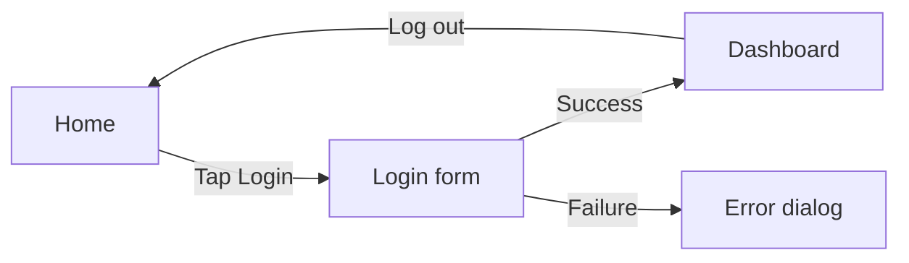

# Wireflow / Screen Flow — composition reference

**Slug:** `wireflow` · **Tool:** Excalidraw (Mermaid `flowchart` for the screen graph) · **Phase:** 6 · **Source of truth:** feature description / prototype spec

## Purpose
The hybrid of wireframes + flow: low-fidelity **screens** as nodes, connected by transition arrows labelled with the trigger (tap, submit, back). Shows how a user moves between screens to complete a task. Answers "which screen leads to which, on what action?".

## When to use / when NOT
- **Use** to map the screen-to-screen navigation of a task at low fidelity — bridges UX flow and prototype.
- **NOT** for the emotional experience over time (→ `journey`), for pure logic steps without screens (→ `flow`), or for a full clickable prototype.

## Element vocabulary
| Element | Meaning | Rules |
|---|---|---|
| Screen placeholder (box) | **Screen** | A low-fi wireframe / named screen node. Carries just enough to be recognizable (title + key element). |
| Smaller / overlay box | **Modal / State** | A modal or sub-state distinct from a full screen navigation. |
| Labelled arrow | **Transition** | From screen to screen; label = the trigger (tap X, submit, back). |
| Diamond (optional) | **Branch point** | Success vs error, condition-based routing to different screens. |
| Start marker | **Entry screen** | Where the task begins (e.g. Home). |
| End marker | **End state** | Success / error terminal screen. |

## Composition rules
- Nodes are **screens** (not steps): each node = a distinct screen or modal.
- Every transition arrow carries a trigger label (the action that causes it).
- Branches (success/error) use a decision point and route to the correct target screen.
- Clearly mark the entry screen and the end state(s).
- Keep fidelity low — a placeholder is a screen identity, not a finished design.

## Canonical structure
Entry screen → (trigger) → next screen → ... with branches to error/alternate screens.

## Anti-patterns
- Treating nodes as logic steps instead of screens (that's `flow`).
- Unlabelled transitions (which action triggers this?).
- Over-detailing the wireframe inside each node (defeats low-fidelity purpose).
- No clear entry/end.

## Rendering
- **Mermaid:** `flowchart LR`. Each screen a `["Screen name"]` node; label edges with the trigger `-->|Tap X|`. Good for the screen graph; can't show actual wireframe content inside nodes.
- **Excalidraw:** draw each screen as a wireframe placeholder box (title bar + a couple of key elements). Connect with labelled arrows for transitions. Distinguish modals (smaller/overlayed). Colors: standard screen blue, error/alternate red, entry/end green. Space screens so arrows read clearly; keep flow left-to-right.

## Required inputs
- Task/goal name (e.g. "User login").
- Ordered list of key screens (wireframes).
- Transitions: from which screen an arrow goes to which, and the triggering action.
- Branch conditions (success vs error) and their target screens.
- Entry screen and end states.

## Worked example

Transition from Home to the Login form, branching on success/failure, then log out back to Home.
