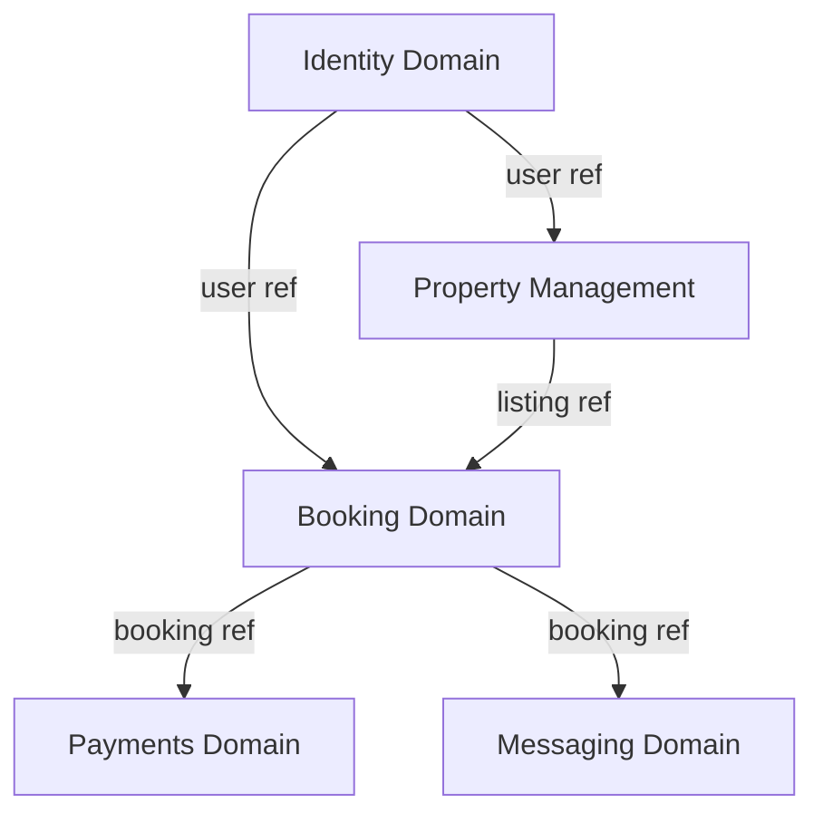
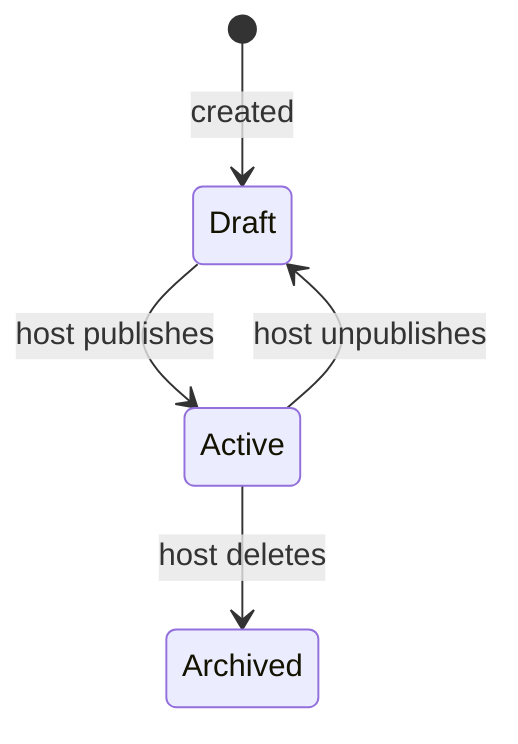
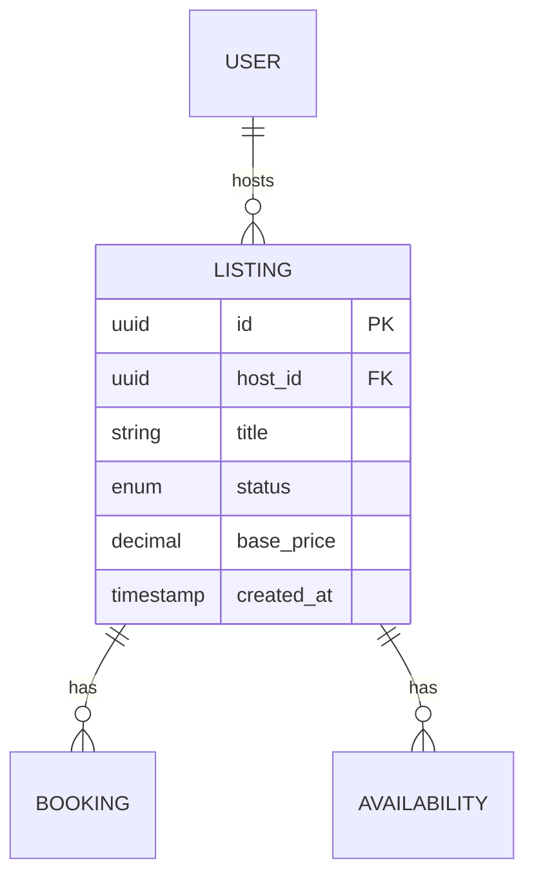

# PM - Domain Model

## What this skill does

Defines the conceptual data and domain structure of the product:
1. Business Domains - bounded areas of responsibility
2. Entity Catalogue - all entities with domain ownership
3. Entity Definitions - attributes, relationships, enums, events, ERD diagrams per entity

Two-stage output: Claude generates the Domain Overview + Entity Catalogue first, waits for user confirmation, then generates the full Entity Definitions. This prevents building detailed specs on top of a wrong domain structure.

Output is the foundation for entities.md (entity state machines), business_rules.md (business behavior), and Feature Cards (delivery). Never duplicate Domain Model content in those documents - reference it.

---

## Dependencies

**Recommended before running:**
- `pm-prd` - product scope defines what entities are needed
- `pm-problem-validation` - validated problem informs domain boundaries

**Produces artifacts used by:**
- `pm-privacy-requirements` - entities and attributes are the PII inventory input
- `pm-business-rules-library` - domain model is the reference for state machines and business rules
- `pm-feature-design` - entities and their attributes are referenced in functional specs
- `pm-features-list` - domain structure informs feature derivation
- Phase 6 skills - all spec work references this document

---

## Step 0: Current state check

Check for existing artifacts:
- Domain Model (any version)
- Entity Catalogue
- Entity Definitions

If a Domain Model exists: identify version and completeness. Check for entities that may have changed since the last version (new features added, scope changed).

Look for: entities without a clear domain owner, missing external/integration entities, relationships without cardinality, enums not listed, events not mapped, no ERD diagram.

Apply the standard skill interaction pattern (CLAUDE.md).

---

## Step 1: Gather inputs

```
I need inputs for the Domain Model.

1. PRODUCT SCOPE
   What does the product do? Who uses it?
   Paste the PRD In-Scope section, or describe the product in detail.
   [paste or describe]

2. KEY ENTITIES (your initial list)
   What are the main "things" in this system?
   (Users, Orders, Listings, Payments, Messages, Properties, Bookings... whatever applies)
   [list what you know - rough is fine]

3. USER ROLES
   Who are the actors? (Host, Guest, Admin, Driver, Sender, Merchant...)
   Which roles create data, which only consume it?

4. EXTERNAL SYSTEMS
   What external systems or APIs will the product integrate with?
   (payment processor, calendar provider, map service, notification service, AI API...)

5. KNOWN DOMAIN BOUNDARIES
   Do you have a sense of how the system splits into areas?
   (e.g., "there's a booking area and a property management area and a payments area")
   [describe or "not sure yet"]

6. MVP SCOPE CONSTRAINT
   Which entities are definitely in MVP vs. post-MVP?
   (I'll flag anything that seems post-MVP based on the features list)
```

---

## Stage 1: Domain Overview + Entity Catalogue

Generate Stage 1 first. Wait for user confirmation before proceeding to Stage 2.

Generate in English.

---

### STAGE 1 OUTPUT

```markdown
# Domain Model - [Product Name]

**Version:** 0.1 (draft)
**Date:** [date]
**Status:** Stage 1 - Pending Review

---

## 1. Business Domains

| Domain | Responsibility | Key entities |
|---|---|---|
| [e.g., Property Management] | [Manages property listings, availability, pricing] | Listing, Availability, PricingRule |
| [e.g., Booking] | [Handles booking requests, confirmations, cancellations] | Booking, BookingRequest |
| [e.g., Payments] | [Processes payments, payouts, refunds] | Payment, Payout, Invoice |
| [e.g., Identity] | [User accounts, authentication, profiles] | User, Profile, Session |
| [e.g., Messaging] | [Guest-host communication] | Conversation, Message |

---

## 2. Domain Boundaries

**Principles:**
- Each entity has one owner domain - the source of truth.
- Domains communicate via references (IDs) and events, not direct data access.
- [Product-specific boundary principle, e.g., "Booking domain does not own pricing logic"]

---

## 3. High-Level Domain Diagram



---

## 4. Entity Catalogue

### Internal Entities

| ID | Entity | Domain | Description |
|---|---|---|---|
| ENT-001 | [User] | Identity | [Person who has an account - host or guest] |
| ENT-002 | [Listing] | Property Management | [A rentable property unit with attributes and pricing] |
| ENT-003 | [Booking] | Booking | [A confirmed reservation linking a listing and a guest] |
| ENT-004 | [Payment] | Payments | [A financial transaction associated with a booking] |
| ENT-005 | [Message] | Messaging | [A message between a host and a guest in a booking context] |

### External / Integration Entities

| ID | Entity | Source system | Description |
|---|---|---|---|
| EXT-001 | [StripePaymentIntent] | Stripe | [Payment intent object from Stripe API] |
| EXT-002 | [AirbnbCalendarEntry] | Airbnb API | [External calendar entry for sync] |

### Entities Flagged as TBD

| Entity | Why flagged | Priority |
|---|---|---|
| [ReviewResponse] | Mentioned in product idea but not in MVP scope | Low |

---

## Confirmation Checkpoint

Please review:
1. Are all the domains correct? Anything missing or should be merged/split?
2. Is the entity list complete for MVP? Any missing entities?
3. Any entities that should be external (from a 3rd party) vs. internal?

Confirm to proceed to Stage 2 (full entity definitions).
```

After the user reviews Stage 1, use AskUserQuestion tool with:
- Question: "Stage 1 is ready for review. Would you also like a visual diagram of the domain overview?"
- Option A: "Yes - render Domain Model Overview in Excalidraw (Recommended)"
- Option B: "No - proceed to Stage 2 confirmation"

If A: generate the Excalidraw diagram using `mcp__claude_ai_Excalidraw__create_view`.

Follow the Domain Model Overview visual conventions from `pm-diagrams.md`:
- Large zone rectangles per domain (opacity 35, color-coded by domain type)
- Entity rectangles inside their domain zone (140x50, rounded, light fill)
- Relationship arrows between domains (labeled with key reference)
- External systems in a separate orange zone
- Camera XL (1200x900) for 4+ domains, Camera L (800x600) for 2-3 domains

After rendering, offer export to excalidraw.com via `mcp__claude_ai_Excalidraw__export_to_excalidraw`.

---

## Stage 2: Entity Definitions

After user confirms Stage 1, generate entity definitions. Can be generated one at a time or all at once.

---

### STAGE 2 OUTPUT TEMPLATE (per entity)

```markdown
---

## ENT-[ID]: [Entity Name]

**Domain:** [Domain name]
**Description:** [What this entity represents and its business role]

### Attributes

| Attribute | Type | Required | Description | Notes |
|---|---|---|---|---|
| `id` | UUID | Yes | Unique identifier | PK |
| `created_at` | Timestamp | Yes | Record creation time | |
| `updated_at` | Timestamp | Yes | Last modification time | |
| `[field]` | [String / Integer / Decimal / Boolean / Enum / UUID ref] | Yes/No | [Description] | [e.g., FK to ENT-XXX] |

### Identifiers

| Type | Attribute |
|---|---|
| Primary Key | `id` |
| Business Key | `[human-readable identifier if different from id]` |
| External ID | `[e.g., stripe_payment_id]` or N/A |

### Relationships

| Relationship | Target | Type | Cardinality | Description |
|---|---|---|---|---|
| [Belongs to] | ENT-001 User | Ownership | N:1 | [A listing belongs to one host (User)] |
| [Has many] | ENT-003 Booking | Association | 1:N | [A listing can have many bookings] |

Relationship types: Ownership / Association / Derivation / Aggregation

### States (if entity has a lifecycle)

| State | Description | Entry conditions |
|---|---|---|
| [Draft] | [Not yet published] | [Created by host, not yet submitted] |
| [Active] | [Published and bookable] | [Host submits and passes validation] |
| [Archived] | [No longer bookable] | [Host deactivates or deletes] |

**State transitions:**


### Events

| Event | Trigger | Payload fields |
|---|---|---|
| `listing.published` | Host publishes listing | `listing_id`, `host_id`, `published_at` |
| `listing.archived` | Host deletes listing | `listing_id`, `archived_at` |

### Enums

| Enum | Values | Description |
|---|---|---|
| `status` | `draft`, `active`, `archived` | Lifecycle state |
| `property_type` | `apartment`, `house`, `room`, `villa` | Property category |

### Derived Fields

| Field | Derived from | Business meaning |
|---|---|---|
| `availability_rate` | Booking records / total days | % of time the property is booked |
| `average_rating` | Review records | Composite guest satisfaction score |

### ERD Diagram



### Notes

[Any domain-specific constraints, design decisions, or open questions for this entity]
```

After all entity definitions are generated, append a Full ERD section to the document:

```markdown
---

## [N+1]. Full ERD

Cross-entity ERD showing all internal entities and their relationships. Use this as the single reference for database schema design.

```mermaid
erDiagram
  [ENTITY_A] {
    uuid id PK
    uuid [fk_field] FK
    [type] [field]
    enum status
    timestamp created_at
  }
  [ENTITY_B] {
    uuid id PK
    uuid [entity_a_id] FK
    [type] [field]
    timestamp created_at
  }
  [ENTITY_A] ||--o{ [ENTITY_B] : "[relationship label]"
  [ENTITY_B] ||--o{ [ENTITY_C] : "[relationship label]"
  [ENTITY_A] ||--|| [EXT_ENTITY] : "[external reference]"
```
```

---

## Stage 2: Excalidraw ERD (optional)

After all entity definitions are complete, use AskUserQuestion tool with:
- Question: "All entity definitions are complete. Would you like a visual ERD overview showing all entities and their relationships?"
- Option A: "Yes - render full ERD in Excalidraw (Recommended)"
- Option B: "No - we're done"

If A: generate the Excalidraw diagram using `mcp__claude_ai_Excalidraw__create_view`.

Layout approach for ERD:
- Group entities by domain (use zone backgrounds, same color scheme as Stage 1 diagram)
- Each entity as a rectangle (160x60, rounded, fill matching domain color)
- Relationship arrows between entities labeled with cardinality (1:1, 1:N, N:M) and relationship type
- External entities in orange zone
- Camera XXL (1600x1200) for large domain models (8+ entities), Camera XL for smaller
- Use camera panning to reveal domain by domain as you draw

After rendering, offer export to excalidraw.com.

---

## Internal completeness checklist

<!-- Claude reference only - not shown to user.
     Use in Step 0 to identify gaps in existing artifacts.
     Use in Step 2 to verify full coverage before finalizing output. -->

**Stage 1 - Domain Overview must cover:**
- [ ] All business domains named and described
- [ ] Domain boundary principles stated
- [ ] High-level domain diagram (Mermaid)
- [ ] Entity Catalogue: all internal entities with domain ownership
- [ ] External/integration entities identified
- [ ] TBD entities flagged
- [ ] Stage 1 confirmation checkpoint before proceeding

**Stage 2 - Entity Definitions must cover (per entity):**
- [ ] Attributes table with types and required flags
- [ ] Primary Key and Business Key identified
- [ ] External IDs noted where applicable
- [ ] Relationships with cardinality and type
- [ ] States and state diagram (Mermaid) for entities with a lifecycle
- [ ] Events: what events this entity emits
- [ ] Enums: all enumerated values listed
- [ ] Derived fields: what is computed vs. stored
- [ ] ERD diagram (Mermaid) - per entity, showing immediate relationships
- [ ] Full ERD section at the end of the document - all entities together in one cross-entity diagram

**Cross-entity consistency:**
- [ ] No entity belongs to multiple domains (one owner per entity)
- [ ] Foreign key references match entity IDs
- [ ] Events reference correct entity IDs in payload
- [ ] No circular ownership dependencies

**For SaaS/AI products:**
- [ ] Multi-tenant isolation: which attribute carries the tenant ID per entity?
- [ ] Audit trail: which entities need created_by / updated_by tracking?
- [ ] Soft delete vs. hard delete: which entities support soft delete (is_deleted flag)?
- [ ] AI-generated content: which attributes contain AI output (needs provenance tracking)?
- [ ] PII fields: identified and flagged (input for pm-privacy-requirements)

## Notion push

**Runs after user approves the domain model artifacts.**

For each DB: read URL from `pureinn-variables.md`, call `mcp__claude_ai_Notion__notion-fetch` to get `data_source_id`, cache in `state.json`. Skip if URL blank.

Use `mcp__claude_ai_Notion__notion-create-pages` with both `properties` AND `content` - do NOT use template_id.

**Internal Entity Catalogue DB** (key: `"Internal Entity Catalogue"`):
```
properties:
  Entity: [Entity name]
  Domain/Source: [[Domain name]]
  Description: [1-sentence description]
  Lifecycle States: [comma-separated states]
  Register Status: Active
  Väzby (R/W/Event): [key relationships]

content:
  ## [Entity Name]

  [Description]

  ## Attributes
  [Key attributes from domain model]

  ## Relationships
  [Relationships to other entities]
```

**External Entity Catalogue DB** (key: `"External Entity Catalogue"`):
```
properties:
  Entity: [System/service name]
  Source System/Provider: [[Provider type]]
  Description: [What this external system provides]
  Väzby (R/W/Event): [integration type: REST API / webhook / SDK]

content:
  ## [External System Name]

  [Description of what it provides]

  ## Integration Type
  [How MediOps connects to it]

  ## Data Exchanged
  [What data flows in/out]
```

**Event Catalogue DB** (key: `"Event Catalogue"`):
```
properties:
  Name: [Event name in past tense, e.g. order.confirmed]
  Domain: [[Domain name]]

content:
  ## [Event Name]

  **Trigger:** [What causes this event]
  **Affected entities:** [Entity names]
  **Consumers:** [Who listens to this event]
  **Payload:** [Key fields in the event payload]
```

Also update the **Domain Model page** (key: `"Domain Model"`) with the full domain-model.md content:
Call `mcp__claude_ai_Notion__notion-update-page` with `command: "replace_content"` and the full domain-model.md text.

After push: report counts per DB (created, errors).

## Save to

```
pureinn-workspace/[project-slug]/artifacts/phase-4-domain/domain-model.md
```
