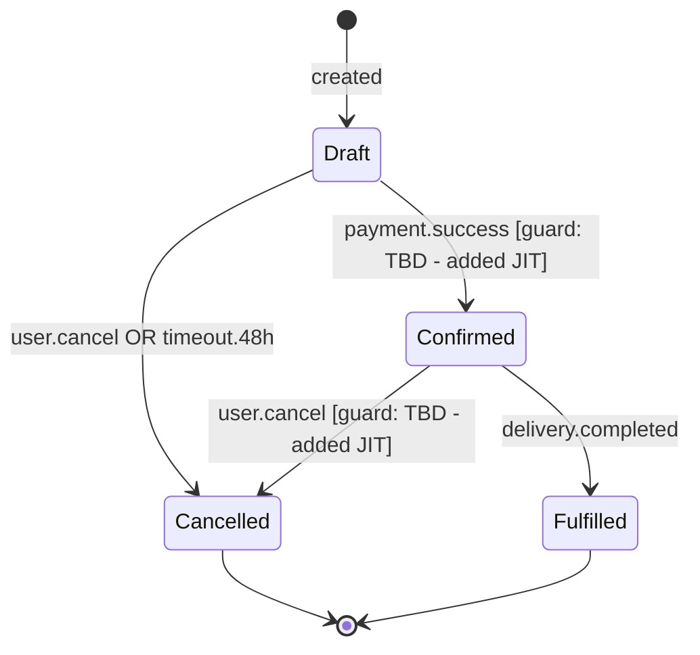

# PM - Entity Registry

## What this skill does

Builds **Live Register 1 of 4**: the Entity & State Registry (`/domain/entities.md`).

This register is the architectural foundation of the FDD+SDD framework. It defines:
- What business objects exist in the system
- What states each object can be in
- What transitions are allowed between states (including triggers and emitted events)
- Guard conditions are added JIT in Phase 6 (pm-feature-design) - not here

**Position in the 4-register architecture:**

| Register | File | Content |
|---|---|---|
| **1. Entity & State Registry** | `/domain/entities.md` | Domain objects + state machines (THIS SKILL) |
| 2. Business Rules Library | `/domain/business_rules.md` | Business rules catalog (pm-business-rules-library) |
| 3. Decision Models Matrix | `/domain/decision_models.md` | Decision tables (pm-business-rules-library) |
| 4. FDD Feature List | `/features/feature_list.md` | Feature hierarchy + planning (pm-features-list) |

**Source:** PRD Business Capabilities section. AI extracts nouns from capabilities → entities. State machines reflect the business lifecycle of each entity.

**Domain overview diagram:** Generated in Excalidraw (high-level visual for the team). State machines per entity: Mermaid.js (embedded in entities.md - readable by Claude Code).

---

## Dependencies

**Required before running:**
- `pm-prd` - PRD must include a Business Capabilities section

**Produces artifacts used by:**
- `pm-business-rules-library` - entities define the scope of rules
- `pm-features-list` - entities inform what operations and actions are needed
- `pm-feature-design` (JIT Phase 6) - adds guard conditions to transitions
- Build phase - Claude Code reads entities.md as architectural guardrail

---

## Step 0: Current state check + mode detection

Check for existing artifacts:
- `domain/entities.md` in current project workspace

**Mode detection:**

| Condition | Mode | Behavior |
|---|---|---|
| `entities.md` does NOT exist | Create mode | Generate full register from scratch |
| `entities.md` EXISTS | Append mode | Add new domain entities, preserve existing |

**If append mode detected**, inform user with state table (N existing entities), then use AskUserQuestion:
- Question 1: "Which domain/initiative is being added?" (free text answer - user describes it)
- Question 2: "Input source for Business Capabilities?" with options:
  - Option A: "Initiative PRD at initiatives/[slug]/prd.md - Business Capabilities section (Recommended)"
  - Option B: "Paste capabilities directly"

Also check: does a PRD or Initiative PRD with a Business Capabilities section exist? Without it, entity extraction is guesswork.

Look for: entities defined as technical components (not business objects), states that are technical statuses (not business lifecycle states), missing state machines for entities with complex lifecycles, transitions without triggers.

Apply the standard skill interaction pattern (CLAUDE.md).

---

## Step 1: Gather inputs

Ask as plain text:

```
I need inputs for the Entity & State Registry.

1. PRD BUSINESS CAPABILITIES
   Paste the Business Capabilities section from the PRD or Initiative PRD,
   or confirm it is in context.
   This is the primary source for entity extraction.
   (For append mode: paste only the capabilities for the new domain/initiative)
   [paste or "in context"]

3. EXISTING CONTEXT (optional)
   Is there an existing domain model, ERD, or tech spec that defines some entities?
   [paste or "none"]
```

Then use AskUserQuestion tool with two questions together:

- Question 1: "Team mode for entity generation?"
  - Option A: "Solo Builder - AI generates entities autonomously, you verify (Recommended)"
  - Option B: "Delivery Team - we refine the entity list together (Domain Walkthrough mode)"

- Question 2: "Do you want a high-level domain overview diagram in Excalidraw after entities are complete?"
  - Option A: "Yes - generate domain overview diagram (Recommended)"
  - Option B: "No - entities.md only"

---

## Step 2: Extract entities

Before generating:
1. Read PRD Business Capabilities
2. Extract all nouns that represent business objects with lifecycle (e.g., Order, Customer, Booking, Payment - NOT: service, module, component)
3. For each entity: identify what states it can be in (business lifecycle states, not technical)
4. Identify state transitions: what triggers the move from state A to state B
5. Identify what event each transition emits (events are named in past tense: `order.confirmed`, `payment.failed`)
6. Mark complex entities (3+ states) for full state machine; simple entities (1-2 states) as flat list

**Entity extraction rules:**
- Entities are nouns with lifecycle (they change state over time)
- States are business-meaningful, not technical: `Confirmed` not `is_confirmed=true`
- Transitions have: trigger (what causes the change) + emits (what event is produced)
- Guard conditions are NOT added here - they come JIT in pm-feature-design
- Phase 1 states only: clean states. Example: `Draft | Confirmed | Cancelled` - not conditions like "if payment > 0"

Generate in English.

---

## Step 3: Generate artifact

---

### ARTIFACT: Entity & State Registry

Save to: `pureinn-workspace/[project-slug]/domain/entities.md`

```markdown
# Entity & State Registry
# Live Register 1 of 4 - FDD+SDD Framework

> **Product:** [Product Name]
> **Version:** 1.0
> **Last updated:** [date]
> **Maintained by:** pm-entity-registry skill + pm-feature-design (JIT guard conditions)

---

> **How to read this register:**
> - States: business lifecycle states (not technical flags)
> - Transitions: trigger (what causes it) + emits (event produced) + guard (added JIT in Phase 6)
> - This register is an architectural guardrail - Claude Code reads it before implementing any feature

---

## [Entity Name 1] (e.g., Order)

**Business role:** [What this entity represents in the business domain]
**Owned by Feature Set:** [FS-NN: name - filled after pm-features-list]

**States:**

| State | Meaning | Terminal? |
|---|---|---|
| Draft | Created but not confirmed | No |
| Confirmed | Accepted and paid | No |
| Cancelled | Terminated before fulfillment | Yes |
| Fulfilled | Completed successfully | Yes |

**State machine:**



**Transitions:**

| From | To | Trigger | Emits | Guard condition |
|---|---|---|---|---|
| Draft | Confirmed | payment.success | order.confirmed | TBD - added JIT in pm-feature-design |
| Draft | Cancelled | user.cancel | order.cancelled | - |
| Draft | Cancelled | timeout.48h | order.expired | - |
| Confirmed | Fulfilled | delivery.completed | order.fulfilled | - |
| Confirmed | Cancelled | user.cancel | order.cancelled | TBD - added JIT in pm-feature-design |

**Illegal transitions:**
- Fulfilled → any state (terminal)
- Cancelled → any state (terminal)

---

## [Entity Name 2] (e.g., Payment)

[same structure]

---

## [Simple Entity] (e.g., Address)

**Business role:** [Description]
**States:** No lifecycle states - value object. Mutable by owner entity.

---

## Entity Relationship Overview

| Entity | Relates to | Relationship |
|---|---|---|
| Order | Customer | Many Orders per Customer |
| Order | Payment | One Payment per Order |
| Payment | Order | Belongs to Order |

---

## Changelog

| Version | Date | Change | Reason |
|---|---|---|---|
| 1.0 | [date] | Initial extraction from PRD | Phase 4 kickoff |
| 1.1 | [date] | Guard conditions added for FEAT-ORD-012 | JIT pm-feature-design |
```

---

## Step 4: Domain overview diagram (if requested)

If user selected option A in Step 1:

Generate a high-level domain overview using Excalidraw MCP (`mcp__claude_ai_Excalidraw__export_to_excalidraw`).

The diagram shows:
- All entities as boxes
- Relationships between entities as labeled arrows
- No states - this is the macro view

```
[Entity A] --owns--> [Entity B]
[Entity B] --triggers--> [Entity C]
```

After Excalidraw generation, save the checkpoint for future updates.

---

## Internal completeness checklist

<!-- Claude reference only - not shown to user -->

**Entity extraction:**
- [ ] All nouns with business lifecycle are captured (not technical components)
- [ ] Pure value objects (no lifecycle) are marked as such
- [ ] Entity count is realistic (3-15 for typical product - more suggests over-granularity)

**States per entity:**
- [ ] States are business-meaningful (not technical flags)
- [ ] Terminal states are identified
- [ ] No state is unreachable from initial state
- [ ] No missing transitions (what puts entity back / forward)

**Transitions:**
- [ ] Every transition has a trigger (event or action that causes it)
- [ ] Every transition has an emitted event (past tense, dot notation: `entity.state`)
- [ ] Guard conditions are marked TBD (NOT filled here - JIT only)
- [ ] Illegal transitions explicitly listed

**Mermaid.js:**
- [ ] stateDiagram-v2 syntax used
- [ ] Diagram compiles without errors
- [ ] [*] initial and terminal states marked

**Register format:**
- [ ] Header with version + last updated
- [ ] Changelog section maintained

---

## Save to

**Create mode (first run):**
```
pureinn-workspace/[project-slug]/domain/entities.md
```
State update → `state.json`: set `registers.entities_initialized` to `true`.

**Append mode (new domain/initiative):**
- Open existing `domain/entities.md`
- Add new domain section(s) after last existing entity
- Update the Changelog section with the new entry:
  `| 1.X | [date] | Added [Domain] entities for [initiative-slug] initiative | Initiative PRD |`
- Update `> Last updated:` in the file header
- Do NOT modify any existing entity sections

---

## Notion push

After saving `entities.md`, push entity data to the Internal Entity Catalogue DB in Notion.

**Step 1 - Get data source ID and template ID:**
1. Read `pureinn-variables.md` key `"Internal Entity Catalogue"` → get DB URL
2. If blank: skip Notion push entirely, continue
3. Call `mcp__claude_ai_Notion__notion-fetch` with the URL
4. Extract `data_source_id` from `<data-source url="collection://...">` → cache in `state.json notion_ids.internal_entity_catalogue`
5. Extract template ID from `<templates>` section - look for `"Internal Entity Template"` → required for Step 2

**Step 2 - Create entries:**

For each **internal entity** in `entities.md`, call `mcp__claude_ai_Notion__notion-create-pages` with both `properties` AND `content`. Do NOT use `template_id` - provide content directly.

```
properties:
  Entity: [Entity name]
  Domain/Source: [[Domain name]]
  Description: [1-sentence description]
  Lifecycle States: [states comma-separated, e.g. "Draft, Active, Archived"]
  Register Status: Active
  Väzby (R/W/Event): [key relationships]

content: (inline markdown - fill from entities.md)
  ## [Entity Name]

  [Description from entities.md]

  ## Lifecycle States

  [Paste the stateDiagram-v2 block from entities.md for this entity]

  ## Key Business Rules

  [List any BR-IDs that reference this entity, or "See business_rules.md"]

  ## Relationships

  [Relationships from entities.md Väzby section]
```

For **external entities**: use `"External Entity Catalogue"` URL. Use `Source System/Provider` field instead of `Domain/Source`. Include system description and integration type in content.

**Append mode:** For new entities added in append mode, create new entries. Do NOT update existing entries.

**Append checklist:**
- [ ] Existing entities preserved exactly as-is
- [ ] New domain entities added as new sections
- [ ] Entity Relationship Overview table updated with new cross-domain relationships (if any)
- [ ] Changelog updated
- [ ] File header `Last updated` updated
