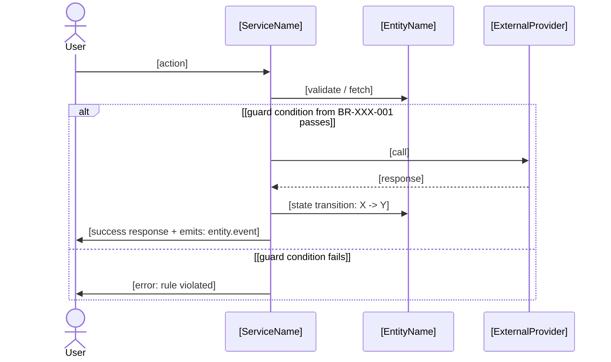

# PM - Feature Design (JIT)


## Agent mode (`--agent`)

Supports `--agent`: runs autonomously in a subagent, drafts the artifact from existing inputs, and returns a short summary + coverage note.

- **No flag** → interactive (default); if inputs are heavy, offer agent mode.
- **`--agent`** → obey. First check inputs are complete. Anything missing: do NOT invent it - mark `[ASSUMED - what/why]` in the output and summary. Never hallucinate to fill a gap.
- **Review required:** the artifact contains commitments - after drafting, require the user's review before finalizing; do not close decisions autonomously.

---

## What this skill does

Produces the Just-In-Time technical design for a single feature immediately before it enters build. This is the FDD Phase 4 (Design by Feature) executed in SDD mode.

**JIT vs. upfront design:**

| Upfront approach (not used) | This skill (JIT) |
|---|---|
| Feature-Set-level design, written upfront | Feature-level design, written just-in-time |
| Standalone design document | Register updates + sequence diagram embedded in Feature Card |
| Written for an entire Feature Set before the Stripe | Written for one Feature just before build |

**What this skill does in one run:**
1. Reads the Feature Card (Section 1 is stub at this point)
2. **Discovery Interrogation** (Step 1.5) - actively interrogates to surface unknowns and reach precision, calibrated to feature criticality; sorts findings into rules / ACs / subtasks
3. Enriches `entities.md` - adds exact guard conditions to state transitions relevant to this feature
4. Enriches `business_rules.md` and `decision_models.md` - finalizes rules this feature enforces (Draft → Final); adds brand-new rules surfaced in discovery via the single-rule helpers
5. Populates Feature Card Section 1 (Biznis Mantinely) - links entities, BR-IDs, TBL-IDs
6. Writes Feature Card Section 2 (Acceptance Criteria) - derived from register state + business rules
7. Writes Feature Card Subtasks - lightweight nuance helpers captured in discovery
8. Generates Mermaid.js sequence diagram + files to modify - writes to Feature Card Section 3
9. Pushes description + Sections 1-3 + Subtasks to Notion; sets Feature Card status to `2_Spec_Done` (or `2b_In_Design` if it is a frontend feature whose Figma design still has to be produced - see Step 4d)

**Atomic commit protocol (parallel Stripe safety):**
All register updates (steps 2-3) are committed BEFORE any code generation begins. This prevents merge conflicts when multiple Stripes run in parallel.

```
Commit 1: "spec([FEAT-ID]): guard conditions + rule finalization"
  → entities.md updated
  → business_rules.md updated (rules status: Final)
  → decision_models.md updated

Commit 2: "spec([FEAT-ID]): feature design complete"
  → Feature Card Sections 1-3 populated
  → status: 2_Spec_Done
```

**Existing codebase mode (Feature Implementation playbook):**
If the project has an existing codebase, Claude Code MUST scan the relevant service files before generating the sequence diagram. The diagram must use only real existing classes and methods - it must not invent interfaces that don't exist.

---

## Dependencies

**Required before running:**
- Feature Card for this FEAT-ID (created by pm-features-list, stub state)
- `pm-entity-registry` - entities.md must exist
- `pm-business-rules-library` - business_rules.md and decision_models.md must exist (at least Draft)

**Recommended before running:**
- `pm-stripe` - confirms this feature is next in its Stripe and dependencies are met

**Produces artifacts used by:**
- Feature Card (Sections 1-3 populated)
- Build phase - Claude Code reads the completed Feature Card as implementation spec
- `test-master` / `playwright-expert` - ACs in Section 2 are the direct test basis

---

## Open questions

Open questions and decisions have exactly one home in the whole project: `domain/open_questions.md` (Live Register 5, owned by `pm-open-questions`). If the Discovery Interrogation surfaces a genuine judgment call (not just a new rule/guard condition to add, which goes into `business_rules.md`/`entities.md` directly), a legacy-vs-code divergence, or a concrete blocker to build - do not park it as a Subtask or a comment in the Feature Card. Append an entry to the register (Type: Question / Divergence / Blocker, `OQ-`/`DIV-`/`BLK-{DOMAIN}-NN` ID; run `pm-open-questions` to initialize it first if it doesn't exist). A Subtask is a nuance for the developer to handle during build; an open question is something nobody has decided yet - keep the two separate.

---

## Step 0: Current state check

Read the Feature Card at `/features/cards/[FEAT-ID].md`.

| Item | Status | Detail |
|---|---|---|
| Feature Card | [status from frontmatter] | [title] |
| entities.md | [exists / not found] | |
| business_rules.md | [exists / not found] | |
| decision_models.md | [exists / not found] | |
| Dependencies met | [yes / no] | [list unmet deps] |

**Verdict:** [One sentence - ready to design or what is blocking]

If Feature Card status is already `3_Ready_to_Build` or later: stop. Design is already approved. Do not overwrite.

**Interaction:** Group related questions (2-4 per round) and confirm before moving on. For any A/B/C/D choice, use the AskUserQuestion tool with one option marked **(Recommended)** - never print options as plain text. Keep open-ended questions free-text (don't fake options). If the user is unsure, propose 3-4 concrete options plus "Other". Surface an assumption the moment you make one; never fabricate to fill a gap. (Full standard: CLAUDE.md.)

---

## Step 1: Detect mode from state.json, then gather feature-specific inputs

**Playbook mode and team mode come from `state.json` - do NOT ask them cold.** By the time a feature reaches design, the workspace already knows its `playbook` and `team_structure` (both set at Phase 1 setup). Asking again is redundant and makes the skill look like it forgot its own state - which violates the situation-aware standard (CLAUDE.md → Adaptive execution). Read them and **state** the detected mode; only fall back to a question if the value is genuinely absent.

Read `state.json`:
- `playbook` → **Greenfield** (design from scratch, diagram defines new classes/methods) or **Feature Implementation** (diagram must match existing code - triggers the Step 2 code scan).
- `team_structure` → **Solo Builder** (AI drafts the full design, you confirm before build) or **Delivery Team** (design goes to a Design Inspection step after this).

State it, don't ask:

```
Detected from state.json: [Greenfield | Feature Implementation] · [Solo Builder | Delivery Team].
→ Designing [from scratch | against the existing codebase]; [you confirm before build | this routes to Design Inspection].
Say "switch mode" if that's wrong.
```

**Only if `playbook` or `team_structure` is missing from state.json** (e.g. a hand-created workspace, or a fast-track that skipped setup), fall back to AskUserQuestion for the missing field(s) - one question, only the one that's unknown:

- Playbook (if unknown): "Greenfield - design from scratch (Recommended for new projects)" / "Feature Implementation - match existing code (Recommended for an existing codebase)"
- Team (if unknown): "Solo Builder - you confirm before build (Recommended)" / "Delivery Team - goes to Design Inspection"

Then ask as plain text:

```
JIT Design for: [FEAT-ID]: [Feature title]

PRD CONTEXT
   The feature references: [prd_ref from frontmatter]
   Is this PRD section in context, or should I read it?
   [confirm or paste relevant section]

BUSINESS RULES SCOPE
   Which business rules from business_rules.md apply to this feature?
   List BR-IDs, or I will identify them from the feature scope.
   [list or "identify automatically"]

   [If Feature Implementation mode: which service files are relevant? I will scan them before designing.]

OPEN QUESTIONS
   Any known edge cases or constraints specific to this feature not yet in the registers?
   [list or "none"]
```

Then use AskUserQuestion tool for UX context (skip if backend/API-only feature):

- Question: "Does this feature have a user interface component? If yes, how will you provide the UX context?"
  - Option A: "Text description - I'll describe where this feature lives and what the user sees/does"
  - Option B: "Attach a screenshot or mockup directly in this message"
  - Option C: "Figma URL - I'll paste the screen URL (requires Figma MCP connected)"
  - Option D: "Backend/API-only - no UI component, skip UX context"

---

## Step 1.5: Discovery Interrogation

This is the core of JIT design. A Feature is a *detailed* view of functionality - at design time the user often does not yet know every detail they implied when writing the business logic, and is unaware of some entirely. **Do not passively ask "any edge cases?" and accept "none."** Actively interrogate to surface the unknowns and reach precision - this is what the deep-dive is for. The AI drives; the user (and optionally the team) answers, or the AI proceeds on flagged assumptions. No class-owner machinery - roles stay flat.

**Calibrate depth to feature criticality - do NOT run a fixed 30-question checklist** (that just trains people to click "none"):

```
Criticality = f(KANO, priority, touches money?, touches PII?, number of state transitions)
  Low   (CRUD, P3, no money/PII)      → 2-3 targeted questions, move on
  Medium (P2)                          → happy path + guard conditions + flag-OFF behavior
  High  (money / PII / P1 / critical)  → full interrogation across all axes below
```

**Security dimension - set the `security_review` flag here.** The same signals that drive criticality also decide whether this feature needs a security specialist in build/review. **Think in security areas, not feature types:** the trigger is whether the feature **creates, crosses, or modifies** a vulnerability area, not whether it is a specific feature (an invite code is an *instance* of the Abuse/enumeration + Identity areas, not its own trigger). Assess it now (you have the most context during interrogation) and write the verdict to the Feature Card frontmatter in Step 4d. Set `security_review` above `none` when the feature touches at least one area:

| # | Security area | Example (illustrative) |
|---|---|---|
| 1 | Access control & tenant isolation | RLS, org/tenant scoping, service-role bypass, privilege escalation, impersonation, bulk/admin ops |
| 2 | Authentication & identity | login, session, token lifecycle, SSO/OAuth, new role/permission flag |
| 3 | Cryptography & secrets | key/API-key storage, token generation, hashing, encryption |
| 4 | Sensitive / regulated data | PII/regulated data crossing a boundary (the regime GDPR/HIPAA/PCI is a per-vertical example, not the trigger) |
| 5 | Input & injection surface | untrusted input parsing, injection, deserialization, file upload |
| 6 | External / server-side integration | outbound → LLM/3rd-party API, inbound webhooks, SSRF |
| 7 | Abuse & enumeration surface | guessable identifiers (invite/coupon codes, reset tokens), brute force, rate-limiting, resource exhaustion |
| 8 | Financial integrity | money movement, accounting, transactional integrity |

Pre-auth / cross-tenant reachability escalates whatever area it touches - treat borderline pre-auth surfaces as triggering.

**Value:** `build` if the feature **creates a new** mechanism in an area (a new security BR going Draft→Final for the first time) → `secure-code-guardian` threat-models before writing it. `review` if it only **crosses** a sensitive area but **reuses an existing Final** security pattern (the primitive is already proven) → `security-reviewer` audit only. `both` if new AND sensitive. `none` if no area touched (plain CRUD behind proven auth). (Full authoritative table + reuse rule: `pm-stripe` → Security Review Trigger Criteria.) State the verdict inline: `security_review: [value] - because [area touched / no area touched]`.

**Axes to probe** (use the grouped question pattern from CLAUDE.md - batch 2-4 related questions per AskUserQuestion round, confirm, continue):

| Axis | What to actively probe | Feeds |
|---|---|---|
| Happy path | Propose the step-by-step flow yourself; the user corrects | → sequence diagram (§3) |
| State transitions | Which entity states does this touch (from `entities.md`)? What triggers each? | → guard conditions |
| Guard conditions | Under what conditions is each action allowed / blocked? | → BR-IDs or new rules |
| Edge cases | Systematically: invalid input? concurrency? external-service failure? entity in an unexpected state? | → ACs (§2) + subtasks |
| Hidden concerns | Permissions, idempotency, notifications, audit, data retention - the things the user "has no clue about" | → rules / subtasks |
| Rule gaps | At every decision point: "is there a rule governing this? what is the value?" | → register enrichment |

**When the user says "I don't know"** (per CLAUDE.md): never leave a vacuum. Based on the domain, registers, and similar features, propose 3-4 concrete options via AskUserQuestion and let them choose, plus an "Other / I'll describe" option.

**Surface assumptions inline** when proceeding without explicit input: `Assumption: [X]. If wrong, tell me - it affects [Y].`

**Outputs of the interrogation - sort every finding into the right layer:**

| Finding | Goes to |
|---|---|
| Non-negotiable, reusable logic | **Business rule** → add via `/pm-business-rule-core` / `-critical` / `-governance` (Step 3), or finalize an existing BR-ID |
| Multi-condition logic | **Decision table** (TBL) → add via `/pm-decision-model`, or finalize an existing TBL-ID |
| Testable condition for this feature | **Acceptance Criterion** (§2) |
| Lightweight nuance / dev helper | **Subtask** (§Subtasks) - not a rule, not an AC |

Produce a short interrogation summary (new rules to add, ACs identified, subtasks captured, open assumptions, **and the `security_review` verdict with its reason**) before moving to register updates.

---

## Step 2: Pre-design scan (Feature Implementation mode only)

If playbook mode = Feature Implementation:

1. Identify service files, models, and handlers relevant to this feature (from feature scope + files listed in Feature Card Section 3 stub)
2. Read those files to extract real class names, method signatures, and dependency injection patterns
3. Build a map of real interfaces before drawing any diagram

Output:
```
Existing code scan for [FEAT-ID]:
  - OrderService: [real methods found]
  - PaymentProvider: [real interface]
  - [Entity]: [real model fields relevant to this feature]

Diagram will use only these existing interfaces.
```

Skip this step if Greenfield mode.

---

## Step 3: Update registers (Atomic Commit 1)

**3a. Update entities.md - add guard conditions**

For each state transition this feature triggers:
- Add the exact guard condition (business logic expression, not code)
- Replace `TBD - added JIT` with the actual condition

Example:
```markdown
| Draft | Confirmed | payment.success | order.confirmed | card.luhn_valid == true AND BR-PAY-001 == pass |
```

**Regression check before tightening a shared guard:** if the transition already has a finalized guard (not `TBD`) because an earlier, already-`6_Shipped` feature set it, adding a new condition to that same guard can silently break the shipped feature's behavior. Before finalizing, grep `/features/cards/` for other Feature Cards referencing this same entity transition. If any are `6_Shipped`, surface it explicitly: "This guard is already used by [FEAT-ID] (shipped). Tightening it to add [new condition] may change its behavior - confirm this is intended, or scope the new condition to this feature only (e.g. an additional guard on a different transition/branch)." Never silently narrow a guard that another shipped feature depends on.

**3b. Finalize rules in business_rules.md**

For each BR-ID this feature enforces:
- Add the exact formula/condition (if still TBD)
- Update status: `Draft` → `Final`
- Add this FEAT-ID to the "Applies to features" field

If this feature surfaces a brand-new rule not yet in the register, add it with the focused single-rule helper by priority class - `/pm-business-rule-core` (operational), `/pm-business-rule-critical` (hard invariant), or `/pm-business-rule-governance` (compliance/policy) - rather than re-running the full library skill.

**3c. Finalize decision tables in decision_models.md**

For each TBL-ID this feature uses:
- Complete any TBD cells
- Update status: `Draft` → `Final`
- Add this FEAT-ID to "Used in features"

**3d. Commit**

```
git add domain/entities.md domain/business_rules.md domain/decision_models.md
git commit -m "spec([FEAT-ID]): guard conditions + rule finalization"
```

---

## Step 4: Generate Feature Card Sections 1-3 (Atomic Commit 2)

**4a. Section 1 - Biznis Mantinely**

Populate using table format for rules and entity transitions. Tables are scannable and show enforcement points explicitly - critical for code review and build.

```markdown
## 1. Biznis Mantinely (SDD Input)

**Rules enforced in this feature:**

| Rule ID | Rule | Priority | Enforcement point |
|---|---|---|---|
| [BR-XXX-001](/domain/business_rules.md#br-xxx-001) | [Rule name: one-line summary] | [Critical/High/Medium] | [Service method / webhook handler / DB constraint] |
| [BR-XXX-002](/domain/business_rules.md#br-xxx-002) | [Rule name: one-line summary] | [Critical/High/Medium] | [Service method / middleware] |

**Entity guard conditions (from entities.md):**

| Entity | Transition | Guard condition |
|---|---|---|
| [Entity Name](/domain/entities.md#entity-name) | [State before] → [State after] | [exact guard expression (finalized: FEAT-ID)] |

**Decision model:** [TBL-XXX-01](/domain/decision_models.md#tbl-xxx-01) - [Table name, if applicable]

**What this feature does NOT do:**
- [explicit scope exclusion - what adjacent feature handles, or what is out of scope in v1]
- [explicit scope exclusion]
```

**4b. Section 2 - Acceptance Criteria**

Derived from: entity state transitions (entities.md) + business rules (business_rules.md) + decision table edge cases (decision_models.md).

Minimum: happy path AC + at least one guard failure AC + feature flag OFF behavior.

```markdown
## 2. Acceptance Criteria

### AC-01: [Happy Path Name]
- **Given** [precondition: entity in state X, actor context]
- **When** [action taken]
- **Then** [observable outcome: entity state change, event emitted, user feedback]
  - **And** [secondary outcome]

### AC-02: [Guard Failure Name] (enforces [BR-ID])
- **Given** [precondition]
- **When** [invalid or failing condition]
- **Then** [system blocks, entity state unchanged, error signal]

### AC-03: Feature Flag OFF
- **Given** flag `[feature_flag from frontmatter]` is OFF
- **When** [same trigger as AC-01]
- **Then** [existing behavior unchanged / feature hidden / graceful degradation]

### AC-0N: [Edge Case from TBL-ID]
[Cover key rows from the decision table]
```

**4b-Subtasks. Subtasks (helper notes)**

Write the lightweight nuance helpers captured during the Step 1.5 interrogation (and any the user/team added). These are dev aids, not deliverables - never sub-features. If none surfaced, leave the section with `- none`.

```markdown
## Subtasks (helper notes)

- [ ] [nuance / spec detail - e.g. "reset link expires in 15 min", "reuse existing EmailService"]
- [ ] [implementation hint or UX nuance the developer should know]
```

**4c. Section 3 - JIT Technical Design**

Generate sequence diagram using Mermaid.js. Greenfield: can define new classes. Feature Implementation: use only real existing classes from Step 2 scan.

```markdown
## 3. JIT Technical Design (FDD Design)

### Data flow and object interaction



### Files to modify
- `[src/services/ServiceName.ts]` - [brief description of change]
- `[src/entities/EntityName.ts]` - [state transition logic]
- `[src/validators/ValidatorName.ts]` - [guard condition implementation]
```

**4c-UX. Section 3b - UX/UI Context** (include only if feature has a UI component)

```markdown
## 3b. UX/UI Context

**Placement:** [Where in the app - screen name, route, component location]

**User-facing intent:** [What the user sees and what action they take - 1-2 sentences]

**Design system reference:** [Component or pattern from your design system (e.g. the external Impeccable skill, or your own) / "new pattern - see Figma"]

**Figma reference:** [URL to specific screen / frame / component - or "N/A"]

**Visual notes:** [Any specific behavior: empty states, loading state, error state, responsive breakpoints]
```

If a `process-flows/[domain]_user_flows.md` exists for this feature's module, draw the UX context (placement, user action, screen, loading/empty/error states) from the relevant user flow there rather than re-deriving it - the flow is the E2E source, this section is its per-feature slice.

If no Figma URL was provided and Figma MCP is connected: check `figma_project_url` in `pureinn-variables.md` and read the relevant screen if identifiable. If not identifiable, ask the user for the Figma frame URL or accept a screenshot.

If feature is backend/API-only: omit Section 3b entirely.

**4d. Update Feature Card frontmatter status + security_review**

Write the `security_review` verdict decided in Step 1.5 to the frontmatter (`none` / `build` / `review` / `both`). pm-stripe reads this to route `secure-code-guardian` (build) and `security-reviewer` (review), and to run its Build Skills Coverage check. If the stub was created with `security_review: none`, overwrite it with the assessed value.

```yaml
security_review: build   # none | build | review | both - from Step 1.5 security dimension
```

Then set status. Spec (Sections 1-3) is complete → `2_Spec_Done`. Then branch on `layer`:

- **Feature has a UI (`layer` includes `frontend`) and the Figma design is not yet done** (no Figma URL in Section 3b, design still to be produced): set `2b_In_Design` - the feature is spec'd but waiting on / in visual design. It advances to `3_Ready_to_Build` once the design is approved.
- **Backend / system feature, or the UI design is already provided/approved:** set `2_Spec_Done` (goes straight to `3_Ready_to_Build` at Design Inspection - nothing to design).

```yaml
# frontend feature, design still to be produced:
status: 2b_In_Design
# backend/system feature, or design already in hand:
status: 2_Spec_Done
```

**4e. Commit**

```
git add features/cards/[FEAT-ID].md
git commit -m "spec([FEAT-ID]): feature design complete"
```

---

## Step 5: Design Inspection handoff

**Solo Builder mode:**

Show summary:
```
Design complete for [FEAT-ID]: [title]

Summary:
- Register updates: [entities.md] guard condition for [transition], [N] rules finalized
- Sequence diagram: [N] actors, [N] steps, [N] alt paths
- Acceptance Criteria: [N] ACs covering happy path + [N] failure cases + flag OFF

Review the sequence diagram in Section 3 of the Feature Card.
```

Then use AskUserQuestion tool with:
- Question: "Any corrections before build starts?"
- Option A: "Looks good - start build (Recommended)"
- Option B: "Correction needed - I'll describe what to fix"

**Delivery Team mode:**

```
Design package ready for Design Inspection - [FEAT-ID]: [title]

Feature Card is at status: 2_Spec_Done
Location: /features/cards/[FEAT-ID].md

Design Inspection checklist:
  [ ] Sequence diagram reflects real system flow (no invented methods)
  [ ] Guard conditions in entities.md are accurate
  [ ] Business rules (BR-IDs) correctly referenced
  [ ] All ACs are testable without knowledge of internals
  [ ] Edge cases from decision table are covered

After inspection: update Feature Card status to 3_Ready_to_Build
Then run /pm-stripe to proceed to build.
```

---

## Internal completeness checklist

<!-- Claude reference only - not shown to user -->

**Security dimension:**
- [ ] `security_review` assessed in Step 1.5 against the 8 security areas, verdict stated with the area(s) touched
- [ ] `build` only when a NEW security mechanism is introduced (new security BR Draft→Final); reuse of an existing Final security BR → not `build`
- [ ] `security_review` written to Feature Card frontmatter in Step 4d (overwrites the `none` stub default)

**Register updates:**
- [ ] Guard conditions added to entities.md (not left as TBD)
- [ ] Rules status updated Draft → Final for all rules used
- [ ] Decision table rows completed (no TBD cells for rules used)
- [ ] Atomic commit 1 made before Section 1-3 work

**Feature Card Section 1:**
- [ ] All relevant entities linked with markdown links
- [ ] State before and after specified
- [ ] All BR-IDs linked with one-line description
- [ ] Decision model linked (if applicable)

**Feature Card Section 2:**
- [ ] At minimum: happy path + one guard failure + flag OFF
- [ ] Each AC uses Given/When/Then format
- [ ] "Then" is observable without knowledge of internals
- [ ] Edge cases from decision table covered as ACs

**Feature Card Section 3:**
- [ ] Mermaid.js sequenceDiagram syntax used
- [ ] Feature Implementation mode: only real existing classes used
- [ ] Alt/else paths cover the guard failure scenarios
- [ ] Files to modify listed

**Atomic commit protocol:**
- [ ] Commit 1: register updates only (before Section 1-3)
- [ ] Commit 2: Feature Card sections (after register commit)

---

## Save to

Feature Card updated in place:
```
pureinn-workspace/[project-slug]/features/cards/[FEAT-ID].md
```

Register updates in place:
```
pureinn-workspace/[project-slug]/domain/entities.md
pureinn-workspace/[project-slug]/domain/business_rules.md
pureinn-workspace/[project-slug]/domain/decision_models.md
```

State update → `pureinn-workspace/[project-slug]/state.json`: update feature status to `2_Spec_Done`.

---

## Notion push

After local files are saved, push spec content to Notion so the team can review it there.

**Step 1 - Find the Notion page for this feature:**
1. Read `pureinn-variables.md` key "Feature Backlog" → get DB URL
2. Check `state.json notion_ids.feature_backlog` → use cached data source ID or fetch
3. Query the DB for the entry where `FEAT-ID` = `[FEAT-ID]` → get the Notion page URL

If Feature Backlog URL is blank or feature entry not found: skip Notion push, continue.

**Step 2 - Update the Notion page:**

Call `mcp__claude_ai_Notion__notion-update-page` with `command: "replace_content"` and the full Feature Card content:

```
[Description from stub - keep as-is]

[Current state from stub - keep as-is]

---

## 1. Biznis Mantinely (SDD Input)

[Full Section 1 content generated by this skill]

---

## 2. Acceptance Criteria

[Full Section 2 content generated by this skill]

---

## Subtasks (helper notes)

[Subtask helper notes captured during discovery - or "none"]

---

## 3. JIT Technical Design (FDD Design)

[Full Section 3 content generated by this skill]

---

## 4. Realizacny Protokol (Build Verification)
*TBD - populated after build and Code Inspection*
```

**Step 3 - Update Status property:**

Call `mcp__claude_ai_Notion__notion-update-page` with `command: "update_properties"`:
- `Status`: `"2_Spec_Done"`

---

## Handoff

---
**Čo si teraz má:** Feature Card Sections 1-3 kompletné + domain registers finalizované. Feature [FEAT-ID] je ready na Design Inspection. Status: 2_Spec_Done.

**Ďalší krok:** Design Inspection
- Tím: reviewni Sections 1-3, potvrď že ACs sú testovateľné a sequence diagram pokrýva happy path + guard failures.
- Solo: prejdi Sections 1-3, potvrď alebo oprav, potom nastav status na 3_Ready_to_Build.
Použite `/pm-stripe` pre tracking.

**Po Design Inspection:** `/pm-stripe` → routuje na build skills pre [FEAT-ID].

**Spec gate - nezačínaj build kým:** Status nie je 3_Ready_to_Build.
