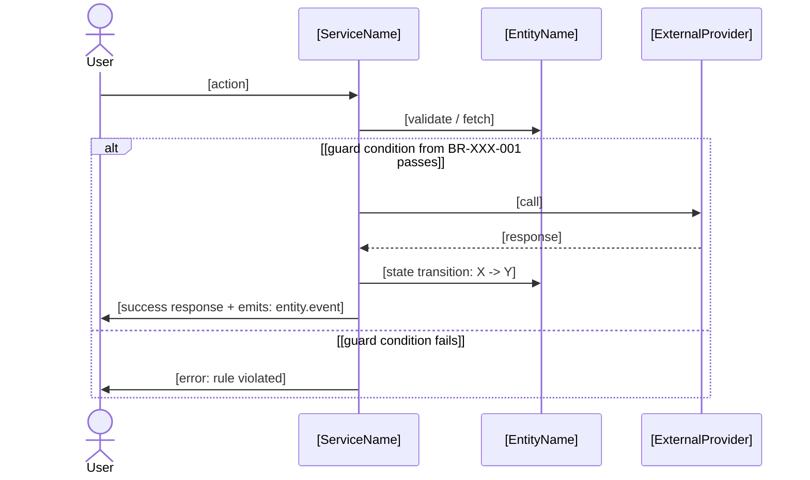

# PM - Feature Design (JIT)

## What this skill does

Produces the Just-In-Time technical design for a single feature immediately before it enters build. This is the FDD Phase 4 (Design by Feature) executed in SDD mode.

**JIT vs. upfront design:**

| Upfront approach (not used) | This skill (JIT) |
|---|---|
| Feature-Set-level design, written upfront | Feature-level design, written just-in-time |
| Standalone design document | Register updates + sequence diagram embedded in Feature Card |
| Written for an entire Feature Set before the Stripe | Written for one Feature just before build |

**What this skill does in one run:**
1. Reads the Feature Card (Section 1 is stub at this point)
2. Enriches `entities.md` - adds exact guard conditions to state transitions relevant to this feature
3. Enriches `business_rules.md` and `decision_models.md` - finalizes formulas and decision matrices for rules this feature enforces (status: Draft → Final)
4. Populates Feature Card Section 1 (Biznis Mantinely) - links entities, BR-IDs, TBL-IDs
5. Writes Feature Card Section 2 (Acceptance Criteria) - derived from register state + business rules
6. Generates Mermaid.js sequence diagram - writes to Feature Card Section 3
7. Lists files to modify - writes to Feature Card Section 3
8. Sets Feature Card status to `2_Spec_Done`

**Atomic commit protocol (parallel Stripe safety):**
All register updates (steps 2-3) are committed BEFORE any code generation begins. This prevents merge conflicts when multiple Stripes run in parallel.

```
Commit 1: "spec([FEAT-ID]): guard conditions + rule finalization"
  → entities.md updated
  → business_rules.md updated (rules status: Final)
  → decision_models.md updated

Commit 2: "spec([FEAT-ID]): feature design complete"
  → Feature Card Sections 1-3 populated
  → status: 2_Spec_Done
```

**Existing codebase mode (Feature Implementation playbook):**
If the project has an existing codebase, Claude Code MUST scan the relevant service files before generating the sequence diagram. The diagram must use only real existing classes and methods - it must not invent interfaces that don't exist.

---

## Dependencies

**Required before running:**
- Feature Card for this FEAT-ID (created by pm-features-list, stub state)
- `pm-entity-registry` - entities.md must exist
- `pm-business-rules-library` - business_rules.md and decision_models.md must exist (at least Draft)

**Recommended before running:**
- `pm-stripe` - confirms this feature is next in its Stripe and dependencies are met

**Produces artifacts used by:**
- Feature Card (Sections 1-3 populated)
- Build phase - Claude Code reads the completed Feature Card as implementation spec
- `test-master` / `playwright-expert` - ACs in Section 2 are the direct test basis

---

## Step 0: Current state check

Read the Feature Card at `/features/cards/[FEAT-ID].md`.

| Item | Status | Detail |
|---|---|---|
| Feature Card | [status from frontmatter] | [title] |
| entities.md | [exists / not found] | |
| business_rules.md | [exists / not found] | |
| decision_models.md | [exists / not found] | |
| Dependencies met | [yes / no] | [list unmet deps] |

**Verdict:** [One sentence - ready to design or what is blocking]

If Feature Card status is already `3_Ready_to_Build` or later: stop. Design is already approved. Do not overwrite.

Apply the standard skill interaction pattern (CLAUDE.md).

---

## Step 1: Gather inputs

Use AskUserQuestion tool with two questions together:

- Question 1: "Playbook mode for [FEAT-ID]?"
  - Option A: "Greenfield - designing from scratch, diagram defines new classes/methods (Recommended for new projects)"
  - Option B: "Feature Implementation - adding to existing codebase, diagram must match real code (Recommended for FI context)"

- Question 2: "Team mode?"
  - Option A: "Solo Builder - AI generates full design, you confirm before build starts (Recommended)"
  - Option B: "Delivery Team - design goes to Design Inspection after this step"

Then ask as plain text:

```
JIT Design for: [FEAT-ID]: [Feature title]

PRD CONTEXT
   The feature references: [prd_ref from frontmatter]
   Is this PRD section in context, or should I read it?
   [confirm or paste relevant section]

BUSINESS RULES SCOPE
   Which business rules from business_rules.md apply to this feature?
   List BR-IDs, or I will identify them from the feature scope.
   [list or "identify automatically"]

   [If Feature Implementation mode: which service files are relevant? I will scan them before designing.]

OPEN QUESTIONS
   Any known edge cases or constraints specific to this feature not yet in the registers?
   [list or "none"]
```

Then use AskUserQuestion tool for UX context (skip if backend/API-only feature):

- Question: "Does this feature have a user interface component? If yes, how will you provide the UX context?"
  - Option A: "Text description - I'll describe where this feature lives and what the user sees/does"
  - Option B: "Attach a screenshot or mockup directly in this message"
  - Option C: "Figma URL - I'll paste the screen URL (requires Figma MCP connected)"
  - Option D: "Backend/API-only - no UI component, skip UX context"

---

## Step 2: Pre-design scan (Feature Implementation mode only)

If playbook mode = Feature Implementation:

1. Identify service files, models, and handlers relevant to this feature (from feature scope + files listed in Feature Card Section 3 stub)
2. Read those files to extract real class names, method signatures, and dependency injection patterns
3. Build a map of real interfaces before drawing any diagram

Output:
```
Existing code scan for [FEAT-ID]:
  - OrderService: [real methods found]
  - PaymentProvider: [real interface]
  - [Entity]: [real model fields relevant to this feature]

Diagram will use only these existing interfaces.
```

Skip this step if Greenfield mode.

---

## Step 3: Update registers (Atomic Commit 1)

**3a. Update entities.md - add guard conditions**

For each state transition this feature triggers:
- Add the exact guard condition (business logic expression, not code)
- Replace `TBD - added JIT` with the actual condition

Example:
```markdown
| Draft | Confirmed | payment.success | order.confirmed | card.luhn_valid == true AND BR-PAY-001 == pass |
```

**3b. Finalize rules in business_rules.md**

For each BR-ID this feature enforces:
- Add the exact formula/condition (if still TBD)
- Update status: `Draft` → `Final`
- Add this FEAT-ID to the "Applies to features" field

If this feature surfaces a brand-new rule not yet in the register, add it with the focused single-rule helper by priority class - `/pm-business-rule-core` (operational), `/pm-business-rule-critical` (hard invariant), or `/pm-business-rule-governance` (compliance/policy) - rather than re-running the full library skill.

**3c. Finalize decision tables in decision_models.md**

For each TBL-ID this feature uses:
- Complete any TBD cells
- Update status: `Draft` → `Final`
- Add this FEAT-ID to "Used in features"

**3d. Commit**

```
git add domain/entities.md domain/business_rules.md domain/decision_models.md
git commit -m "spec([FEAT-ID]): guard conditions + rule finalization"
```

---

## Step 4: Generate Feature Card Sections 1-3 (Atomic Commit 2)

**4a. Section 1 - Biznis Mantinely**

Populate using table format for rules and entity transitions. Tables are scannable and show enforcement points explicitly - critical for code review and build.

```markdown
## 1. Biznis Mantinely (SDD Input)

**Rules enforced in this feature:**

| Rule ID | Rule | Priority | Enforcement point |
|---|---|---|---|
| [BR-XXX-001](/domain/business_rules.md#br-xxx-001) | [Rule name: one-line summary] | [Critical/High/Medium] | [Service method / webhook handler / DB constraint] |
| [BR-XXX-002](/domain/business_rules.md#br-xxx-002) | [Rule name: one-line summary] | [Critical/High/Medium] | [Service method / middleware] |

**Entity guard conditions (from entities.md):**

| Entity | Transition | Guard condition |
|---|---|---|
| [Entity Name](/domain/entities.md#entity-name) | [State before] → [State after] | [exact guard expression (finalized: FEAT-ID)] |

**Decision model:** [TBL-XXX-01](/domain/decision_models.md#tbl-xxx-01) - [Table name, if applicable]

**What this feature does NOT do:**
- [explicit scope exclusion - what adjacent feature handles, or what is out of scope in v1]
- [explicit scope exclusion]
```

**4b. Section 2 - Acceptance Criteria**

Derived from: entity state transitions (entities.md) + business rules (business_rules.md) + decision table edge cases (decision_models.md).

Minimum: happy path AC + at least one guard failure AC + feature flag OFF behavior.

```markdown
## 2. Acceptance Criteria

### AC-01: [Happy Path Name]
- **Given** [precondition: entity in state X, actor context]
- **When** [action taken]
- **Then** [observable outcome: entity state change, event emitted, user feedback]
  - **And** [secondary outcome]

### AC-02: [Guard Failure Name] (enforces [BR-ID])
- **Given** [precondition]
- **When** [invalid or failing condition]
- **Then** [system blocks, entity state unchanged, error signal]

### AC-03: Feature Flag OFF
- **Given** flag `[feature_flag from frontmatter]` is OFF
- **When** [same trigger as AC-01]
- **Then** [existing behavior unchanged / feature hidden / graceful degradation]

### AC-0N: [Edge Case from TBL-ID]
[Cover key rows from the decision table]
```

**4c. Section 3 - JIT Technical Design**

Generate sequence diagram using Mermaid.js. Greenfield: can define new classes. Feature Implementation: use only real existing classes from Step 2 scan.

```markdown
## 3. JIT Technical Design (FDD Design)

### Data flow and object interaction



### Files to modify
- `[src/services/ServiceName.ts]` - [brief description of change]
- `[src/entities/EntityName.ts]` - [state transition logic]
- `[src/validators/ValidatorName.ts]` - [guard condition implementation]
```

**4c-UX. Section 3b - UX/UI Context** (include only if feature has a UI component)

```markdown
## 3b. UX/UI Context

**Placement:** [Where in the app - screen name, route, component location]

**User-facing intent:** [What the user sees and what action they take - 1-2 sentences]

**Design system reference:** [Component or pattern from Impeccable design system / "new pattern - see Figma"]

**Figma reference:** [URL to specific screen / frame / component - or "N/A"]

**Visual notes:** [Any specific behavior: empty states, loading state, error state, responsive breakpoints]
```

If no Figma URL was provided and Figma MCP is connected: check `figma_project_url` in `pureinn-variables.md` and read the relevant screen if identifiable. If not identifiable, ask the user for the Figma frame URL or accept a screenshot.

If feature is backend/API-only: omit Section 3b entirely.

**4d. Update Feature Card frontmatter status**

```yaml
status: 2_Spec_Done
```

**4e. Commit**

```
git add features/cards/[FEAT-ID].md
git commit -m "spec([FEAT-ID]): feature design complete"
```

---

## Step 5: Design Inspection handoff

**Solo Builder mode:**

Show summary:
```
Design complete for [FEAT-ID]: [title]

Summary:
- Register updates: [entities.md] guard condition for [transition], [N] rules finalized
- Sequence diagram: [N] actors, [N] steps, [N] alt paths
- Acceptance Criteria: [N] ACs covering happy path + [N] failure cases + flag OFF

Review the sequence diagram in Section 3 of the Feature Card.
```

Then use AskUserQuestion tool with:
- Question: "Any corrections before build starts?"
- Option A: "Looks good - start build (Recommended)"
- Option B: "Correction needed - I'll describe what to fix"

**Delivery Team mode:**

```
Design package ready for Design Inspection - [FEAT-ID]: [title]

Feature Card is at status: 2_Spec_Done
Location: /features/cards/[FEAT-ID].md

Design Inspection checklist:
  [ ] Sequence diagram reflects real system flow (no invented methods)
  [ ] Guard conditions in entities.md are accurate
  [ ] Business rules (BR-IDs) correctly referenced
  [ ] All ACs are testable without knowledge of internals
  [ ] Edge cases from decision table are covered

After inspection: update Feature Card status to 3_Ready_to_Build
Then run /pm-stripe to proceed to build.
```

---

## Internal completeness checklist

<!-- Claude reference only - not shown to user -->

**Register updates:**
- [ ] Guard conditions added to entities.md (not left as TBD)
- [ ] Rules status updated Draft → Final for all rules used
- [ ] Decision table rows completed (no TBD cells for rules used)
- [ ] Atomic commit 1 made before Section 1-3 work

**Feature Card Section 1:**
- [ ] All relevant entities linked with markdown links
- [ ] State before and after specified
- [ ] All BR-IDs linked with one-line description
- [ ] Decision model linked (if applicable)

**Feature Card Section 2:**
- [ ] At minimum: happy path + one guard failure + flag OFF
- [ ] Each AC uses Given/When/Then format
- [ ] "Then" is observable without knowledge of internals
- [ ] Edge cases from decision table covered as ACs

**Feature Card Section 3:**
- [ ] Mermaid.js sequenceDiagram syntax used
- [ ] Feature Implementation mode: only real existing classes used
- [ ] Alt/else paths cover the guard failure scenarios
- [ ] Files to modify listed

**Atomic commit protocol:**
- [ ] Commit 1: register updates only (before Section 1-3)
- [ ] Commit 2: Feature Card sections (after register commit)

---

## Save to

Feature Card updated in place:
```
pureinn-workspace/[project-slug]/features/cards/[FEAT-ID].md
```

Register updates in place:
```
pureinn-workspace/[project-slug]/domain/entities.md
pureinn-workspace/[project-slug]/domain/business_rules.md
pureinn-workspace/[project-slug]/domain/decision_models.md
```

State update → `pureinn-workspace/[project-slug]/state.json`: update feature status to `2_Spec_Done`.

---

## Notion push

After local files are saved, push spec content to Notion so the team can review it there.

**Step 1 - Find the Notion page for this feature:**
1. Read `pureinn-variables.md` key "Feature Backlog" → get DB URL
2. Check `state.json notion_ids.feature_backlog` → use cached data source ID or fetch
3. Query the DB for the entry where `FEAT-ID` = `[FEAT-ID]` → get the Notion page URL

If Feature Backlog URL is blank or feature entry not found: skip Notion push, continue.

**Step 2 - Update the Notion page:**

Call `mcp__claude_ai_Notion__notion-update-page` with `command: "replace_content"` and the full Feature Card content:

```
[Description from stub - keep as-is]

[Current state from stub - keep as-is]

---

## 1. Biznis Mantinely (SDD Input)

[Full Section 1 content generated by this skill]

---

## 2. Acceptance Criteria

[Full Section 2 content generated by this skill]

---

## 3. JIT Technical Design (FDD Design)

[Full Section 3 content generated by this skill]

---

## 4. Realizacny Protokol (Build Verification)
*TBD - populated after build and Code Inspection*
```

**Step 3 - Update Status property:**

Call `mcp__claude_ai_Notion__notion-update-page` with `command: "update_properties"`:
- `Status`: `"2_Spec_Done"`

---

## Handoff

```
---
**Čo si teraz má:** Feature Card Sections 1-3 kompletné + domain registers finalizované.
Feature [FEAT-ID] je ready na Design Inspection. Status: 2_Spec_Done.

**Ďalší krok:** Design Inspection
- Tím: reviewni Sections 1-3, potvrď že ACs sú testovateľné a sequence diagram pokrýva happy path + guard failures.
- Solo: prejdi Sections 1-3, potvrď alebo oprav, potom nastav status na 3_Ready_to_Build.
Použite /pm-stripe pre tracking.

**Po Design Inspection:** /pm-stripe → routuje na build skills pre [FEAT-ID].

**Spec gate - nezačínaj build kým:** Status nie je 3_Ready_to_Build.
```
